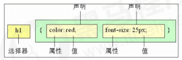
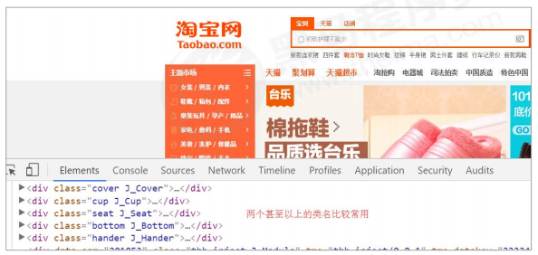
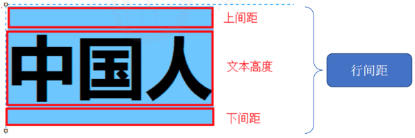
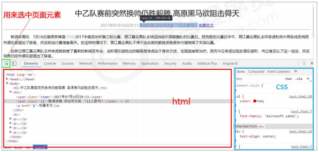

## 1. `CSS` 简介

`CSS` 的主要使用场景就是美化网页，布局页面的。

### 1.1 `HTML` 的局限性

说起 `HTML`，这其实是个非常单纯的家伙，他只关注内容的语义。

比如 `<h1>` 表明这是一个大标题，`<p>` 表明这是一个段落，`` 表明这儿有一个图片，`<a>` 表示此处有链接。

很早的时候，世界上的网站虽然很多，但是他们都有一个共同的特点：丑。

虽然 `HTML` 可以做简单的样式，但是带来的是无尽的臃肿和繁琐。

### 1.2 `CSS` - 网页的美容师

`CSS` 是层叠样式表（`Cascading Style Sheets`）的简称。

> 有时我们也会称之为 `CSS` 样式表或级联样式表。

`CSS` 是也是一种标记语言。

`CSS` 主要用于设置 `HTML` 页面中的文本内容（字体、大小、对齐方式等）、图片的外形（宽高、边框样式、边距等）以及版面的布局和外观显示样式。

`CSS` 让我们的网页更加丰富多彩，布局更加灵活自如。

简单理解：`CSS` 可以美化 `HTML`，让 `HTML` 更漂亮，让页面布局更简单。

**总结：**

1. `HTML` 主要做结构，显示元素内容。
   
2. `CSS` 美化 `HTML`，布局网页。
   
3. `CSS` 最大价值：由 `HTML` 专注去做结构呈现，样式交给 `CSS`，即 **结构（`HTML`）与样式（`CSS`）相分离**。

### 1.3 `CSS` 语法规范：选择器以及一条或多条声明

使用 `HTML` 时，需要遵从一定的规范，`CSS` 也是如此。要想熟练地使用 `CSS` 对网页进行修饰，首先需要了解 `CSS` 样式规则。

`CSS` 规则由两个主要的部分构成：**选择器以及一条或多条声明**。



如上图所示：

```:no-line-numbers
1. 选择器是用于指定 CSS 样式的 HTML 标签，花括号内是对该对象设置的具体样式；
2. 属性和属性值以 “键值对” 的形式出现；
3. 属性是对指定的对象设置的样式属性，例如字体大小、文本颜色等；
4. 属性和属性值之间用英文 “:” 分开；
5. 多个 “键值对” 之间用英文 “;” 进行区分。
```

所有的样式，都包含在 `<style>` 标签内，表示是样式表。`<style>` 一般写到 `</head>` 上方。示例如下：

```html:no-line-numbers
<head>
    <style>
        h4 {
            color: blue;
            font-size: 100px;
        }
    </style>
</head>
```

### 1.4 `CSS` 代码规范

以下代码书写规范不是强制规范，而是符合实际开发书写方式：

1. 样式格式规范

    ```css:no-line-numbers
    /* 紧凑格式 */
    h3 { color: deeppink; font-size: 20px;}
    ```

    ```css:no-line-numbers
    /* 展开格式 */
    h3 {
        color: pink;
        font-size: 20px; 
    }
    ```

    > 强烈推荐 **展开格式**，因为更直观。

2. 样式大小写规范

    ```css:no-line-numbers
    h3 {
        color: pink;
    }
    ```

    ```css:no-line-numbers
    H3 {
        COLOR: PINK; 
    }
    ```

    > 强烈推荐 **样式选择器，属性名，属性值关键字全部使用小写字母**，特殊情况除外。

3. 样式空格规范

    ```css:no-line-numbers
    h3 {
        color: pink; 
    }
    ```

    > 属性值前面，冒号后面，保留一个空格；
    >
    > 选择器（标签）和大括号中间保留空格。

## 2. `CSS` 基础选择器

### 2.1 `CSS` 选择器的作用：选择标签

选择器（选择符）就是根据不同需求把不同的标签选出来这就是选择器的作用。 简单来说，就是 **选择标签用的**。


上图中 `CSS` 做了两件事：

1. 找到所有的 `h1` 标签。选择器（选对人）。
   
2. 设置这些标签的样式，比如颜色为红色（做对事）。

### 2.2 选择器的分类：基础选择器 & 复合选择器

选择器分为基础选择器和复合选择器两个大类。

我们这里先讲解一下基础选择器：

1. 基础选择器是由单个选择器组成的；
   
2. 基础选择器又包括：标签选择器、类选择器、`id` 选择器和通配符选择器。

### 2.3 标签选择器（元素选择器）：`p {color: red;}`

标签选择器（元素选择器）是指用 `HTML` 标签名称作为选择器，按标签名称分类，为页面中某一类标签指定统一的 `CSS` 样式。

**语法：**

```:no-line-numbers
标签名 {
    属性1: 属性值1; 
    属性2: 属性值2; 
    属性3: 属性值3; 
    ...
}
```

**作用：**

标签选择器可以把某一类标签全部选择出来，比如所有的 `<div>` 标签和所有的 `<span>` 标签。

**优点：**

能快速为页面中同类型的标签统一设置样式。

**缺点：**

不能设计差异化样式，只能选择全部的当前标签。

### 2.4 类选择器：`.nav {color: red;}`

如果想要差异化选择不同的标签，单独选一个或者某几个标签，可以使用类选择器。

**语法：**

```:no-line-numbers
.类名 {
    属性1: 属性值1; 
    ...
}
```

例如，将所有拥有 `red` 类的 `HTML` 元素均为红色：

```css:no-line-numbers
.red {
    color: red;
}
```

结构需要用 `class` 属性来调用：

```html:no-line-numbers
<div class="red"> 变红色 </div>
```

类选择器在 `HTML` 中以 `class` 属性表示，在 `CSS` 中，类选择器以一个点 “`.`” 号显示。

**注意：**

1. 类选择器使用 "`.`"（英文点号）进行标识，后面紧跟类名（自定义，我们自己命名的）。
   
2. 可以理解为给这个标签起了一个名字，来表示。
   
3. 长名称或词组可以使用中横线来为选择器命名。
   
4. 不要使用纯数字、中文等命名，尽量使用英文字母来表示。
   
5. 命名要有意义，尽量使别人一眼就知道这个类名的目的。
   
> 记忆口诀：样式 **点** 定义，结构 **类** 调用。一个或多个，开发最常用。

#### 2.4.1 类选择器 - 多类名

我们可以给一个标签指定多个类名，从而达到更多的选择目的。

这些类名都可以选出这个标签，简单理解就是：一个标签有多个名字。



**多类名使用方式：**

1. 在标签 `class` 属性中写多个类名；
   
2. 多个类名中间必须用空格分开；
   
3. 这个标签就可以分别具有这些类名的样式。

```html:no-line-numbers
<div class="red font20">亚瑟</div>
```

**多类名开发中使用场景：**

1. 可以把一些标签元素相同的样式（共同的部分）放到一个类里面；
   
2. 这些标签都可以调用这个公共的类，然后再调用自己独有的类；
   
3. 从而节省 `CSS` 代码，统一修改也非常方便。

```html:no-line-numbers
<div class="pink fontWeight font20">亚瑟</div>
<div class="font20">刘备</div>
<div class="font14 pink">安其拉</div>
<div class="font14">貂蝉</div>
```

**总结：**

1. 各个类名中间用空格隔开；
   
2. 简单理解：就是给某个标签添加了多个类，或者这个标签有多个名字；
   
3. 这个标签就可以分别具有这些类名的样式；
   
4. 从而节省 `CSS` 代码，统一修改也非常方便；

5. 多类名选择器在后期布局比较复杂的情况下，还是较多使用的。

### 2.5 `id` 选择器：`#nav {color: red;}`

`id` 选择器可以为标有特定 `id` 的 `HTML` 元素指定特定的样式。

`HTML` 元素以 `id` 属性来设置 `id` 选择器，`CSS` 中 `id` 选择器以 "`#`" 来定义。

**语法：**

```css:no-line-numbers
#id名 {
    属性1: 属性值1; 
    ...
}
```

**示例：**

```css:no-line-numbers
#nav {
    color:red; 
}
```

> 注意：`id` 属性只能在每个 `HTML` 文档中出现一次。
> 
> 口诀：样式 `#` 定义，结构 `id` 调用。只能调用一次，别人切勿使用。（“调用” 就是指在 `HTML` 标签中使用）

#### 2.5.1 `id` 选择器和类选择器的区别

1. 类选择器（`class`）好比人的名字，一个人可以有多个名字，同时一个名字也可以被多个人使用。
   
2. `id` 选择器好比人的身份证号码，全中国是唯一的，不得重复。 
   
3. `id` 选择器和类选择器最大的不同在于使用次数上。
   
4. 类选择器在修改样式中用的最多，`id` 选择器一般用于页面唯一性的元素上，经常和 `JavaScript` 搭配使用。

### 2.6 通配符选择器：`* {color: red;}`

在 `CSS` 中，通配符选择器使用 "`*`" 定义，它表示选取页面中所有元素（标签）。

**语法：**

```css:no-line-numbers
* {
    属性1: 属性值1; 
    ...
}
```

> 通配符选择器不需要调用， 自动就给所有的元素使用样式。

特殊情况才使用通配符选择器。以下是清除所有的元素标签的内外边距：

```css:no-line-numbers
* {
    margin: 0;
    padding: 0;
}
```

### 2.7 基础选择器总结

|**基础选择器**|**作用**|**特点**|**使用情况**|**用法**|
|:-|:-|:-|:-|:-|
|标签选择器|可以选出所有相同的标签|不能差异化选择|较多|`p {color: red;}`|
|类选择器|可以选出 `1` 个或多个标签|可以根据需求选择|非常多|`.nav {color: red;}`|
|`id` 选择器|一次只能选择 `1` 个标签|id 属性只能在每个 `HTML` 文档中出现一次|一般和 `js` 搭配|`#nav {color: red;}`|
|通配符选择器|选择所有的标签|选择的太多，有部分不需要|特殊情况使用|`* {color: red;}`|

> 如果是修改样式， 类选择器是使用最多的。

## 3. `CSS` 字体属性

`CSS Fonts`（字体）属性用于定义字体系列、大小、粗细、和文字样式（如斜体）。

### 3.1 字体系列：`font-family`

`CSS` 使用 `font-family` 属性定义文本的字体系列。

```css:no-line-numbers
p { font-family: "微软雅黑";} 
div {font-family: Arial, "Microsoft Yahei", "微软雅黑";}
```

1. 各种字体之间必须使用英文状态下的逗号隔开；
   
2. 一般情况下，如果有空格隔开的多个单词组成的字体，加引号；
   
3. 尽量使用系统默认自带字体，保证在任何用户的浏览器中都能正确显示；
   
4. 最常见的几个字体：`body {font-family: 'Microsoft YaHei', tahoma, arial, 'Hiragino Sans GB'; }`

### 3.2 字体大小：`font-size`

`CSS` 使用 `font-size` 属性定义字体大小。

```css:no-line-numbers
p { 
    font-size: 20px; 
}
```

1. `px`（像素）大小是我们网页的最常用的单位；
   
2. 谷歌浏览器默认的文字大小为 `16px`；
   
3. 不同浏览器可能默认显示的字号大小不一致，我们尽量给一个明确值大小，不要默认大小；
   
4. 可以给 `body` 指定整个页面文字的大小。

### 3.3 字体粗细：`font-weight`

`CSS` 使用 `font-weight` 属性设置文本字体的粗细。

```css:no-line-numbers
p { 
    font-weight: bold;
}
```

|**属性值**|**描述**|
|:-|:-|
|`normal`|默认值（不加粗）|
|`bold`|定义粗体（加粗）|
|`100-900`|`400` 等同于 `normal`，而 `700` 等同于 `bold`。注意这个数字后面不跟单位|

> 学会让加粗标签（比如 `h` 和 `strong` 等) 不加粗，或者其他标签加粗；
>  
> 实际开发时，我们更喜欢用数字表示粗细。

### 3.4 文字样式：`font-style`

`CSS` 使用 `font-style` 属性设置文本的风格。

```css:no-line-numbers
p { 
    font-style: normal;
}
```

|**属性值**|**作用**|
|:-|:-|
|`normal`|默认值，浏览器会显示标准的字体样式 `font-style: normal;`|
|`italic`|浏览器会显示斜体的字体样式|

> 注意：平时我们很少给文字加斜体，反而要给斜体标签（`em`，`i`）改为不倾斜字体。

### 3.5 字体复合属性：`font`

字体属性可以把以上文字样式综合来写, 这样可以更节约代码：

```css:no-line-numbers
body { 
    font: font-style font-weight font-size/line-height font-family; }
```

> 使用 `font` 属性时，必须按上面语法格式中的顺序书写，**不能更换顺序**，并且各个属性间以空格隔开。
> 
> 不需要设置的属性可以省略（取默认值），但 **必须保留 `font-size` 和 `font-family` 属性**，否则 `font` 属性将不起作用。

### 3.6 字体属性总结

|**属性**|**表示**|**注意点**|
|:-|:-|:-|
|`font-size`|字号|我们通常用的单位是 `px` 像素，一定要跟上单位|
|`font-family`|字体|实际工作中按照团队约定来写字体|
|`font-weight`|字体粗细|记住加粗是 `700` 或者 `bold`，不加粗是 `normal` 或者 `400`。记住数字不要跟单位|
|`font-style`|字体样式|记住倾斜是 `italic`，不倾斜是 `normal` 。工作中我们最常用 `normal`|
|`font`|字体连写|1. 字体连写是有顺序的，不能随意换位置；2. 其中字号和字体必须同时出现|

## 4. `CSS` 文本属性

`CSS Text`（文本）属性可定义文本的外观，比如文本的颜色、对齐文本、装饰文本、文本缩进、行间距等。

### 4.1 文本颜色：`color`

`color` 属性用于定义文本的颜色。

```css:no-line-numbers
div { 
    color: red;
}
```

|**表示方式**|**属性值**|
|:-|:-|
|预定义的颜色值|`red`、`green`、`blue`、`pink`|
|十六进制|`#FF0000`、`#FF6600`、`#29D794`|
|`RGB` 代码|`rgb(255, 0, 0)` 或 `rgb(100%, 0%, 0%)`|

> 开发中最常用的是十六进制。

### 4.2 对齐文本：`text-align`

`text-align` 属性用于设置元素内文本内容的水平对齐方式。

```css:no-line-numbers
div { 
    text-align: center;
}
```

|**属性值**|**解释**|
|:-|:-|
|`left`|左对齐（默认值）|
|`right`|右对齐|
|`center`|居中对齐|

### 4.3 装饰文本：`text-decoration`

`text-decoration` 属性规定添加到文本的修饰。可以给文本添加下划线、删除线、上划线等。

```css:no-line-numbers
div { 
    text-decoration：underline;
}
```

|**属性值**|**描述**|
|:-|:-|
|`none`|默认。没有装饰线（最常用）|
|`underline`|下划线。链接 `a` 自带下划线（常用）|
|`overline`|上划线（几乎不用）|
|`line-throught`|删除线。（不常用）|

### 4.4 文本缩进：`text-indent`

`text-indent` 属性用来指定文本的第一行的缩进，通常是将段落的首行缩进。

```css:no-line-numbers
div { 
    text-indent: 10px;
}
```

> 通过设置该属性，所有元素的第一行都可以缩进一个给定的长度，甚至该长度可以是负值。

```css:no-line-numbers
p { 
    text-indent: 2em;
}
```

> `em` 是一个相对单位，就是当前元素（`font-size`) `1` 个文字的大小, 如果当前元素没有设置大小，则会按照父元
素的 `1` 个文字大小。

### 4.5 行间距：`line-height`

`line-height` 属性用于设置行间的距离（行高）。可以控制文字行与行之间的距离。

```css:no-line-numbers
p { 
    line-height: 26px;
}
```



### 4.6 文本属性总结

|**属性**|**表示**|**注意点**|
|:-|:-|:-|
|`color`|文本颜色|我们通常用十六进制，而且是简写形式。比如：`#fff`|
|`text-align`|文本对齐|可以设定文字水平的对齐方式|
|`text-indent`|文本缩进|通常我们用于段落首行缩进 `2` 个字的距离，即：`text-indent: 2em;`|
|`line-height`|行高|控制行与行之间的距离|

## 5. `CSS` 的引入方式

### 5.1 `CSS` 的三种样式表

按照 `CSS` 样式书写的位置（或者引入的方式），`CSS` 样式表可以分为三大类：

1. 行内样式表（行内式）
   
2. 内部样式表（嵌入式）
   
3. 外部样式表（链接式）

#### 5.1.1 内部样式表（嵌入式）

内部样式表是写到 `html` 页面内部。是将所有的 `CSS` 代码抽取出来，单独放到一个 `<style>` 标签中。

```html:no-line-numbers
<style>
    div {
        color: red;
        font-size: 12px;
    }
</style>
```

**注意：**

1. `<style>` 标签理论上可以放在 `HTML` 文档的任何地方，但一般会放在文档的 `<head>` 标签中；

2. 通过此种方式，可以方便控制当前整个页面中的元素样式设置；

3. 代码结构清晰，但是并没有实现结构与样式完全分离；

4. 使用内部样式表设定 `CSS`，通常也被称为嵌入式引入，这种方式是我们练习时常用的方式。

#### 5.1.2 行内样式表（行内式）

行内样式表是在元素标签内部的 `style` 属性中设定 `CSS` 样式。适合于修改简单样式。

```html:no-line-numbers
<div style="color: red; font-size: 12px;">青春不常在，抓紧谈恋爱</div>
```

1. `style` 其实就是标签的属性；

2. 在双引号中间，写法要符合 `CSS` 规范；

3. 可以控制当前的标签设置样式；

4. 由于书写繁琐，并且没有体现出结构与样式相分离的思想，所以不推荐大量使用，只有对当前元素添加简单样式的时候，可以考虑使用；

5. 使用行内样式表设定 `CSS`，通常也被称为行内式引入。

#### 5.1.3 外部样式表（链接式）

实际开发都是外部样式表，适合于样式比较多的情况。

**核心是：** 样式单独写到 `CSS` 文件中，之后把 `CSS` 文件引入到 `HTML` 页面中使用。

**引入外部样式表分为两步：**

1. 新建一个后缀名为 `.css` 的样式文件，把所有 `CSS` 代码都放入此文件中。
   
2. 在 `HTML` 页面中，使用 `<link>` 标签引入这个文件。

```html:no-line-numbers
<link rel="stylesheet" href="css文件路径">
```

|**属性**|**作用**|
|:-|:-|
|`rel`|定义当前文档与被链接文档之间的关系。在这里需要指定为 `stylesheet`，表示被链接的文档是一个样式表文件。|
|`href`|定义所链接外部样式表文件的 `URL`，可以是相对路径，也可以是绝对路径。|

使用外部样式表设定 `CSS`，通常也被称为外链式或链接式引入，这种方式是开发中常用的方式。

### 5.2 `CSS` 引入方式总结

|**样式表**|**优点**|**缺点**|**使用情况**|**控制范围**|
|:-|:-|:-|:-|:-|
|行内样式表|书写方便，权重高|结构样式混写|较少|控制一个标签|
|内部样式表|部分结构和样式相分离|没有彻底分离|较多|控制一个页面|
|外部样式表|完全实现结构和样式相分离|需要引入|最多，推荐使用|控制多个页面|

## 6. `Chrome` 调试工具

`Chrome` 浏览器提供了一个非常好用的调试工具，可以用来调试我们的 `HTML` 结构和 `CSS` 样式。

**打开调式工具：**

打开 `Chrome` 浏览器，按下 `F12` 键或者右击页面空白处 `->` 检查。



**使用调式工具：**

1. `Ctrl` + 滚轮，可以放大开发者工具代码大小。 

2. 左边是 `HTML` 元素结构，右边是 `CSS` 样式。

3. 右边 `CSS` 样式可以改动数值（左右箭头或者直接输入）和查看颜色。 

4. `Ctrl` + `0` 复原浏览器大小。

5. 如果点击元素，发现右侧没有样式引入，极有可能是类名或者样式引入错误。

6. 如果有样式，但是样式前面有黄色叹号提示，则是样式属性书写错误。

## 7. `Emmet` 语法

`Emmet` 语法的前身是 `Zen codin`，它使用缩写来提高 `html/css` 的编写速度。

> `Vscode` 内部已经集成该语法。

### 7.1 快速生成 `HTML` 结构语法

1. 生成标签：直接输入标签名，按 `tab` 键即可。比如 `div` 然后 `tab` 键， 就可以生成 `<div></div>`
   
2. 如果想要生成多个相同标签，加上 `*` 就可以了。比如 `div*3` 就可以快速生成 `3` 个 `div`
   
3. 如果有父子级关系的标签，可以用 `>`。比如 `ul > li` 就可以了
   
4. 如果有兄弟关系的标签，用 `+` 就可以了。比如 `div+p `
   
5. 如果生成带有类名或者 `id` 名字的， 直接写 `.demo` 或者 `#two tab` 键就可以了
   
6. 如果生成的 `div` 类名是有顺序的，可以用自增符号 `$`
   
7. 如果想要在生成的标签内部写内容可以用 `{ }` 表示

### 7.2 快速生成 `CSS` 样式语法

`CSS` 基本采取简写形式即可。

1. 比如 `w200` 按 `tab` 可以生成 `width: 200px;`
   
2. 比如 `lh26px` 按 `tab` 可以生成 `line-height: 26px;`

### 7.3 快速格式化代码

`Vscode` 快速格式化代码：`shift+alt+f`

也可以设置成：当我们保存页面的时候自动格式化代码，步骤如下：

1. 文件 ->【首选项】->【设置】；
 
2. 搜索 `emmet.include`； 
 
3. 在 `settings.json` 下的【工作区设置】中添加以下语句：

    ```json:no-line-numbers
    "editor.formatOnType": true,
    "editor.formatOnSave": true
    ```

## 8. `CSS` 的复合选择器

在 `CSS` 中，可以根据选择器的类型把选择器分为基础选择器和复合选择器。

复合选择器可以更准确、更高效的选择目标元素（标签）。

复合选择器是由两个或多个基础选择器，通过不同的方式组合而成的。

常用的复合选择器包括：后代选择器、子选择器、并集选择器、伪类选择器等等。

### 8.1 后代选择器

后代选择器又称为包含选择器，可以选择父元素里面子元素。

其写法就是把外层标签写在前面，内层标签写在后面，中间用空格分隔。当标签发生嵌套时，内层标签就成为外层标签的后代。

**语法：**

```:no-line-numbers
元素1 元素2 { 样式声明 }
```

> 上述语法表示选择元素 `1` 里面的所有元素 `2`（后代元素）。

**示例：**

```css:no-line-numbers
ul li { 样式声明 } /* 选择 ul 里面所有的 li 标签元素 */
```

**注意：**

1. 元素 `1` 和元素 `2` 中间用空格隔开；

2. 元素 `1` 是父级，元素 `2` 是子级，最终选择的是元素 `2`；

3. 元素 `2` 可以是儿子，也可以是孙子等，只要是元素 `1` 的后代即可；

4. 元素 `1` 和元素 `2` 可以是任意基础选择器。

### 8.2 子选择器

子元素选择器（子选择器）只能选择作为某元素的最近一级子元素。简单理解就是选亲儿子元素。

**语法：**

```:no-line-numbers
元素1 > 元素2 { 样式声明 }
```

> 上述语法表示选择元素 `1` 里面的所有直接后代（子元素）元素 `2`。

**示例：**

```css:no-line-numbers
div > p { 样式声明 } /* 选择 div 里面所有最近一级 p 标签元素 */
```

**注意：**

1. 元素 `1` 和元素 `2` 中间用大于号隔开；

2. 元素 `1` 是父级，元素 `2` 是子级，最终选择的是元素 `2` ；

3. **元素 `2` 必须是亲儿子**，其孙子、重孙之类都不归他管。你也可以叫他亲儿子选择器。

### 8.3 并集选择器

并集选择器可以选择多组标签，同时为他们定义相同的样式。通常用于集体声明。

并集选择器是各选择器通过英文逗号 "`,`" 连接而成，任何形式的选择器都可以作为并集选择器的一部分。

**语法：**

```:no-line-numbers
元素1,元素2 { 样式声明 }
```

> 上述语法表示选择元素 `1` 和元素 `2`。

**示例：**

```css:no-line-numbers
ul,div { 样式声明 } /* 选择 ul 和 div标签元素 */
```

**注意：**

1. 元素 `1` 和元素 `2` 中间用逗号隔开；

2. 逗号可以理解为和的意思；

3. 并集选择器通常用于集体声明。

### 8.4 伪类选择器

伪类选择器用于向某些选择器添加特殊的效果，比如给链接添加特殊效果，或选择第 `1` 个，第 `n` 个元素。

伪类选择器书写最大的特点是用冒号 "`:`" 表示，比如 `:hover`、`:first-child`。

因为伪类选择器很多，比如有链接伪类、结构伪类等，所以这里先讲解常用的链接伪类选择器。

#### 8.4.1 链接伪类选择器

**链接伪类选择器注意事项：**

1. 为了确保生效，请按照 `LVHA` 的循顺序声明 `:link`－`:visited`－`:hover`－`:active`。
   
2. 记忆法："`love` `hate`" 或者 "`lv` 包包 `hao`” 。
   
3. 因为 `a` 链接在浏览器中具有默认样式，所以我们实际工作中都需要给链接单独指定样式。

**链接伪类选择器实际工作开发中的写法：**

```css:no-line-numbers
 /* a 是标签选择器 所有的链接 */ 
 a { 
    color: gray;
 }

 /* :hover 是链接伪类选择器 鼠标经过 */
 a:hover { 
    color: red; /* 鼠标经过的时候，由原来的灰色 变成了红色 */
 }
```

#### 8.4.2 `:focus` 伪类选择器

`:focus` 伪类选择器用于选取获得 **焦点** 的表单元素。

焦点就是光标，一般情况 `<input>` 类表单元素才能获取，因此这个选择器也主要针对于表单元素来说。

```css:no-line-numbers
input:focus { 
    background-color:yellow;
}
```

### 8.5 复合选择器总结

|**选择器**|**作用**|**特征**|**使用情况**|**隔开符号及用法**|
|:-|:-|:-|:-|:-|
|后代选择器|用来选择后代元素|可以是子孙后代|较多|符号是空格，示例：`.nav a`|
|子选择器|选择最近一级元素|只选亲儿子|较少|符号是大于，示例：`.nav>p`|
|并集选择器|选择某些相同样式的元素|可以用于集体声明|较多|符号是逗号，示例：`.nav,.header`|
|链接伪类选择器|选择不同状态的链接|跟链接相关|较多|重点记住 `a{}` 和 `a:hover` 实际开发的写法|
|`:focus` 选择器|选择获得光标的表单|跟表单相关|较少|`input:focus` 记住这个写法|

## 9. `CSS` 的元素显示模式

### 9.1 元素显示模式的分类

#### 9.1.1 块元素

#### 9.1.2 行内元素

#### 9.1.3 行内块元素

#### 9.1.4 元素显示模式总结

### 9.2 元素显示模式的转换

### 9.3 截图小工具：`snipaste`

### 9.4 小技巧：单行文字垂直居中

## 10. `CSS` 的背景

## 11. `CSS` 的三大特性

## 12. `CSS` 的注释