## 1. `CSS` 简介

`CSS` 的主要使用场景就是美化网页，布局页面的。

### 1.1 `HTML` 的局限性

说起 `HTML`，这其实是个非常单纯的家伙，他只关注内容的语义。

比如 `<h1>` 表明这是一个大标题，`<p>` 表明这是一个段落，`` 表明这儿有一个图片，`<a>` 表示此处有链接。

很早的时候，世界上的网站虽然很多，但是他们都有一个共同的特点：丑。

虽然 `HTML` 可以做简单的样式，但是带来的是无尽的臃肿和繁琐。

### 1.2 `CSS` - 网页的美容师

`CSS` 是层叠样式表（`Cascading Style Sheets`）的简称。

> 有时我们也会称之为 `CSS` 样式表或级联样式表。

`CSS` 是也是一种标记语言。

`CSS` 主要用于设置 `HTML` 页面中的文本内容（字体、大小、对齐方式等）、图片的外形（宽高、边框样式、边距等）以及版面的布局和外观显示样式。

`CSS` 让我们的网页更加丰富多彩，布局更加灵活自如。

简单理解：`CSS` 可以美化 `HTML`，让 `HTML` 更漂亮，让页面布局更简单。

**总结：**

1. `HTML` 主要做结构，显示元素内容。
   
2. `CSS` 美化 `HTML`，布局网页。
   
3. `CSS` 最大价值：由 `HTML` 专注去做结构呈现，样式交给 `CSS`，即 **结构（`HTML`）与样式（`CSS`）相分离**。

### 1.3 `CSS` 语法规范：选择器以及一条或多条声明

使用 `HTML` 时，需要遵从一定的规范，`CSS` 也是如此。要想熟练地使用 `CSS` 对网页进行修饰，首先需要了解 `CSS` 样式规则。

`CSS` 规则由两个主要的部分构成：**选择器以及一条或多条声明**。


如上图所示：

```:no-line-numbers
1. 选择器是用于指定 CSS 样式的 HTML 标签，花括号内是对该对象设置的具体样式；
2. 属性和属性值以 “键值对” 的形式出现；
3. 属性是对指定的对象设置的样式属性，例如字体大小、文本颜色等；
4. 属性和属性值之间用英文 “:” 分开；
5. 多个 “键值对” 之间用英文 “;” 进行区分。
```

所有的样式，都包含在 `<style>` 标签内，表示是样式表。`<style>` 一般写到 `</head>` 上方。示例如下：

```html:no-line-numbers
<head>
    <style>
        h4 {
            color: blue;
            font-size: 100px;
        }
    </style>
</head>
```

### 1.4 `CSS` 代码规范

以下代码书写规范不是强制规范，而是符合实际开发书写方式：

1. 样式格式规范

    ```css:no-line-numbers
    /* 紧凑格式 */
    h3 { color: deeppink; font-size: 20px;}
    ```

    ```css:no-line-numbers
    /* 展开格式 */
    h3 {
        color: pink;
        font-size: 20px; 
    }
    ```

    > 强烈推荐 **展开格式**，因为更直观。

2. 样式大小写规范

    ```css:no-line-numbers
    h3 {
        color: pink;
    }
    ```

    ```css:no-line-numbers
    H3 {
        COLOR: PINK; 
    }
    ```

    > 强烈推荐 **样式选择器，属性名，属性值关键字全部使用小写字母**，特殊情况除外。

3. 样式空格规范

    ```css:no-line-numbers
    h3 {
        color: pink; 
    }
    ```

    > 属性值前面，冒号后面，保留一个空格；
    >
    > 选择器（标签）和大括号中间保留空格。

## 2. `CSS` 基础选择器

### 2.1 `CSS` 选择器的作用：选择标签

选择器（选择符）就是根据不同需求把不同的标签选出来这就是选择器的作用。 简单来说，就是 **选择标签用的**。


上图中 `CSS` 做了两件事：

1. 找到所有的 `h1` 标签。选择器（选对人）。
   
2. 设置这些标签的样式，比如颜色为红色（做对事）。

### 2.2 选择器的分类：基础选择器 & 复合选择器

选择器分为基础选择器和复合选择器两个大类。

我们这里先讲解一下基础选择器：

1. 基础选择器是由单个选择器组成的；
   
2. 基础选择器又包括：标签选择器、类选择器、`id` 选择器和通配符选择器。

### 2.3 标签选择器（元素选择器）：`p {color: red;}`

标签选择器（元素选择器）是指用 `HTML` 标签名称作为选择器，按标签名称分类，为页面中某一类标签指定统一的 `CSS` 样式。

**语法：**

```:no-line-numbers
标签名 {
    属性1: 属性值1; 
    属性2: 属性值2; 
    属性3: 属性值3; 
    ...
}
```

**作用：**

标签选择器可以把某一类标签全部选择出来，比如所有的 `<div>` 标签和所有的 `<span>` 标签。

**优点：**

能快速为页面中同类型的标签统一设置样式。

**缺点：**

不能设计差异化样式，只能选择全部的当前标签。

### 2.4 类选择器：`.nav {color: red;}`

如果想要差异化选择不同的标签，单独选一个或者某几个标签，可以使用类选择器。

**语法：**

```:no-line-numbers
.类名 {
    属性1: 属性值1; 
    ...
}
```

例如，将所有拥有 `red` 类的 `HTML` 元素均为红色：

```css:no-line-numbers
.red {
    color: red;
}
```

结构需要用 `class` 属性来调用：

```html:no-line-numbers
<div class="red"> 变红色 </div>
```

类选择器在 `HTML` 中以 `class` 属性表示，在 `CSS` 中，类选择器以一个点 “`.`” 号显示。

**注意：**

1. 类选择器使用 "`.`"（英文点号）进行标识，后面紧跟类名（自定义，我们自己命名的）。
   
2. 可以理解为给这个标签起了一个名字，来表示。
   
3. 长名称或词组可以使用中横线来为选择器命名。
   
4. 不要使用纯数字、中文等命名，尽量使用英文字母来表示。
   
5. 命名要有意义，尽量使别人一眼就知道这个类名的目的。
   
> 记忆口诀：样式 **点** 定义，结构 **类** 调用。一个或多个，开发最常用。

#### 2.4.1 类选择器 - 多类名

我们可以给一个标签指定多个类名，从而达到更多的选择目的。

这些类名都可以选出这个标签，简单理解就是：一个标签有多个名字。


**多类名使用方式：**

1. 在标签 `class` 属性中写多个类名；
   
2. 多个类名中间必须用空格分开；
   
3. 这个标签就可以分别具有这些类名的样式。

```html:no-line-numbers
<div class="red font20">亚瑟</div>
```

**多类名开发中使用场景：**

1. 可以把一些标签元素相同的样式（共同的部分）放到一个类里面；
   
2. 这些标签都可以调用这个公共的类，然后再调用自己独有的类；
   
3. 从而节省 `CSS` 代码，统一修改也非常方便。

```html:no-line-numbers
<div class="pink fontWeight font20">亚瑟</div>
<div class="font20">刘备</div>
<div class="font14 pink">安其拉</div>
<div class="font14">貂蝉</div>
```

**总结：**

1. 各个类名中间用空格隔开；
   
2. 简单理解：就是给某个标签添加了多个类，或者这个标签有多个名字；
   
3. 这个标签就可以分别具有这些类名的样式；
   
4. 从而节省 `CSS` 代码，统一修改也非常方便；

5. 多类名选择器在后期布局比较复杂的情况下，还是较多使用的。

### 2.5 `id` 选择器：`#nav {color: red;}`

`id` 选择器可以为标有特定 `id` 的 `HTML` 元素指定特定的样式。

`HTML` 元素以 `id` 属性来设置 `id` 选择器，`CSS` 中 `id` 选择器以 "`#`" 来定义。

**语法：**

```css:no-line-numbers
#id名 {
    属性1: 属性值1; 
    ...
}
```

**示例：**

```css:no-line-numbers
#nav {
    color:red; 
}
```

> 注意：`id` 属性只能在每个 `HTML` 文档中出现一次。
> 
> 口诀：样式 `#` 定义，结构 `id` 调用。只能调用一次，别人切勿使用。（“调用” 就是指在 `HTML` 标签中使用）

#### 2.5.1 `id` 选择器和类选择器的区别

1. 类选择器（`class`）好比人的名字，一个人可以有多个名字，同时一个名字也可以被多个人使用。
   
2. `id` 选择器好比人的身份证号码，全中国是唯一的，不得重复。 
   
3. `id` 选择器和类选择器最大的不同在于使用次数上。
   
4. 类选择器在修改样式中用的最多，`id` 选择器一般用于页面唯一性的元素上，经常和 `JavaScript` 搭配使用。

### 2.6 通配符选择器：`* {color: red;}`

在 `CSS` 中，通配符选择器使用 "`*`" 定义，它表示选取页面中所有元素（标签）。

**语法：**

```css:no-line-numbers
* {
    属性1: 属性值1; 
    ...
}
```

> 通配符选择器不需要调用， 自动就给所有的元素使用样式。

特殊情况才使用通配符选择器。以下是清除所有的元素标签的内外边距：

```css:no-line-numbers
* {
    margin: 0;
    padding: 0;
}
```

### 2.7 基础选择器总结

|**基础选择器**|**作用**|**特点**|**使用情况**|**用法**|
|:-|:-|:-|:-|:-|
|标签选择器|可以选出所有相同的标签|不能差异化选择|较多|`p {color: red;}`|
|类选择器|可以选出 `1` 个或多个标签|可以根据需求选择|非常多|`.nav {color: red;}`|
|`id` 选择器|一次只能选择 `1` 个标签|id 属性只能在每个 `HTML` 文档中出现一次|一般和 `js` 搭配|`#nav {color: red;}`|
|通配符选择器|选择所有的标签|选择的太多，有部分不需要|特殊情况使用|`* {color: red;}`|

> 如果是修改样式， 类选择器是使用最多的。

## 3. `CSS` 字体属性

`CSS Fonts`（字体）属性用于定义字体系列、大小、粗细、和文字样式（如斜体）。

### 3.1 字体系列：`font-family`

`CSS` 使用 `font-family` 属性定义文本的字体系列。

```css:no-line-numbers
p { font-family: "微软雅黑";} 
div {font-family: Arial, "Microsoft Yahei", "微软雅黑";}
```

1. 各种字体之间必须使用英文状态下的逗号隔开；
   
2. 一般情况下，如果有空格隔开的多个单词组成的字体，加引号；
   
3. 尽量使用系统默认自带字体，保证在任何用户的浏览器中都能正确显示；
   
4. 最常见的几个字体：`body {font-family: 'Microsoft YaHei', tahoma, arial, 'Hiragino Sans GB'; }`

### 3.2 字体大小：`font-size`

`CSS` 使用 `font-size` 属性定义字体大小。

```css:no-line-numbers
p { 
    font-size: 20px; 
}
```

1. `px`（像素）大小是我们网页的最常用的单位；
   
2. 谷歌浏览器默认的文字大小为 `16px`；
   
3. 不同浏览器可能默认显示的字号大小不一致，我们尽量给一个明确值大小，不要默认大小；
   
4. 可以给 `body` 指定整个页面文字的大小。

### 3.3 字体粗细：`font-weight`

`CSS` 使用 `font-weight` 属性设置文本字体的粗细。

```css:no-line-numbers
p { 
    font-weight: bold;
}
```

|**属性值**|**描述**|
|:-|:-|
|`normal`|默认值（不加粗）|
|`bold`|定义粗体（加粗）|
|`100-900`|`400` 等同于 `normal`，而 `700` 等同于 `bold`。注意这个数字后面不跟单位|

> 学会让加粗标签（比如 `h` 和 `strong` 等) 不加粗，或者其他标签加粗；
>  
> 实际开发时，我们更喜欢用数字表示粗细。

### 3.4 文字样式：`font-style`

`CSS` 使用 `font-style` 属性设置文本的风格。

```css:no-line-numbers
p { 
    font-style: normal;
}
```

|**属性值**|**作用**|
|:-|:-|
|`normal`|默认值，浏览器会显示标准的字体样式 `font-style: normal;`|
|`italic`|浏览器会显示斜体的字体样式|

> 注意：平时我们很少给文字加斜体，反而要给斜体标签（`em`，`i`）改为不倾斜字体。

### 3.5 字体复合属性：`font`

字体属性可以把以上文字样式综合来写, 这样可以更节约代码：

```css:no-line-numbers
body { 
    font: font-style font-weight font-size/line-height font-family; }
```

> 使用 `font` 属性时，必须按上面语法格式中的顺序书写，**不能更换顺序**，并且各个属性间以空格隔开。
> 
> 不需要设置的属性可以省略（取默认值），但 **必须保留 `font-size` 和 `font-family` 属性**，否则 `font` 属性将不起作用。

### 3.6 字体属性总结

|**属性**|**表示**|**注意点**|
|:-|:-|:-|
|`font-size`|字号|我们通常用的单位是 `px` 像素，一定要跟上单位|
|`font-family`|字体|实际工作中按照团队约定来写字体|
|`font-weight`|字体粗细|记住加粗是 `700` 或者 `bold`，不加粗是 `normal` 或者 `400`。记住数字不要跟单位|
|`font-style`|字体样式|记住倾斜是 `italic`，不倾斜是 `normal` 。工作中我们最常用 `normal`|
|`font`|字体连写|1. 字体连写是有顺序的，不能随意换位置；2. 其中字号和字体必须同时出现|

## 4. `CSS` 文本属性

`CSS Text`（文本）属性可定义文本的外观，比如文本的颜色、对齐文本、装饰文本、文本缩进、行间距等。

### 4.1 文本颜色：`color`

`color` 属性用于定义文本的颜色。

```css:no-line-numbers
div { 
    color: red;
}
```

|**表示方式**|**属性值**|
|:-|:-|
|预定义的颜色值|`red`、`green`、`blue`、`pink`|
|十六进制|`#FF0000`、`#FF6600`、`#29D794`|
|`RGB` 代码|`rgb(255, 0, 0)` 或 `rgb(100%, 0%, 0%)`|

> 开发中最常用的是十六进制。

### 4.2 对齐文本：`text-align`

`text-align` 属性用于设置元素内文本内容的水平对齐方式。

```css:no-line-numbers
div { 
    text-align: center;
}
```

|**属性值**|**解释**|
|:-|:-|
|`left`|左对齐（默认值）|
|`right`|右对齐|
|`center`|居中对齐|

### 4.3 装饰文本：`text-decoration`

`text-decoration` 属性规定添加到文本的修饰。可以给文本添加下划线、删除线、上划线等。

```css:no-line-numbers
div { 
    text-decoration：underline;
}
```

|**属性值**|**描述**|
|:-|:-|
|`none`|默认。没有装饰线（最常用）|
|`underline`|下划线。链接 `a` 自带下划线（常用）|
|`overline`|上划线（几乎不用）|
|`line-throught`|删除线。（不常用）|

### 4.4 文本缩进：`text-indent`

`text-indent` 属性用来指定文本的第一行的缩进，通常是将段落的首行缩进。

```css:no-line-numbers
div { 
    text-indent: 10px;
}
```

> 通过设置该属性，所有元素的第一行都可以缩进一个给定的长度，甚至该长度可以是负值。

```css:no-line-numbers
p { 
    text-indent: 2em;
}
```

> `em` 是一个相对单位，就是当前元素（`font-size`) `1` 个文字的大小, 如果当前元素没有设置大小，则会按照父元
素的 `1` 个文字大小。

### 4.5 行间距：`line-height`

`line-height` 属性用于设置行间的距离（行高）。可以控制文字行与行之间的距离。

```css:no-line-numbers
p { 
    line-height: 26px;
}
```


### 4.6 文本属性总结

|**属性**|**表示**|**注意点**|
|:-|:-|:-|
|`color`|文本颜色|我们通常用十六进制，而且是简写形式。比如：`#fff`|
|`text-align`|文本对齐|可以设定文字水平的对齐方式|
|`text-indent`|文本缩进|通常我们用于段落首行缩进 `2` 个字的距离，即：`text-indent: 2em;`|
|`line-height`|行高|控制行与行之间的距离|

## 5. `CSS` 的引入方式

### 5.1 `CSS` 的三种样式表

按照 `CSS` 样式书写的位置（或者引入的方式），`CSS` 样式表可以分为三大类：

1. 行内样式表（行内式）
   
2. 内部样式表（嵌入式）
   
3. 外部样式表（链接式）

#### 5.1.1 内部样式表（嵌入式）

内部样式表是写到 `html` 页面内部。是将所有的 `CSS` 代码抽取出来，单独放到一个 `<style>` 标签中。

```html:no-line-numbers
<style>
    div {
        color: red;
        font-size: 12px;
    }
</style>
```

**注意：**

1. `<style>` 标签理论上可以放在 `HTML` 文档的任何地方，但一般会放在文档的 `<head>` 标签中；

2. 通过此种方式，可以方便控制当前整个页面中的元素样式设置；

3. 代码结构清晰，但是并没有实现结构与样式完全分离；

4. 使用内部样式表设定 `CSS`，通常也被称为嵌入式引入，这种方式是我们练习时常用的方式。

#### 5.1.2 行内样式表（行内式）

行内样式表是在元素标签内部的 `style` 属性中设定 `CSS` 样式。适合于修改简单样式。

```html:no-line-numbers
<div style="color: red; font-size: 12px;">青春不常在，抓紧谈恋爱</div>
```

1. `style` 其实就是标签的属性；

2. 在双引号中间，写法要符合 `CSS` 规范；

3. 可以控制当前的标签设置样式；

4. 由于书写繁琐，并且没有体现出结构与样式相分离的思想，所以不推荐大量使用，只有对当前元素添加简单样式的时候，可以考虑使用；

5. 使用行内样式表设定 `CSS`，通常也被称为行内式引入。

#### 5.1.3 外部样式表（链接式）

实际开发都是外部样式表，适合于样式比较多的情况。

**核心是：** 样式单独写到 `CSS` 文件中，之后把 `CSS` 文件引入到 `HTML` 页面中使用。

**引入外部样式表分为两步：**

1. 新建一个后缀名为 `.css` 的样式文件，把所有 `CSS` 代码都放入此文件中。
   
2. 在 `HTML` 页面中，使用 `<link>` 标签引入这个文件。

```html:no-line-numbers
<link rel="stylesheet" href="css文件路径">
```

|**属性**|**作用**|
|:-|:-|
|`rel`|定义当前文档与被链接文档之间的关系。在这里需要指定为 `stylesheet`，表示被链接的文档是一个样式表文件。|
|`href`|定义所链接外部样式表文件的 `URL`，可以是相对路径，也可以是绝对路径。|

使用外部样式表设定 `CSS`，通常也被称为外链式或链接式引入，这种方式是开发中常用的方式。

### 5.2 `CSS` 引入方式总结

|**样式表**|**优点**|**缺点**|**使用情况**|**控制范围**|
|:-|:-|:-|:-|:-|
|行内样式表|书写方便，权重高|结构样式混写|较少|控制一个标签|
|内部样式表|部分结构和样式相分离|没有彻底分离|较多|控制一个页面|
|外部样式表|完全实现结构和样式相分离|需要引入|最多，推荐使用|控制多个页面|

## 6. `Chrome` 调试工具

`Chrome` 浏览器提供了一个非常好用的调试工具，可以用来调试我们的 `HTML` 结构和 `CSS` 样式。

**打开调式工具：**

打开 `Chrome` 浏览器，按下 `F12` 键或者右击页面空白处 `->` 检查。


**使用调式工具：**

1. `Ctrl` + 滚轮，可以放大开发者工具代码大小。 

2. 左边是 `HTML` 元素结构，右边是 `CSS` 样式。

3. 右边 `CSS` 样式可以改动数值（左右箭头或者直接输入）和查看颜色。 

4. `Ctrl` + `0` 复原浏览器大小。

5. 如果点击元素，发现右侧没有样式引入，极有可能是类名或者样式引入错误。

6. 如果有样式，但是样式前面有黄色叹号提示，则是样式属性书写错误。

## 7. `Emmet` 语法

`Emmet` 语法的前身是 `Zen codin`，它使用缩写来提高 `html/css` 的编写速度。

> `Vscode` 内部已经集成该语法。

### 7.1 快速生成 `HTML` 结构语法

1. 生成标签：直接输入标签名，按 `tab` 键即可。比如 `div` 然后 `tab` 键， 就可以生成 `<div></div>`
   
2. 如果想要生成多个相同标签，加上 `*` 就可以了。比如 `div*3` 就可以快速生成 `3` 个 `div`
   
3. 如果有父子级关系的标签，可以用 `>`。比如 `ul > li` 就可以了
   
4. 如果有兄弟关系的标签，用 `+` 就可以了。比如 `div+p `
   
5. 如果生成带有类名或者 `id` 名字的， 直接写 `.demo` 或者 `#two tab` 键就可以了
   
6. 如果生成的 `div` 类名是有顺序的，可以用自增符号 `$`
   
7. 如果想要在生成的标签内部写内容可以用 `{ }` 表示

### 7.2 快速生成 `CSS` 样式语法

`CSS` 基本采取简写形式即可。

1. 比如 `w200` 按 `tab` 可以生成 `width: 200px;`
   
2. 比如 `lh26px` 按 `tab` 可以生成 `line-height: 26px;`

### 7.3 快速格式化代码

`Vscode` 快速格式化代码：`shift+alt+f`

也可以设置成：当我们保存页面的时候自动格式化代码，步骤如下：

1. 文件 ->【首选项】->【设置】；
 
2. 搜索 `emmet.include`； 
 
3. 在 `settings.json` 下的【工作区设置】中添加以下语句：

    ```json:no-line-numbers
    "editor.formatOnType": true,
    "editor.formatOnSave": true
    ```

## 8. `CSS` 的复合选择器

在 `CSS` 中，可以根据选择器的类型把选择器分为基础选择器和复合选择器。

复合选择器可以更准确、更高效的选择目标元素（标签）。

复合选择器是由两个或多个基础选择器，通过不同的方式组合而成的。

常用的复合选择器包括：后代选择器、子选择器、并集选择器、伪类选择器等等。

### 8.1 后代选择器

后代选择器又称为包含选择器，可以选择父元素里面子元素。

其写法就是把外层标签写在前面，内层标签写在后面，中间用空格分隔。当标签发生嵌套时，内层标签就成为外层标签的后代。

**语法：**

```:no-line-numbers
元素1 元素2 { 样式声明 }
```

> 上述语法表示选择元素 `1` 里面的所有元素 `2`（后代元素）。

**示例：**

```css:no-line-numbers
ul li { 样式声明 } /* 选择 ul 里面所有的 li 标签元素 */
```

**注意：**

1. 元素 `1` 和元素 `2` 中间用空格隔开；

2. 元素 `1` 是父级，元素 `2` 是子级，最终选择的是元素 `2`；

3. 元素 `2` 可以是儿子，也可以是孙子等，只要是元素 `1` 的后代即可；

4. 元素 `1` 和元素 `2` 可以是任意基础选择器。

### 8.2 子选择器

子元素选择器（子选择器）只能选择作为某元素的最近一级子元素。简单理解就是选亲儿子元素。

**语法：**

```:no-line-numbers
元素1 > 元素2 { 样式声明 }
```

> 上述语法表示选择元素 `1` 里面的所有直接后代（子元素）元素 `2`。

**示例：**

```css:no-line-numbers
div > p { 样式声明 } /* 选择 div 里面所有最近一级 p 标签元素 */
```

**注意：**

1. 元素 `1` 和元素 `2` 中间用大于号隔开；

2. 元素 `1` 是父级，元素 `2` 是子级，最终选择的是元素 `2` ；

3. **元素 `2` 必须是亲儿子**，其孙子、重孙之类都不归他管。你也可以叫他亲儿子选择器。

### 8.3 并集选择器

并集选择器可以选择多组标签，同时为他们定义相同的样式。通常用于集体声明。

并集选择器是各选择器通过英文逗号 "`,`" 连接而成，任何形式的选择器都可以作为并集选择器的一部分。

**语法：**

```:no-line-numbers
元素1,元素2 { 样式声明 }
```

> 上述语法表示选择元素 `1` 和元素 `2`。

**示例：**

```css:no-line-numbers
ul,div { 样式声明 } /* 选择 ul 和 div标签元素 */
```

**注意：**

1. 元素 `1` 和元素 `2` 中间用逗号隔开；

2. 逗号可以理解为和的意思；

3. 并集选择器通常用于集体声明。

### 8.4 伪类选择器

伪类选择器用于向某些选择器添加特殊的效果，比如给链接添加特殊效果，或选择第 `1` 个，第 `n` 个元素。

伪类选择器书写最大的特点是用冒号 "`:`" 表示，比如 `:hover`、`:first-child`。

因为伪类选择器很多，比如有链接伪类、结构伪类等，所以这里先讲解常用的链接伪类选择器。

#### 8.4.1 链接伪类选择器

**链接伪类选择器注意事项：**

1. 为了确保生效，请按照 `LVHA` 的循顺序声明 `:link`－`:visited`－`:hover`－`:active`。
   
2. 记忆法："`love` `hate`" 或者 "`lv` 包包 `hao`” 。
   
3. 因为 `a` 链接在浏览器中具有默认样式，所以我们实际工作中都需要给链接单独指定样式。

**链接伪类选择器实际工作开发中的写法：**

```css:no-line-numbers
 /* a 是标签选择器 所有的链接 */ 
 a { 
    color: gray;
 }

 /* :hover 是链接伪类选择器 鼠标经过 */
 a:hover { 
    color: red; /* 鼠标经过的时候，由原来的灰色 变成了红色 */
 }
```

#### 8.4.2 `:focus` 伪类选择器

`:focus` 伪类选择器用于选取获得 **焦点** 的表单元素。

焦点就是光标，一般情况 `<input>` 类表单元素才能获取，因此这个选择器也主要针对于表单元素来说。

```css:no-line-numbers
input:focus { 
    background-color:yellow;
}
```

### 8.5 复合选择器总结

|**选择器**|**作用**|**特征**|**使用情况**|**隔开符号及用法**|
|:-|:-|:-|:-|:-|
|后代选择器|用来选择后代元素|可以是子孙后代|较多|符号是空格，示例：`.nav a`|
|子选择器|选择最近一级元素|只选亲儿子|较少|符号是大于，示例：`.nav>p`|
|并集选择器|选择某些相同样式的元素|可以用于集体声明|较多|符号是逗号，示例：`.nav,.header`|
|链接伪类选择器|选择不同状态的链接|跟链接相关|较多|重点记住 `a{}` 和 `a:hover` 实际开发的写法|
|`:focus` 选择器|选择获得光标的表单|跟表单相关|较少|`input:focus` 记住这个写法|

## 9. `CSS` 的元素显示模式

作用：网页的标签非常多，在不同地方会用到不同类型的标签，了解他们的特点可以更好的布局我们的网页。

元素显示模式就是元素（标签）以什么方式进行显示，比如 `<div>` 自己占一行，比如一行可以放多个 `<span>`。

### 9.1 元素显示模式的分类

`HTML` 元素一般分为块元素和行内元素两种类型。

#### 9.1.1 块元素

常见的块元素有 `<h1>~<h6>`、`<p>`、`<div>`、`<ul>`、`<ol>`、`<li>` 等，其中 `<div>` 标签是最典型的块元素。

**块级元素的特点：**

1. 比较霸道，自己独占一行。 

2. 高度，宽度、外边距以及内边距都可以控制。

3. 宽度默认是容器（父级宽度）的 `100%`。 

4. 是一个容器及盒子，里面可以放行内或者块级元素。

**注意：**

1. 文字类的元素内不能使用块级元素；

2. `<p>` 标签主要用于存放文字，因此 `<p>` 里面不能放块级元素，特别是不能放 `<div>`；

3. 同理， `<h1>~<h6>` 等都是文字类块级标签，里面也不能放其他块级元素。

#### 9.1.2 行内元素

常见的行内元素有 `<a>`、`<strong>`、`<b>`、`<em>`、`<i>`、`<del>`、`<s>`、`<ins>`、`<u>`、`<span>` 等，

其中 `<span>` 标签是最典型的行内元素。有的地方也将行内元素称为内联元素。

**行内元素的特点：**

1. 相邻行内元素在一行上，一行可以显示多个。

2. 高、宽直接设置是无效的。

3. 默认宽度就是它本身内容的宽度。

4. 行内元素只能容纳文本或其他行内元素。

**注意：**

1. 链接里面不能再放链接；

2. 特殊情况链接 `<a>` 里面可以放块级元素，但是给 `<a>` 转换一下块级模式最安全。

#### 9.1.3 行内块元素

在行内元素中有几个特殊的标签 —— ``、`<input/>`、`<td>`，它们同时具有块元素和行内元素的特点。有些资料称它们为行内块元素。

**行内块元素的特点：**

1. 和相邻行内元素（行内块）在一行上，但是他们之间会有空白缝隙。一行可以显示多个（行内元素特点）。

2. 默认宽度就是它本身内容的宽度（行内元素特点）。

3. 高度，行高、外边距以及内边距都可以控制（块级元素特点）。

#### 9.1.4 元素显示模式总结

|**元素模式**|**元素排列**|**设置样式**|**默认宽度**|**包含**|
|:-|:-|:-|:-|:-|
|块级元素|一行只能放一个块级元素|可以设置宽度高度|容器的 `100%`|容器级可以包含任何标签|
|行内元素|一行可以放多个行内元素|不可以直接设置宽度高度|它本身内容的宽度|容纳文本或其他行内元素|
|行内块元素|一行放多个行内块元素|可以设置宽度高度|它本身内容的宽度||

学习元素显示模式的主要目的就是分清它们各自的特点，当我们网页布局的时候，在合适的地方用合适的标签元素。

### 9.2 元素显示模式的转换

特殊情况下，我们需要元素模式的转换，简单理解: 一个模式的元素需要另外一种模式的特性。

> 比如想要增加链接 `<a>` 的触发范围。

转换为块元素：`display:block;`

转换为行内元素：`display:inline;`

转换为行内块：`display:inline-block;`

### 9.3 截图小工具：`snipaste`

`Snipaste` 是一个简单但强大的截图工具，也可以让你将截图贴回到屏幕上。

**常用快捷方式：**

1. `F1` 可以截图。同时测量大小，设置箭头、书写文字等；
   
2. `F3` 在桌面置顶显示；
   
3. 点击图片，`alt` 可以取色（按下 `shift` 可以切换取色模式）；
   
4. 按下 `esc` 取消图片显示。

### 9.4 小技巧：单行文字垂直居中

`CSS` 没有给我们提供文字垂直居中的代码。这里我们可以使用一个小技巧来实现。 

解决方案：让文字的行高等于盒子的高度，就可以让文字在当前盒子内垂直居中。

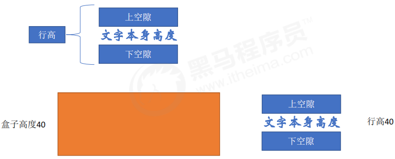

简单理解：行高的上空隙和下空隙把文字挤到中间了。于是如果行高小于盒子高度，文字会偏上；如果行高大于盒子高度，则文字偏下。

## 10. `CSS` 的背景

通过 `CSS` 背景属性，可以给页面元素添加背景样式。
背景属性可以设置背景颜色、背景图片、背景平铺、背景图片位置、背景图像固定等。

### 10.1 背景颜色：`background-color`

`background-color` 属性定义了元素的背景颜色。

```css:no-line-numbers
background-color:颜色值;
```

一般情况下元素背景颜色默认值是 `transparent`（透明），我们也可以手动指定背景颜色为透明色。

```css:no-line-numbers
background-color:transparent;
```

### 10.2 背景图片：`background-image`

`background-image` 属性描述了元素的背景图像。

实际开发常见于 `logo` 或者一些装饰性的小图片或者是超大的背景图片，优点是非常便于控制位置。（精灵图也是一种运用场景）

```css:no-line-numbers
background-image : none | url (url)
```

|**参数值**|**作用**|
|:-|:-|
|`none`|无背景图（默认的）|
|`url`|使用绝对或相对地址指定背景图像|

**注意：** 背景图片后面的地址，千万不要忘记加 `URL`，同时里面的路径不要加引号。

### 10.3 背景平铺：`background-repeat`

如果需要在 `HTML` 页面上对背景图像进行平铺，可以使用 `background-repeat` 属性。

```css:no-line-numbers
background-repeat: repeat | no-repeat | repeat-x | repeat-y
```

|**参数值**|**作用**|
|:-|:-|
|`repeat`|背景图像在纵向和横向上平铺（默认的）|
|`no-repeat`|背景图像不平铺|
|`repeat-x`|背景图像在横向上平铺|
|`repeat-y`|背景图像在纵向平铺|

### 10.4 背景图片位置：`background-position`

利用 `background-position` 属性可以改变图片在背景中的位置。

```css:no-line-numbers
background-position: x y;
```

参数代表的意思是：`x` 坐标和 `y` 坐标。（可以使用 **方位名词** 或者 **精确单位**）

|**参数值**|**说明**|
|:-|:-|
|`length`|百分数，或由浮点数字和单位标识符组成的长度值|
|`position`|`top`、`center`、`bottom`、`left`、`right` 方位名词|

**参数是方位名词时：**

1. 如果指定的两个值都是方位名词，则两个值前后顺序无关，比如 `left` `top` 和 `top` `left` 效果一致。
   
2. 如果只指定了一个方位名词，另一个值省略，则第二个值默认居中对齐。

**参数是精确单位时：**

1. 如果参数值是精确坐标，那么第一个肯定是 `x` 坐标，第二个一定是 `y` 坐标；
   
2. 如果只指定一个数值，那该数值一定是 `x` 坐标，另一个默认垂直居中。

**参数是混合单位时：**

1. 如果指定的两个值是精确单位和方位名词混合使用，则第一个值是 `x` 坐标，第二个值是 `y` 坐标。

### 10.5 背景图像固定（背景附着）：`background-attachment`

`background-attachment` 属性设置背景图像是否固定或者随着页面的其余部分滚动。

`background-attachment` 后期可以制作视差滚动的效果。

```css:no-line-numbers
background-attachment : scroll | fixed
```

|**参数值**|**作用**|
|:-|:-|
|`scroll`|背景图像是随对象内容滚动|
|`fixed`|背景图像固定|

### 10.6 背景复合写法

为了简化背景属性的代码，我们可以将这些属性合并简写在同一个属性 `background` 中，从而节约代码量。

当使用简写属性时，没有特定的书写顺序,一般习惯约定顺序为：

```css:no-line-numbers
background: 背景颜色 背景图片地址 背景平铺 背景图像滚动 背景图片位置;
```

> 这是实际开发中我们更提倡的写法。


### 10.7 背景色半透明

`CSS3` 为我们提供了背景颜色半透明的效果。

```css:no-line-numbers
background: rgba(0, 0, 0, 0.3);
```

**注意：**

1. 最后一个参数是 `alpha` 透明度，取值范围在 `0~1` 之间；
   
2. 我们习惯把 `0.3` 的 `0` 省略掉，写为 `background: rgba(0, 0, 0, .3);`

3. 背景半透明是指盒子背景半透明，盒子里面的内容不受影响；

4. `CSS3` 新增属性，是 `IE9+` 版本浏览器才支持的，但是现在实际开发我们不太关注兼容性写法了，可以放心使用。

### 10.8 背景总结

|**属性**|**作用**|**值**|
|:-|:-|:-|
|`background-color`|背景颜色|预定义的颜色值，或十六进制，或 `RGB` 代码|
|`background-image`|背景图片|`url(图片路径)`|
|`background-repeat`|是否平铺|`repeat`/`no-repeat`/`repeat-x`/`repeat-y`|
|`background-position`|背景位置|`length`/`postion`；分别是 `x` 和 `y` 坐标|
|`background-attachment`|背景附着|`scroll`（背景滚动）/ `fixed`（背景固定）|
|背景简写|书写更简单|`背景颜色 背景图片地址 背景平铺 背景滚动 背景位置;`|
|背景半透明|背景颜色半透明|`background:rgba(0,0,0,0.3);` 后面必须是 `4` 个值|

## 11. `CSS` 的三大特性

`CSS` 有三个非常重要的三个特性：层叠性、继承性、优先级。

### 11.1 层叠性

相同选择器给设置相同的样式，此时一个样式就会覆盖（层叠）另一个冲突的样式。层叠性主要解决样式冲突的问题。

层叠性原则：

1. 样式冲突，遵循的原则是就近原则，哪个样式离结构近，就执行哪个样式；

2. 样式不冲突，不会层叠。

> `CSS` 层叠性口诀：长江后浪推前浪，前浪死在沙滩上。

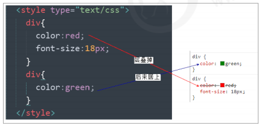

### 11.2 继承性

`CSS` 中的继承：子标签会继承父标签的某些样式，如文本颜色和字号。简单的理解就是：子承父业。

恰当地使用继承可以简化代码，降低 `CSS` 样式的复杂性。

子元素可以继承父元素的样式（`text-`，`font-`，`line-` 这些元素开头的可以继承，以及 `color` 属性）。

> 继承性口诀：龙生龙，凤生凤，老鼠孩子会打洞。

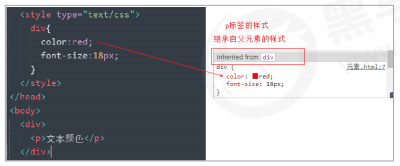

**行高的继承性：**

```css:no-line-numbers
body {
    font:12px/1.5 Microsoft YaHei;
}
```

1. 行高可以跟单位也可以不跟单位；

2. 如果子元素没有设置行高，则会继承父元素的行高为 `1.5`；

3. 此时子元素的行高是：**当前子元素的文字大小 * `1.5`**；

4. `body` 行高 `1.5` 这样写法最大的优势就是里面子元素可以根据自己文字大小自动调整行高。

### 11.3 优先级

当同一个元素指定多个选择器，就会有优先级的产生。

1. 选择器相同，则执行层叠性；

2. 选择器不同，则根据选择器权重执行。

**选择器权重如下表所示：**

|**选择器**|**选择器权重**|
|:-|:-|
|继承或者 `*`|`0,0,0,0`|
|元素（标签）选择器|`0,0,0,1`|
|类选择器，伪类选择器|`0,0,1,0`|
|`ID` 选择器|`0,1,0,0`|
|行内样式 `style=""`|`1,0,0,0`|
|`!important` 重要的|`∞` 无穷大|

**优先级注意点：**

1. 权重是有 `4` 组数字组成，但是不会有进位。
   
2. 可以理解为类选择器永远大于元素选择器，`id` 选择器永远大于类选择器，以此类推；
   
3. 等级判断从左向右，如果某一位数值相同，则判断下一位数值。
   
4. 简单记忆法：通配符和继承权重为 `0`，标签选择器为 `1`，类(伪类)选择器为 `10`，`id` 选择器 `100`，行内样式表为 `1000`，`!important` 无穷大；

5. 继承的权重是 `0`， 如果该元素没有直接选中，不管父元素权重多高，子元素得到的权重都是 `0`。

**权重叠加：** 如果是复合选择器，则会有权重叠加，需要计算权重。

```:no-line-numbers
div ul li  --> 0,0,0,3
.nav ul li --> 0,0,1,2
a:hover    -—> 0,0,1,1
.nav a     --> 0,0,1,1
```

## 12. `CSS` 的注释

注释用于解释代码，它们会被浏览器忽略。`CSS` 中的注释以 "`/*`" 开头，以 "`*/`" 结尾。

```css:no-line-numbers
/* 需要注释的内容 */
```

## 13. 盒子模型（`Box Model`）

页面布局要学习三大核心：盒子模型、浮动、定位。

学习好盒子模型能非常好的帮助我们布局页面。

### 13.1 看透网页布局的本质

**网页布局过程：**

1. 先准备好相关的网页元素，网页元素基本都是盒子（`Box`）；
   
2. 利用 `CSS` 设置好盒子样式，然后摆放到相应位置；
   
3. 往盒子里面装内容。
   
**网页布局的核心本质：** 就是利用 `CSS` 摆盒子。

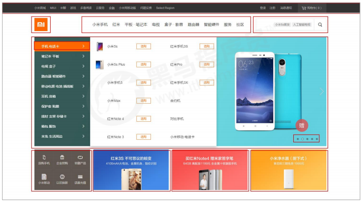

### 13.2 盒子模型的组成

所谓盒子模型：就是把 `HTML` 页面中的布局元素看作是一个矩形的盒子，也就是一个盛装内容的容器。

`CSS` 盒子模型本质上是一个盒子封装周围的 `HTML` 元素，盒子包括：边框、外边距、内边距、和实际内容。

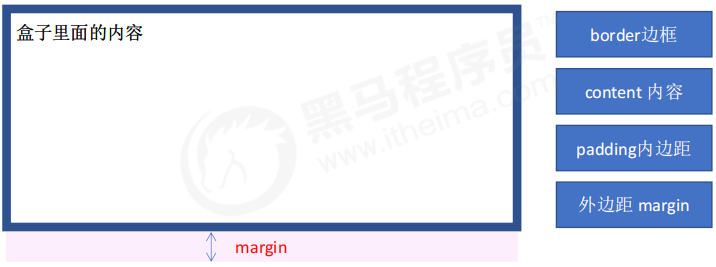

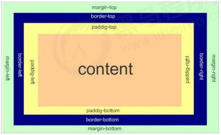

#### 13.2.1 边框：`border`

`border` 可以设置元素的边框。

**边框有三部分组成：** 边框宽度（粗细）、边框样式、边框颜色。

**语法：**

```css:no-line-numbers
border : border-width || border-style || border-color
```

|**属性**|**作用**|
|:-|:-|
|`border-width`|定义边框粗细，单位是 `px`|
|`border-style`|边框的样式|
|`border-color`|边框颜色|

**边框样式 `border-style` 可以设置如下值：**

1. `none`：没有边框即忽略所有边框的宽度（默认值）；

2. `solid`：边框为单实线（最为常用的）；

3. `dashed`：边框为虚线；

4. `dotted`：边框为点线。

**边框简写：**

```css:no-line-numbers
border: 1px solid red; /* 没有顺序 */
```

**边框分开写法：**

```css:no-line-numbers
border-top: 1px solid red; /* 只设定上边框，其余同理 */
```

##### 13.2.1.1 表格的细线边框：`border-collapse`

`border-collapse` 属性控制浏览器绘制表格边框的方式。它控制相邻单元格的边框。

**语法：**

```css:no-line-numbers
border-collapse:collapse;
```

1. `collapse` 单词是合并的意思。
   
2. `border-collapse: collapse;` 表示相邻边框合并在一起。

##### 13.2.1.2 边框会影响盒子的实际大小

边框会额外增加盒子的实际大小。因此我们有两种方案解决：

1. 测量盒子大小的时候不量边框；
   
2. 如果测量的时候包含了边框，则需要 `width`/`height` 减去边框宽度。

#### 13.2.2 内边距：`padding`

`padding` 属性用于设置内边距，即边框与内容之间的距离。

|**属性**|**作用**|
|:-|:-|
|`padding-left`|左内边距|
|`padding-right`|右内边距|
|`padding-top`|上内边距|
|`padding-bottom`|下内边距|

**`padding` 属性（简写属性）可以有一到四个值：**

|**值的个数**|**表达意思**|
|:-|:-|
|`padding:5px;`|`1` 个值，代表上下左右都有 `5` 像素内边距|
|`padding:5px 10px;`|`2` 个值，代表上下内边距是 `5` 像素，左右内边距是 `10` 像素|
|`padding:5px 10px 20px;`|`3` 个值，代表上内边距 `5` 像素，左右内边距 `10` 像素，下内边距 `20` 像素|
|`padding:5px 10px 20px 30px;`|`4` 个值，上是 `5` 像素，右 `10` 像素，下 `20` 像素，左 `30` 像素。（顺时针）|

**当我们给盒子指定 `padding` 值之后，发生了 `2` 件事情：**

1. 内容和边框有了距离，添加了内边距；
   
2. `padding` 影响了盒子实际大小。

也就是说，如果盒子已经有了宽度和高度，此时再指定内边距，会撑大盒子。

> 如何盒子本身没有指定 `width`/`height` 属性, 则此时 `padding` 不会撑开盒子大小.

**解决方案：**

如果保证盒子跟效果图大小保持一致，则让 `width`/`height` 减去多出来的内边距大小即可。

#### 13.2.3 外边距：`margin`

`margin` 属性用于设置外边距，即控制盒子和盒子之间的距离。

|**属性**|**作用**|
|:-|:-|
|`margin-left`|左外边距|
|`margin-right`|右外边距|
|`margin-top`|上外边距|
|`margin-bottom`|下外边距|

> `margin` 简写方式代表的意义跟 `padding` 完全一致。

##### 13.2.3.1 外边距的典型应用

外边距可以让块级盒子水平居中，但是必须满足两个条件：

1. 盒子必须指定了宽度（`width`）；
   
2. 盒子左右的外边距都设置为 `auto`。

```css:no-line-numbers
.header{ width:960px; margin:0 auto;}
```

**常见的写法，以下三种都可以：**

1. `margin-left: auto; margin-right: auto;`

2. `margin: auto;`

3. `margin: 0 auto;`

**注意：**

以上方法是让块级元素水平居中，行内元素或者行内块元素水平居中给其父元素添加 `text-align:center` 即可。

##### 13.2.3.2 外边距合并

使用 `margin` 定义块元素的垂直外边距时，可能会出现外边距的合并。主要有两种情况：

1. 相邻块元素垂直外边距的合并；
   
2. 嵌套块元素垂直外边距的塌陷。

###### 13.2.3.2.1 相邻块元素垂直外边距的合并

当上下相邻的两个块元素（兄弟关系）相遇时，如果上面的元素有下外边距 `margin-bottom`，下面的元素有上外边距 `margin-top`，

则他们之间的垂直间距不是` margin-bottom` 与 `margin-top` 之和，而是取两个值中的较大者。

这种现象被称为相邻块元素垂直外边距的合并。

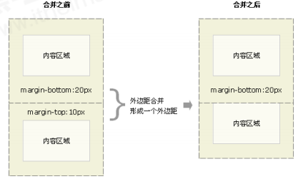

**解决方案：**

尽量只给一个盒子添加 `margin` 值。

###### 13.2.3.2.2 嵌套块元素垂直外边距的塌陷

对于两个嵌套关系（父子关系）的块元素，父元素有上外边距，同时子元素也有上外边距。此时，父元素会塌陷较大的外边距值。

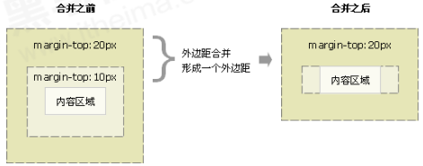

解决方案：

1. 可以为父元素定义上边框；

2. 可以为父元素定义上内边距；

3. 可以为父元素添加 `overflow:hidden`。

> 还有其他方法，比如浮动、固定，绝对定位的盒子不会有塌陷问题。后面咱们再总结。

### 13.3 清除内外边距

网页元素很多都带有默认的内外边距，而且不同浏览器默认的也不一致。

因此我们在布局前，首先要清除下网页元素的内外边距。

```css:no-line-numbers
* {
    padding:0; /* 清除内边距 */
    margin:0; /* 清除外边距 */
}
```

**注意：**

行内元素为了照顾兼容性，尽量只设置左右内外边距，不要设置上下内外边距。

但是转换为块级和行内块元素就可以了。

## 14. `PS` 基本操作

因为网页美工大部分效果图都是利用 `PS`（`Photoshop`）来做的，所以以后我们大部分切图工作都是在 `PS` 里面完成。

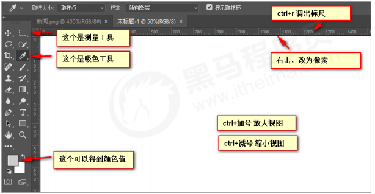

1. 文件 -> 打开：可以打开我们要测量的图片；

2. 视图 -> 标尺（`Ctrl R`）：可以打开标尺；

3. 右击标尺，把里面的单位改为像素；

4. `Ctrl +` 可以放大视图，`Ctrl -` 可以缩小视图；

5. 按住空格键，鼠标可以变成小手，拖动 `PS` 视图；

6. 用选区拖动 可以测量大小；

7. `Ctrl D` 可以取消选区，或者在旁边空白处点击一下也可以取消选区。

## 15. 综合案例

### 15.1 `FAQ`

#### 15.1.1 布局为啥用不同盒子，我只想用 `div`？

```:no-line-numbers
标签都是有语义的，合理的地方用合理的标签。比如产品标题就用 h，大量文字段落就用 p。
```

#### 15.1.2 为啥用那么多类名？

```:no-line-numbers
类名就是给每个盒子起了一个名字，可以更好的找到这个盒子，选取盒子更容易，后期维护也方便。
```

#### 15.1.3 到底用 `margin` 还是 `padding`？

```:no-line-numbers
大部分情况两个可以混用，两者各有优缺点，但是根据实际情况，总是有更简单的方法实现。
```

### 15.2 小技巧：去掉 `li` 前面的项目符号（小圆点）

```css:no-line-numbers
list-style: none;
```

## 16. 圆角边框：`border-radius`

在 `CSS3` 中，新增了圆角边框样式，这样我们的盒子就可以变圆角了。

`border-radius` 属性用于设置元素的外边框圆角。

**语法：**

```css:no-line-numbers
border-radius: length;
```

**注意点：**

1. 参数值可以为数值或百分比的形式；

2. 如果是正方形，想要设置为一个圆，把数值修改为高度或者宽度的一半即可，或者直接写为 `50%`；

3. 该属性是一个简写属性，可以跟四个值，分别代表左上角、右上角、右下角、左下角；

4. 分开写：`border-top-left-radius`、`border-top-right-radius`、`border-bottom-right-radius` 和 `border-bottom-left-radius`；

5. 兼容性 `ie9+` 浏览器支持，但是不会影响页面布局，可以放心使用。

## 17. 盒子阴影：`box-shadow`

`CSS3` 中新增了盒子阴影，我们可以使用 `box-shadow` 属性为盒子添加阴影。

**语法：**

```css:no-line-numbers
box-shadow: h-shadow v-shadow blur spread color inset;
```

|**值**|**描述**|
|:-|:-|
|`h-shadow`|必需。水平阴影的位置。允许负值。|
|`v-shadow`|必需。垂直阴影的位置。允许负值。|
|`blur`|可选。模糊距离。|
|`spread`|可选。阴影的尺寸。|
|`color`|可选。阴影的颜色。请参阅 `CSS` 颜色值。|
|`inset`|可选。将外部阴影（`outset`）改为内部阴影。|

**注意：**

1. 默认的是外阴影（`outset`），但是不可以写这个单词，否则造成阴影无效；
   
2. 盒子阴影不占用空间，不会影响其他盒子排列。

## 18. 文字阴影：`text-shadow`

在 `CSS3` 中，我们可以使用 `text-shadow` 属性将阴影应用于文本。

**语法：**

```css:no-line-numbers
text-shadow: h-shadow v-shadow blur color;
```

|**值**|**描述**|
|:-|:-|
|`h-shadow`|必需。水平阴影的位置。允许负值。|
|`v-shadow`|必需。垂直阴影的位置。允许负值。|
|`blur`|可选。模糊距离。|
|`color`|可选。阴影的颜色。请参阅 `CSS` 颜色值。|

## 19. 浮动

### 19.1 网页的三种传统布局方式：标准流、浮动、定位

网页布局的本质 —— 用 `CSS` 来摆放盒子。

`CSS` 提供了三种传统布局方式（简单说，就是提供了三种摆放盒子的方式）：

1. 标准流（普通流）；

2. 浮动；

3. 定位；

**注意：** 实际开发中，一个页面基本都包含了这三种布局方式（后面移动端学习新的布局方式）。

### 19.2 标准流（普通流/文档流）

所谓的标准流：就是标签按照规定好默认方式排列，其中：

1. 块级元素会独占一行，从上向下顺序排列。

    ```:no-line-numbers
    常用元素：div、hr、p、h1~h6、ul、ol、dl、form、table
    ```

2. 行内元素会按照顺序，从左到右顺序排列，碰到父元素边缘则自动换行。

    ```:no-line-numbers
    常用元素：span、a、i、em 等
    ```

以上都是标准流布局，我们前面学习的就是标准流，**标准流是最基本的布局方式**。

### 19.3 为什么需要浮动？

#### 19.3.1 思考两个问题：

##### 19.3.1.1 如何让多个块级盒子（`div`）水平排列成一行？

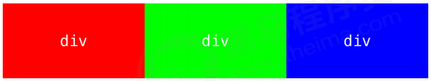

比较难，虽然转换为行内块元素可以实现一行显示，但是他们之间会有大的空白缝隙，很难控制。

##### 19.3.1.2 如何实现两个盒子的左右对齐？

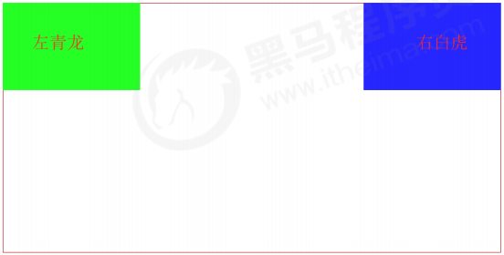

**总结：** 有很多的布局效果，标准流没有办法完成，此时就可以利用浮动完成布局。因为浮动可以改变元素标签默认的排列方式。

#### 19.3.2 浮动最典型的应用：让多个块级元素在一行内排列显示

#### 19.3.3 网页布局第一准则：多个块级元素纵向排列找标准流，多个块级元素横向排列找浮动

### 19.4 什么是浮动？（浮动属性：`float`）

`float` 属性用于创建浮动框，将其移动到一边，直到左边缘或右边缘触及包含块或另一个浮动框的边缘。

**语法：**

```:no-line-numbers
选择器 { float: 属性值; }
```

|**属性值**|**描述**|
|:-|:-|
|`none`|元素不浮动（默认）|
|`left`|元素向左浮动|
|`right`|元素向右浮动|

### 19.5 浮动特性

#### 19.5.1 浮动元素会脱离标准流（脱标），且不再保留原先的位置

设置了浮动（`float`）的元素会脱离标准流的控制（浮），移动到指定位置（动）。即：俗称脱标。

浮动的盒子不再保留原先的位置。

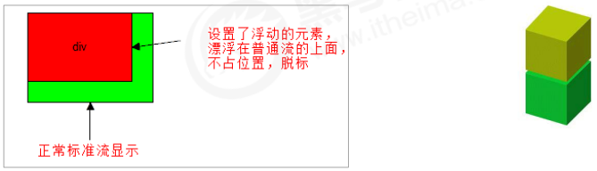

#### 19.5.2 浮动的元素会一行内显示并且元素顶部对齐

如果多个盒子都设置了浮动，则它们会按照属性值在一行内显示，并且顶端对齐排列。

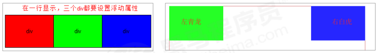

**注意：** 浮动的元素是互相贴靠在一起的（不会有缝隙）。如果父级宽度装不下这些浮动的盒子，多出的盒子会另起一行对齐。

#### 19.5.3 浮动的元素会具有行内块元素的特性

任何元素都可以浮动。不管原先是什么模式的元素，添加浮动之后具有行内块元素相似的特性，即：

1. 如果块级盒子没有设置宽度，默认宽度和父级一样宽，但是添加浮动后，它的大小根据内容来决定；

2. 浮动的盒子中间是没有缝隙的，是紧挨着一起的；
   
3. 行内元素同理。

### 19.6 浮动布局注意点

#### 19.6.1 浮动元素经常和标准流的父盒子搭配使用

为了约束浮动元素位置, 我们网页布局一般采取的策略是：

```:no-line-numbers
先用标准流的父元素排列上下位置，之后内部子元素采取浮动排列左右位置。
```

> 该策略符合 [网页布局第一准则](#_19-3-3-网页布局第一准则-多个块级元素纵向排列找标准流-多个块级元素横向排列找浮动)。

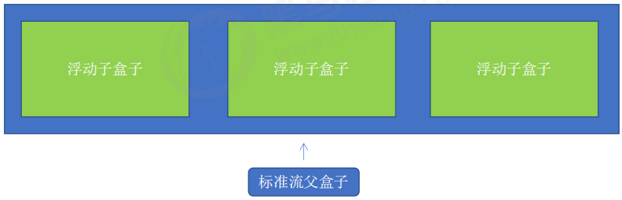

#### 19.6.2 网页布局第二准则：先设置盒子的大小，之后设置盒子的位置

#### 19.6.3 一个元素浮动了，理论上其余的兄弟元素也要浮动

一个盒子里面有多个子盒子，如果其中一个盒子浮动了，那么其他兄弟也应该浮动，以防止引起问题。

#### 19.6.4 浮动的盒子只会影响浮动盒子后面的标准流，不会影响前面的标准流

## 20. 常见网页布局

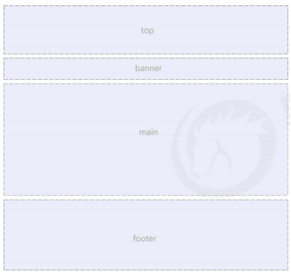

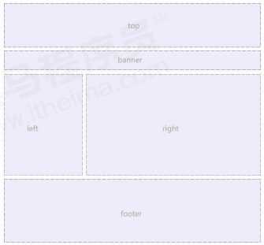

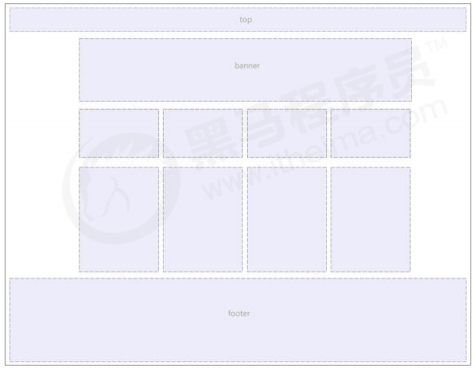

## 21. 清除浮动

### 21.1 思考：浮动元素的标准流父盒子必须有高度吗？

我们前面浮动元素有一个标准流的父元素，他们有一个共同的特点：都是有高度的。

但是，所有的父盒子都必须有高度吗？

理想中的状态：让子盒子撑开父亲。即：有多少孩子，父盒子就有多高。

但是不给父盒子高度会有问题吗？

### 21.2 为什么需要清除浮动？

由于父级盒子很多情况下，不方便给高度，但是子盒子浮动又不占有位置，最后父级盒子高度为 `0` 时，就会影响下面的标准流盒子。

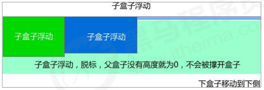

> 由于浮动元素不再占用原文档流的位置，所以它会对后面的元素排版产生影响。

### 21.3 清除浮动的本质：清除浮动元素脱离标准流造成的影响

清除浮动的本质是清除浮动元素造成的影响。

清除浮动之后，父级就会根据浮动的子盒子自动检测高度。父级有了高度，就不会影响下面的标准流了。

**注意：** 如果父盒子本身有高度，则不需要清除浮动。

### 21.4 清除浮动的策略：闭合浮动

清除浮动策略是闭合浮动。即：只让浮动在父盒子内部影响，不影响父盒子外面的其他盒子。

### 21.4 清除浮动的语法属性：`clear`

**语法：**

```:no-line-numbers
选择器 { clear: 属性值; }
```

|**属性值**|**描述**|
|:-|:-|
|`left`|不允许左侧有浮动元素（清除左侧浮动的影响）|
|`right`|不允许右侧有浮动元素（清除右侧浮动的影响）|
|`both`|同时清除左右两侧浮动的影响|

我们实际工作中，几乎只用 `clear: both;`

### 21.5 清除浮动的方法

#### 21.5.1 额外标签法

额外标签法也称为隔墙法，是 `W3C` 推荐的做法。

> 实际工作中可能会遇到，但是不常用。

额外标签法就是在最后一个浮动的子元素后面添加一个额外的空标签，在空标签中添加清除浮动样式。

例如 `<div style="clear:both"></div>`，或者其他标签（如 `<br/>` 等）。

**优点：** 通俗易懂，书写方便。

**缺点：** 添加许多无意义的标签，结构化较差。

**注意：** **要求这个新的空标签必须是块级元素**。

#### 21.5.2 父级添加 `overflow` 属性

可以给父级添加 `overflow` 属性，将其属性值设置为 `hidden`、`auto` 或 `scroll`。

> 注意是给父元素添加 `overflow` 属性。

**优点：** 代码简洁。

**缺点：** 无法显示溢出的部分。

#### 21.5.3 父级添加 `:after` 伪元素

`:after` 方式是额外标签法的升级版。**也是给父元素添加**。

```css:no-line-numbers
.clearfix:after { 
    content: ""; 
    display: block; 
    height: 0; 
    clear: both; 
    visibility: hidden; 
} 

.clearfix { /* IE6、7 专有 */ 
    *zoom: 1;
}
```

**优点：** 没有增加标签，结构更简单。

**缺点：** 照顾低版本浏览器。

代表网站：百度、淘宝网、网易等。

#### 21.5.4 父级添加 `:before`、`:after` 双伪元素

**也是给给父元素添加**。

```css:no-line-numbers
.clearfix:before,.clearfix:after {
    content:"";
    display:table; 
}

.clearfix:after {
    clear:both; 
}

.clearfix {
    *zoom:1;
}
```

**优点：** 代码更简洁、

**缺点：** 照顾低版本浏览器。

代表网站：小米、腾讯等。

### 21.6 清除浮动总结

**为什么需要清除浮动？**

由于父级没高度，当子盒子浮动后，就会影响下面的布局，因此需要清除浮动。

**清除浮动的方式如下：**

|**方式**|**优点**|**缺点**|
|:-|:-|:-|
|额外标签法（隔墙法）|通俗易懂，书写方便|添加许多无意义的标签，结构化较差。|
|父级 `overflow:hidden;`|书写简单|溢出隐藏|
|父级 `:after` 伪元素|结构语义化正确|由于 `IE6`、`IE7` 不支持 `:after`，因此存在兼容性问题|
|父级双伪元素|结构语义化正确|由于 `IE6`、`IE7` 不支持 `:after`，因此存在兼容性问题|

## 22. `PS` 切图

### 22.1 常见的图片格式：`jpg`、`gif`、`png`、`psd`

1. `jpg` 图像格式

    ```:no-line-numbers
    JPEG（.JPG）对色彩的信息保留较好，高清，颜色较多，我们产品类的图片经常用 jpg 格式的。
    ```

2. `gif` 图像格式

    ```:no-line-numbers
    GIF 格式最多只能储存 256 色，所以通常用来显示简单图形及字体，但是可以保存透明背景和动画效果。
    实际经常用于一些图片小动画效果。
    ```

3. `png` 图像格式

    ```:no-line-numbers
    PNG 格式是一种新兴的网络图形格式，结合了 GIF 和 JPEG 的优点，具有存储形式丰富的特点，能够保持透明背景。
    如果想要切成背景透明的图片，请选择 png 格式。
    ```

4. `psd` 图像格式

    ```:no-line-numbers
    PSD 格式是 Photoshop 的专用格式，里面可以存放图层、通道、遮罩等多种设计稿。
    对前端人员来说，最大的优点是：我们可以直接从上面复制文字、获得图片、还可以测量大小和距离。
    ```

### 22.2 `PS` 的切图方式

`PS` 有很多的切图方式：图层切图、切片切图、`PS` 插件切图等。

#### 22.2.1 图层切图

最简单的切图方式：右击图层 -> 快速导出为 `PNG`。

但是很多情况下，我们需要合并图层再导出：

1. 选中需要的图层：图层菜单 -> 合并图层（`Ctrl+E`）
   
2. 右击 -> 快速导出为 `PNG`

#### 22.2.2 切片切图

1. 利用切片选中图片。

    ```:no-line-numbers
    利用切片工具手动划出
    ```

2. 导出选中的图片

    ```:no-line-numbers
    文件菜单 -> 导出 -> 存储为 web 设备所用格式 -> 选择我们要的图片格式 -> 存储
    ```

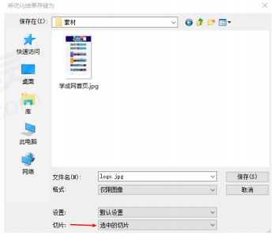

#### 22.2.3 `PS` 插件切图

`Cutterman` 是一款运行在 `Photoshop` 中的插件，能够自动将你需要的图层进行输出，以替代传统的手工 “导出 `web` 所用格式” 以及使用切片工具进行挨个切图的繁琐流程。

官网：[http://www.cutterman.cn/zh/cutterman](http://www.cutterman.cn/zh/cutterman)

**注意：** `Cutterman` 插件要求你的 `PS` 必须是完整版，不能是绿色版，所以大家需要安装完整版本。

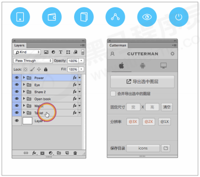

## 23. 学成在线案例


### 23.1 准备素材和工具

1. 学成在线 `PSD` 源文件。
   
2. 开发工具 = `PS`（切图）/ `cutterman` 插件 + `vscode`（代码）+ `chrome`（测试）

### 23.2 案例准备工作

采取结构与样式相分离思想：

1. 创建 `study` 目录文件夹（用于存放我们这个页面的相关内容）；

2. 用 `vscode` 打开 `study` 目录文件夹；
   
3. `study` 目录内新建 `images` 文件夹，用于保存图片；
   
4. 新建首页文件 `index.html`（以后我们的网站首页统一规定为 `index.html`）； 
   
5. 新建 `style.css` 样式文件（采用外链样式表）；
    
6. 将样式引入到我们的 `HTML` 页面文件中； 
   
7. 样式表写入清除内外边距的样式，来检测样式表是否引入成功。

### 23.3 `CSS` 属性书写顺序

建议遵循以下顺序：

1. 布局定位属性：`display` / `position` / `float` / `clear` / `visibility` / `overflow`（建议 `display` 第一个写，毕竟关系到模式）

2. 自身属性：`width` / `height` / `margin` / `padding` / `border` / `background`

3. 文本属性：`color` / `font` / `text-decoration` / `text-align` / `vertical-align` / `white- space` / `break-word`

4. 其他属性（`CSS3`）：`content` / `cursor` / `border-radius` / `box-shadow` / `text-shadow` / `background:linear-gradient` ...

```css:no-line-numbers
.jdc {
    display: block;
    position: relative;
    float: left;
    width: 100px;
    height: 100px;
    margin: 0 10px;
    padding: 20px 0;
    font-family: Arial, 'Helvetica Neue', Helvetica, sans-serif;
    color: #333;
    background: rgba(0,0,0,.5);
    border-radius: 10px;
}
```

### 23.4 页面布局整体思路

为了提高网页制作的效率，布局时通常有以下的布局流程：

1. 必须确定页面的版心（可视区），我们测量可得知。

2. 分析页面中的行模块，以及每个行模块中的列模块。即：网页布局第一准则。

3. 一行中的列模块经常浮动布局，先确定每个列的大小，之后确定列的位置。即：网页布局第二准则。

4. 制作 `HTML` 结构。我们还是遵循：先有结构，后有样式的原则。结构永远最重要。

5. 所以，先理清楚布局结构，再写代码尤为重要。这需要我们多写多积累。