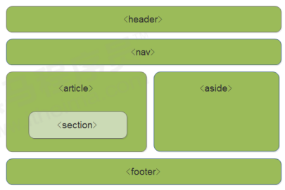
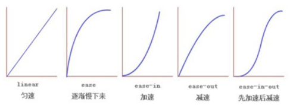

> 相关案例：[前端基础 HTML5+CSS3](https://github.com/zengkaiqiang562/JavaGuide-Demo/tree/main/docs/zkq/web/_1_web-dev-basic/_3_html5_css3/10-HTML5%2BCSS3)

## 1. `HTML5` 的新特性

`HTML5` 的新增特性主要是针对于以前的不足，增加了一些新的标签、新的表单和新的表单属性等。

这些新特性都有兼容性问题，基本是 `IE9+` 以上版本的浏览器才支持，如果不考虑兼容性问题，可以大量使用这些新特性。

**声明：**

1. 新特性增加了很多，但是我们专注于开发常用的新特性。

2. 本章讲解部分新特性，[`HTML5+CSS3` 进阶](/zkq/web/_2_mobile_web_dev/_1_html5_css3_advance.html#_1-html5-的新特性)中还会继续讲解其他新特性。

### 1.1 `HTML5` 新增的语义化标签

以前布局，我们基本用 `div` 来做。`div` 对于搜索引擎来说，是没有语义的。

```html:no-line-numbers
<div class="header"> </div>
<div class="nav"> </div>
<div class="content"> </div>
<div class="footer"> </div>
```

`HTML5` 新增的语义化标签：

```:no-line-numbers
<header>：  头部标签
<nav>：     导航标签
<article>： 内容标签
<section>： 定义文档某个区域
<aside>：   侧边栏标签
<footer>：  尾部标签
```



**注意：**

1. 这种语义化标准主要是针对搜索引擎的；

2. 这些新标签页面中可以使用多次；

3. 在 `IE9` 中，需要把这些元素转换为块级元素；

4. 其实，我们移动端更喜欢使用这些标签；

5. `HTML5` 还增加了很多其他标签，我们后面再慢慢学。

### 1.2 `HTML5` 新增的多媒体标签

新增的多媒体标签主要包含两个：

1. 视频：`<video>`
   
2. 音频：`<audio> `

使用它们可以很方便的在页面中嵌入音频和视频，而不再去使用 `flash` 和其他浏览器插件。

#### 1.2.1 视频：`<video>`

`HTML5` 在不使用插件的情况下，也可以原生的支持视频格式文件的播放，当然，支持的格式是有限的。

当前 `<video>` 元素支持 `MP4`、`WebM`、`Ogg` 三种视频格式（**尽量使用 `mp4` 格式**）： 

|**浏览器**|`MP4`|`WebM`|`Ogg`|
|:-|:-|:-|:-|
|`Internet Explorer`|`YES`|`NO`|`NO`|
|`Chrome`|`YES`|`YES`|`YES`|
|`Firefox`|`YES`（从 `Firefox` `21` 版本开始，`Linux` 系统从 `Firefox` `30` 开始）|`YES`|`YES`|
|`Safari`|`YES`|`NO`|`NO`|
|`Opera`|`YES`（从 `Opera` `23` 开始）|`YES`|`YES`|

**语法：**

```html:no-line-numbers
<video src="文件地址" controls="controls"></video>
```

**示例：**

```html:no-line-numbers
<video controls="controls" width="300">
    <source src="move.ogg" type="video/ogg" >
    <source src="move.mp4" type="video/mp4" >
    您的浏览器暂不支持 <video> 标签播放视频
</video >
```

**常见属性：**

|**属性**|**值**|**描述**|
|:-|:-|:-|
|`autoplay`|`autoplay`|视频就绪自动播放（谷歌浏览器需要添加 `muted` 来解决自动播放问题）|
|`controls`|`controls`|向用户显示播放控件|
|`width`|`pixels`（像素）|设置播放器宽度|
|`height`|`pixels`（像素）|设置播放器高度|
|`loop`|`loop`|播放完是否继续播放该视频（即循环播放）|
|`preload`|`auto`（预先加载视频）、`none`（不预先加载视频）|规定是否预加载视频（如果有了 `autoplay` 就忽略该属性）|
|`src`|`url`|视频 `url` 地址|
|`poster`|`imgurl`|加载等待的画面图片|
|`muted`|`muted`|静音播放|

#### 1.2.2 音频：`<audio> `

`HTML5` 在不使用插件的情况下，也可以原生的支持音频格式文件的播放，当然，支持的格式是有限的。

当前 `<audio>` 元素支持 `MP3`、`Wav`、`Ogg` 三种音频格式：

|**浏览器**|`MP3`|`Wav`|`Ogg`|
|:-|:-|:-|:-|
|`Internet Explorer`|`YES`|`NO`|`NO`|
|`Chrome`|`YES`|`YES`|`YES`|
|`Firefox`|`YES`|`YES`|`YES`|
|`Safari`|`YES`|`YES`|`NO`|
|`Opera`|`YES`|`YES`|`YES`|

**语法：**

```html:no-line-numbers
<audio src="文件地址" controls="controls"></audio>
```

**示例：**

```html:no-line-numbers
<audio controls="controls" >
    <source src="happy.mp3" type="audio/mpeg" >
    <source src="happy.ogg" type="audio/ogg" >
    您的浏览器暂不支持 <audio> 标签。
</audio>
```

**常见属性：**

|**属性**|**值**|**描述**|
|:-|:-|:-|
|`autoplay`|`autoplay`|如果出现该属性，则音频在就绪后马上播放|
|`controls`|`controls`|如果出现该属性，则向用户显示控件，比如播放按钮|
|`loop`|`loop`|如果出现该属性，则每当音频结束时重新开始播放|
|`src`|`url`|要播放的音频的 `URL`|

> 注意：谷歌浏览器把音频和视频自动播放禁止了。

#### 1.2.3 总结

1. 音频标签和视频标签使用方式基本一致；

2. 浏览器支持情况不同；

3. 谷歌浏览器把音频和视频自动播放禁止了；

4. 我们可以给视频标签添加 `muted` 属性来静音播放视频，音频不可以（可以通过 `JavaScript` 解决）；

5. 视频标签是重点，我们经常设置自动播放，不使用 `controls` 控件，循环和设置大小属性。

### 1.3 `HTML5` 新增的 `input` 类型

|**属性**|**说明**|
|:-|:-|
|`type="email"`|限制用户输入必须为 `Email` 类型|
|`type="url"`|限制用户输入必须为 `URL` 类型|
|`type="date"`|限制用户输入必须为日期类型|
|`type="time"`|限制用户输入必须为时间类型|
|`type="month"`|限制用户输入必须为月类型|
|`type="week"`|限制用户输入必须为周类型|
|`type="number"`|限制用户输入必须为数字类型|
|`type="tel"`|手机号码|
|`type="search"`|搜索框|
|`type="color"`|生成一个颜色选择表单|

> 重点记住：`number`、`tel`、`search` 这三个。

### 1.4 `HTML5` 新增的表单属性

|**属性**|**值**|**说明**|
|:-|:-|:-|
|`required`|`required`|表单拥有该属性表示其内容不能为空，必填|
|`placeholder`|提示文本|表单的提示信息，存在默认值将不显示|
|`autofocus`|`autofocus`|自动聚焦属性，页面加载完成自动聚焦到指定表单|
|`autocomplete`|`off`、`on`|当用户在字段开始键入时，浏览器基于之前键入过的值，应该显示出字段中填写的选项。默认已经打开。需要放在表单内，同时加上 `name` 属性，同时成功提交。|
|`multiple`|`multiple`|可以多选文件提交|

可以通过以下设置方式修改 `placeholder` 里面的字体颜色

```css:no-line-numbers
input::placeholder {
    color: pink;
}
```

## 2. CSS3 的新特性

### 2.1 `CSS3` 的现状

1. 新增的 `CSS3` 特性有兼容性问题，`ie9+` 才支持；

2. 移动端支持优于 `PC` 端；

3. 不断改进中；

4. 应用相对广泛；

5. 现阶段主要学习：新增选择器和盒子模型以及其他特性。

### 2.2 `CSS3` 新增的选择器

`CSS3` 给我们新增了选择器，可以更加便捷，更加自由的选择目标元素。

1. 属性选择器
   
2. 结构伪类选择器
   
3. 伪元素选择器

#### 2.2.1 属性选择器

属性选择器可以根据元素特定属性的来选择元素。这样就可以不用借助于类或者 `id` 选择器。

|**选择符**|**简介**|
|:-|:-|
|`E[att]`|选择具有 `att` 属性的 `E` 元素|
|`E[att="val"]`|选择具有 `att` 属性且属性值等于 `val` 的 `E` 元素|
|`E[att^="val"]`|匹配具有 `att` 属性且值以 `val` 开头的 `E` 元素|
|`E[att$="val"]`|匹配具有 `att` 属性且值以 `val` 结尾的 `E` 元素|
|`E[att*="val"]`|匹配具有 `att` 属性且值中含有 `val` 的 `E` 元素|

> 注意：类选择器、属性选择器、伪类选择器，权重为 `10`。

#### 2.2.2 结构伪类选择器

结构伪类选择器主要根据文档结构来选择器元素，常用于根据父级选择器里面的子元素。

|**选择符**|**简介**|
|:-|:-|
|`E:first-child`|匹配父元素中的第一个子元素 `E`|
|`E:last-child`|匹配父元素中最后一个 `E` 元素|
|`E:nth-child(n)`|匹配父元素中的第 `n` 个子元素 `E`|
|`E:first-of-type`|指定类型 `E` 的第一个|
|`E:last-of-type`|指定类型 `E` 的最后一个|
|`E:nth-of-type(n)`|指定类型 `E` 的第 `n` 个|

> 注意：类选择器、属性选择器、伪类选择器，权重为 `10`。

##### 2.2.2.1 选择某个父元素的一个或多个特定的子元素 `E:nth-child(n)`

`E:nth-child(n)` 用于选择某个父元素的一个或多个特定的子元素 `E`，其中：

- `n` 可以是数字，关键字和公式；
  
- `n` 如果是数字，就是选择第 `n` 个子元素，如 `E:nth-child(1)` 表示选择第 1 个子元素（**即 `n` 从 1 开始**）；
  
- `n` 可以是关键字：`even` 偶数，`odd` 奇数；
  
- `n` 可以是公式：常见的公式如下（**如果 `n` 是公式，则 `n` 从 0 开始**，但是第 0 个元素或者超出了元素的个数会被忽略）。

|**公式**|**取值**|
|:-|:-|
|`2n`|偶数|
|`2n+1`|奇数|
|`5n`|5, 10, 15, ...|
|`n+5`|从第 5 个开始（包含第 5 个）到最后|
|`-n+5`|前 5 个（包含第 5 个）|

###### 2.2.2.2 `E:nth-child(n)` 和 `E:nth-of-type(n)` 的区别

```:no-line-numbers
E:nth-child(n) 对父元素里面所有子元素排序选择（序号是固定的），先找到第 n 个子元素，然后看看是否和 E 匹配。
E:nth-of-type(n) 对父元素里面指定子元素进行排序选择。先去匹配 E，然后再根据 E 找第 n 个子元素。
```

#### 2.2.3 伪元素选择器

伪元素选择器可以帮助我们利用 `CSS` 创建新标签元素，而不需要 `HTML` 标签，从而简化 `HTML` 结构。

|**选择符**|**简介**|
|:-|:-|
|`::before`|在元素内容的前面插入内容|
|`::after`|在元素内容的后面插入内容|

**注意：**

```:no-line-numbers
- before 和 after 创建一个元素，但是属于行内元素
- 新创建的这个元素在文档树中是找不到的，所以我们称为伪元素
- 语法：element::before {} 
- before 和 after 必须有 content 属性
- before 在父元素内容的前面创建元素，after 在父元素内容的后面插入元素
- 伪元素选择器和标签选择器一样，权重为 1
```

### 2.3 `CSS3` 盒子模型

`CSS3` 中可以通过 `box-sizing` 属性来指定盒模型，这样我们计算盒子大小的方式就发生了改变。

> `box-sizing` 属性有2个值：`content-box` 和 `border-box`。
> 1. `box-sizing: content-box` 盒子大小为 `width + padding + border`（以前默认的）
> 2. `box-sizing: border-box`  盒子大小为 `width` 

注意：如果盒子模型我们改为了 `box-sizing: border-box`，那 `padding` 和 `border` 就不会撑大盒子了（前提 `padding` 和 `border` 不会超过 `width` 宽度）

### 2.4 `CSS3` 其他特性

#### 2.4.1 `CSS3` 滤镜：`filter`（图片变模糊）

`filter` 属性可以将模糊或颜色偏移等图形效果应用于元素。

**用法：**

```:no-line-numbers
filter: 函数();
```

**示例：**
```css:no-line-numbers
/* blur 函数用于模糊处理，数值越大越模糊 */
filter: blur(5px);     
```


#### 2.4.2 `CSS3` 提供的 `calc` 函数（计算盒子宽度）

`calc()` 函数让你在声明属性值时执行一些计算。

**示例：**

```css:no-line-numbers
width: calc(100% - 80px);
```

> 括号里面可以使用 `+ - *  /` 来进行计算。

### 2.5 `CSS3` 过渡

过渡（`transition`）是 `CSS3` 中具有颠覆性的特征之一，我们可以在不使用 `Flash` 动画或 `JavaScript` 的情况下，当元素从一种样式变换为另一种样式时为元素添加效果。

过渡动画就是从一个状态渐渐的过渡到另外一个状态，可以让我们页面更好看，更动感十足。虽然低版本浏览器不支持（`ie9` 以下版本）但是不会影响页面布局。

> 过渡动画经常和 `:hover` 一起搭配使用。

**语法：**

```css:no-line-numbers
transition: 要过渡的属性  花费时间  运动曲线  何时开始;
```

```:no-line-numbers
1. 属性：     想要变化的 css 属性，宽度高度背景颜色内外边距都可以。如果想要所有的属性都变化过渡，写一个 all 就可以。 
2. 花费时间： 单位是秒（必须写单位），比如 0.5s  
3. 运动曲线： 默认是 ease（可以省略） 
4. 何时开始： 单位是秒（必须写单位）可以设置延迟触发时间，默认是 0s（可以省略） 
 
记住过渡的使用口诀： 谁做过渡给谁加 
```

> 运动曲线的属性值如下：
> 
> 