## 1. 初识 `JavaScript`

### 1.1 `JavaScript` 是什么

- `JavaScript` 是世界上最流行的语言之一，是一种运行在客户端的脚本语言（`Script` 是脚本的意思）；

- 脚本语言：不需要编译，运行过程中由 `js` 解释器（`js` 引擎）逐行来进行解释并执行；

- 现在也可以基于 `Node.js` 技术进行服务器端编程。

> 布兰登·艾奇（`Brendan Eich`，1961年～）。用10天完成 `JavaScript` 设计。最初命名为 `LiveScript`，后来在与 `Sun` 合作之后将其改名为 `JavaScript`。

### 1.2 `JavaScript` 的作用

```:no-line-numbers
- 表单动态校验（密码强度检测）（JS 产生最初的目的） 
- 网页特效
- 服务端开发（Node.js）
- 桌面程序（Electron）
- App（Cordova） 
- 控制硬件-物联网（Ruff）
- 游戏开发（cocos2d-js）
```

### 1.3 `HTML`/`CSS`/`JS` 的关系

**`HTML`/`CSS` 标记语言--描述类语言**

```:no-line-numbers
- HTML 决定网页结构和内容（决定看到什么），相当于人的身体
- CSS 决定网页呈现给用户的模样（决定好不好看），相当于给人穿衣服、化妆
```

**`JS` 脚本语言--编程类语言**

```:no-line-numbers
实现业务逻辑和页面控制（决定功能），相当于人的各种动作
```

### 1.4 浏览器执行 `JS` 简介

**浏览器分成两部分：渲染引擎和 `JS` 引擎**

```:no-line-numbers
渲染引擎：用来解析 HTML 与 CSS，俗称内核，比如 chrome 浏览器的 blink ，老版本的 webkit
```

```:no-line-numbers
JS 引擎：也称为 JS 解释器。用来读取网页中的 JavaScript 代码，对其处理后运行，比如 chrome 浏览器的 V8
```

> 浏览器本身并不会执行 `JS` 代码，而是通过内置 `JavaScript` 引擎（解释器）来执行 `JS` 代码。`JS` 引擎执行代码时逐行解释每一句源码（转换为机器语言），然后由计算机去执行，所以 `JavaScript` 语言归为脚本语言，会逐行解释执行。

### 1.5 `JS` 的组成

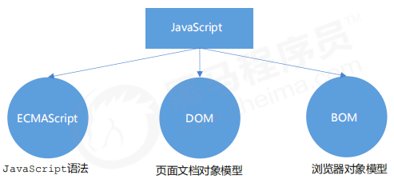

#### 1.5.1 `ECMAScript`

`ECMAScript` 是由 `ECMA` 国际（原欧洲计算机制造商协会）进行标准化的一门编程语言，这种语言在万维网上应用广泛，它往往被称为 `JavaScript` 或 `JScript`，但实际上后两者是 `ECMAScript` 语言的实现和扩展。

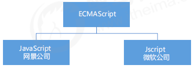

> `ECMAScript`：`ECMAScript` 规定了 `JS` 的编程语法和基础核心知识，是所有浏览器厂商共同遵守的一套 `JS` 语法工业标准。
>
> 更多参看 `MDN`: [https://developer.mozilla.org/zh-CN/docs/Web/JavaScript/JavaScript_technologies_overview](https://developer.mozilla.org/zh-CN/docs/Web/JavaScript/JavaScript_technologies_overview)

#### 1.5.2 `DOM` —— 文档对象模型

文档对象模型（`Document Object Model`，简称 `DOM`），是 `W3C` 组织推荐的处理可扩展标记语言的 **标准编程接口**。通过 `DOM` 提供的接口可以对页面上的各种元素进行操作（大小、位置、颜色等）。

#### 1.5.3 `BOM` —— 浏览器对象模型

`BOM` (`Browser Object Model`，简称 `BOM`) 是指浏览器对象模型，它提供了独立于内容的、可以与浏览器窗口进行互动的对象结构。通过 `BOM` 可以操作浏览器窗口，比如弹出框、控制浏览器跳转、获取分辨率等。

### 1.6 `JS` 的三种书写位置

`JS` 有3种书写位置，分别为行内、内嵌和外部。

#### 1.6.1 行内式 `JS`

```html:no-line-numbers
<input type="button" value="点我试试" onclick="alert('Hello World')" />
```

```:no-line-numbers
- 可以将单行或少量 JS 代码写在 HTML 标签的事件属性中（以 on 开头的属性），如：onclick
- 注意单双引号的使用：在 HTML 中我们推荐使用双引号, JS 中我们推荐使用单引号
- 可读性差， 在 html 中编写 JS 大量代码时，不方便阅读；
- 引号易错，引号多层嵌套匹配时，非常容易弄混；
- 特殊情况下使用
```

#### 1.6.2 内嵌 `JS`

```html:no-line-numbers
<script>
 alert('Hello World~!');
</script>
```

```:no-line-numbers
- 可以将多行 JS 代码写到 <script> 标签中
- 内嵌 JS 是学习时常用的方式
```

#### 1.6.3  外部 `JS` 文件

```html:no-line-numbers
<script src="my.js"></script>
```

```:no-line-numbers
- 利于 HTML 页面代码结构化，把大段 JS 代码独立到 HTML 页面之外，既美观，也方便文件级别的复用
- 引用外部 JS 文件的 script 标签中间不可以写代码
- 适合于 JS 代码量比较大的情况
```

### 1.7 `JavaScript` 注释

为了提高代码的可读性，`JS` 与 `CSS` 一样，也提供了注释功能。`JS` 中的注释主要有两种，分别是单行注释和多行注释。

#### 1.7.1 单行注释

```:no-line-numbers
// 用来注释单行文字（快捷键 ctrl + /）
```

#### 1.7.2 多行注释

```:no-line-numbers
/* */ 用来注释多行文字（ 默认快捷键 alt + shift + a ）
```

```:no-line-numbers
快捷键修改为 ctrl + shift + / 的方式如下：
vscode -> 首选项按钮 -> 键盘快捷方式 -> 查找 原来的快捷键 -> 修改为新的快捷键 -> 回车确认
```

### 1.8. `JavaScript` 输入输出语句：`alert`、`console.log`、`prompt`

为了方便信息的输入输出，`JS` 中提供了一些输入输出语句，其常用的语句如下：

|**方法**|**说明**|**归属**|
|:-|:-|:-|
|`alert(msg)`|浏览器弹出警示框|浏览器|
|`console.log(msg)`|浏览器控制台打印输出信息|浏览器|
|`prompt(msg)`|浏览器弹出输入框，用户可以输入|浏览器|

> 注意：`alert()` 主要用来显示消息给用户，`console.log()` 用来给程序员自己看运行时的消息。

## 2. 变量

### 2.1 什么是变量

变量是用于存放数据的容器。我们通过变量名获取数据，以及修改数据。

### 2.2 变量在内存中的存储

本质：变量是程序在内存中申请的一块用来存放数据的空间。

### 2.3 变量的使用

变量在使用时分为两步：1. 声明变量；2. 赋值。

#### 2.3.1 声明变量

```js:no-line-numbers
var age; // 声明一个 名称为age 的变量
```

```:no-line-numbers
- var 是一个 JS 关键字，用来声明变量（variable 变量的意思）。使用该关键字声明变量后，计算机会自动为变量分配内存空间。
- age 是程序员定义的变量名，我们要通过变量名来访问内存中分配的空间。
```

#### 2.3.2 赋值

```js:no-line-numbers
age = 10; // 给 age 这个变量赋值为 10
```

```:no-line-numbers
- = 用来把右边的值赋给左边的变量空间中，此处代表赋值的意思
- 变量值是程序员保存到变量空间里的值
```

#### 2.3.3 变量的初始化（声明一个变量并赋值）

```js:no-line-numbers
var age = 18; // 声明变量同时赋值为 18
```

```:no-line-numbers
声明一个变量并赋值， 我们称之为变量的初始化。
```

### 2.4 变量语法扩展

#### 2.4.1 更新变量

一个变量被重新复赋值后，它原有的值就会被覆盖，变量值将以最后一次赋的值为准。

```js:no-line-numbers
var age = 18;
age = 81; // 最后的结果就是 81，因为 18 被覆盖掉了
```

#### 2.4.2 同时声明多个变量

同时声明多个变量时，只需要写一个 `var`，多个变量名之间使用英文逗号隔开。

```js:no-line-numbers
var age = 10, name = 'zs', sex = 2;
```

#### 2.4.3 声明变量特殊情况

|**情况**|**说明**|**结果**|
|:-|:-|:-|
|`var age; console.log(age)`| 只声明不赋值|`undefined`|
|`console.log(age)`| 不声明不赋值，直接使用|报错|
|`age = 10; console.log(age)`| 不声明只赋值|`10`|

### 2.5 变量命名规范

```:no-line-numbers
- 由字母(A-Za-z)、数字(0-9)、下划线(_)、美元符号($)组成，如：usrAge, num01, _name
- 严格区分大小写。var app; 和 var App; 是两个变量
- 不能以数字开头。 18age 是错误的
- 不能是关键字、保留字。例如：var、for、while
- 变量名必须有意义。 MMD BBD nl → age 
- 遵守驼峰命名法。首字母小写，后面单词的首字母需要大写。 myFirstName
```

## 3. 数据类型

### 3.1 为什么需要数据类型

在计算机中，不同的数据所需占用的存储空间是不同的，为了便于把数据分成所需内存大小不同的数据，充分利用存储空间，于是定义了不同的数据类型。

### 3.2 变量的数据类型

变量是用来存储值的所在处，它们有名字和数据类型。变量的数据类型决定了如何将代表这些值的位存储到计算机的内存中。

**`JavaScript` 是一种弱类型或者说动态语言**。这意味着不用提前声明变量的类型，在程序运行过程中，类型会被自动确定。

```js:no-line-numbers
var age = 10; // 这是一个数字型
var areYouOk = '是的'; // 这是一个字符串
```

在代码运行时，变量的数据类型是由 `JS` 引擎根据 "= 右边变量值的数据类型" 来判断的，运行完毕之后，变量就确定了数据类型。

`JavaScript` 拥有动态类型，同时也意味着**相同的变量可用作不同的类型**：

```js:no-line-numbers
var x = 6; // x 为数字
var x = "Bill"; // x 为字符串
```

### 3.3 数据类型的分类：简单数据类型 & 复杂数据类型

`JS` 把数据类型分为两类： 

- 简单数据类型

    ```:no-line-numbers
    Number, String, Boolean, Undefined, Null
    ```

- 复杂数据类型

    ```:no-line-numbers
    object
    ```

### 3.4 简单数据类型（又称基本数据类型）

`JavaScript` 中的简单数据类型及其说明如下：

|**简单数据类型**|**说明**|**默认值**|
|:-|:-|:-|
|`Number`|数字型，包含整数和浮点数|`0`|
|`Boolean`|布尔值类型，如 `true`、`false`，等价于 `1` 和 `0`|`false`|
|`String`|字符串类型，如”张三“，注意：`js` 里面字符串都带引号|`""`|
|`Undefined`|`var a;` 声明了变量 `a` 但没有赋值，此时 `a = undefined`|`undefined`|
|`Null`|`var a = null;` 声明了变量 `a` 为空值|`null`|

#### 3.4.1 数字型：`Number`

##### 3.4.1.1 整数和浮点数都可以保存在数字型变量中

`JavaScript` 数字类型既可以用来保存整数值，也可以保存小数(浮点数）。

```js:no-line-numbers
var age = 21; // 整数
var Age = 21.3747; // 小数
```

##### 3.4.1.2 数字型进制

最常见的进制有二进制、八进制、十进制、十六进制。

```js:no-line-numbers
// 1.八进制数字序列范围：0~7
var num1 = 07; // 对应十进制的7
var num2 = 019; // 对应十进制的19
var num3 = 08; // 对应十进制的8
// 2.十六进制数字序列范围：0~9以及A~F
var num = 0xA;
```

> 在 `JS` 中八进制前面加 `0`，十六进制前面加 `0x`

##### 3.4.1.3 数字型范围：`Number.MAX_VALUE` & `Number.MIN_VALUE`

`JavaScript` 中数值的最大和最小值：

```js:no-line-numbers
alert(Number.MAX_VALUE); // 1.7976931348623157e+308
alert(Number.MIN_VALUE); // 5e-324
```

```:no-line-numbers
- 最大值：Number.MAX_VALUE，这个值为：1.7976931348623157e+308
- 最小值：Number.MIN_VALUE，这个值为：5e-32
```

##### 3.4.1.4 数字型三个特殊值：`Infinity` & -`Infinity` & `NaN`

```js:no-line-numbers
alert(Infinity); // Infinity
alert(-Infinity); // -Infinity
alert(NaN); // NaN
```

```:no-line-numbers
- Infinity，代表无穷大，大于任何数值
- -Infinity，代表无穷小，小于任何数值
- NaN，Not a number，代表一个非数值
```

##### 3.4.1.5 判断变量是否为非数字型：`isNaN()`

```:no-line-numbers
对于 isNaN(x)，返回 true 表示变量 x 是一个非数字类型；返回 false 表示变量 x 是一个数字类型。
```

```js:no-line-numbers
var usrAge = 21;
var isOk = isNaN(userAge);
console.log(isNum); // false ，21 不是一个非数字
var usrName = "andy";
console.log(isNaN(userName)); // true ，"andy"是一个非数字
```

#### 3.4.2 字符串型：`String`

既可以用双引号表示字符串，也可以用单引号表示字符串。

> 因为 `HTML` 标签里面的属性使用的是双引号，`JS` 这里我们更推荐使用单引号。

```js:no-line-numbers
var strMsg = "我爱北京天安门~"; // 使用双引号表示字符串
var strMsg2 = '我爱吃猪蹄~'; // 使用单引号表示字符串
var strMsg3 = 我爱大肘子; // 报错，没使用引号，会被认为是 js 代码，但 js 没有这些语法
```

##### 3.4.2.1 字符串引号嵌套：外双内单 & 外单内双

`JS` 可以用单引号嵌套双引号，或者用双引号嵌套单引号（外双内单，外单内双）

```js:no-line-numbers
var strMsg = '我是"高帅富"程序猿'; // 可以用''包含""
var strMsg2 = "我是'高帅富'程序猿"; // 也可以用"" 包含''
var badQuotes = 'What on earth?"; // 报错，不能单双引号搭配
```

##### 3.4.2.2 字符串转义符

类似 `HTML` 里面的特殊字符，字符串中也有特殊字符，我们称之为转义符。

转义符都是 `\` 开头的，常用的转义符及其说明如下：

|**转义符**|**解释说明**|
|:-|:-|
|`\n`|换行符，`n` 是 `newline` 的意思|
|`\\`|斜杠 `\`|
|`\'`|单引号 `'`|
|`\"`|双引号 `"`|
|`\t`|`tab` 缩进|
|`\b`|空格，`b` 是 `blank` 的意思|

##### 3.4.2.3 字符串长度

字符串是由若干字符组成的，这些字符的数量就是字符串的长度。通过字符串的 `length` 属性可以获取整个字符串的长度。

```js:no-line-numbers
var strMsg = "我是帅气多金的程序猿！";
alert(strMsg.length); // 显示 11
```

##### 3.4.2.4 字符串拼接

多个字符串之间可以使用 `+` 进行拼接，其拼接方式为：

```:no-line-numbers
字符串 + 任何类型 = 拼接之后的新字符串
```

> 拼接前会把与字符串相加的任何类型转成字符串，再拼接成一个新的字符串。

**示例1：**

```js:no-line-numbers
// 1.1 字符串 "相加"
alert('hello' + ' ' + 'world'); // hello world
// 1.2 数值字符串 "相加"
alert('100' + '100'); // 100100
// 1.3 数值字符串 + 数值
alert('11' + 12); // 1112
```

**示例2：**

```js:no-line-numbers
console.log('pink老师' + 18); // 只要有字符就会相连
var age = 18;
// console.log('pink老师age岁啦'); // 这样不行哦
console.log('pink老师' + age); // pink老师18
console.log('pink老师' + age + '岁啦'); // pink老师18岁啦
```

**示例3：**

```js:no-line-numbers
// 弹出一个输入框（prompt)，让用户输入年龄（用户输入）
// 把用户输入的值用变量保存起来,把刚才输入的年龄与所要输出的字符串拼接 （程序内部处理）
// 使用alert语句弹出警示框（输出结果）
var age = prompt('请输入您的年龄');
var str = '您今年已经' + age + '岁了';
alert(str);
```

#### 3.4.3 布尔型：`Boolean`

布尔类型有两个值：`true` 和 `false`，其中 `true` 表示真（对），而 `false` 表示假（错）。

布尔型和数字型相加的时候，`true` 的值为 `1`，`false` 的值为 `0`。

```js:no-line-numbers
console.log(true + 1); // 2
console.log(false + 1); // 1
```

#### 3.4.4 `Undefined` 和 `Null`

一个声明后没有被赋值的变量会有一个默认值 `undefined` ( 如果进行相连或者相加时，注意结果）

```js:no-line-numbers
var variable;
console.log(variable); // undefined
console.log('你好' + variable); // 你好undefined
console.log(11 + variable); // NaN
console.log(true + variable); // NaN
```

一个声明变量给 `null` 值，里面存的值为空（学习对象时，我们继续研究 `null`)

```js:no-line-numbers
var vari = null;
console.log('你好' + vari); // 你好 null
console.log(11 + vari); // 11
console.log(true + vari); // 1
```

### 3.5 获取变量的数据类型：`typeof`

`typeof` 可用来获取检测变量的数据类型

```js:no-line-numbers
var num = 18;
console.log(typeof num) // 结果 number
```

不同类型时，`typeof` 的返回值如下：

|**类型**|**例**|**结果**|
|:-|:-|:-|
|`String`|`typeof "小白"`|`"String"`|
|`Number`|`typeof 18`|`"number"`|
|`Boolean`|`typeof true`|`"boolean"`|
|`Undefined`|`typeof undefined`|`"undefined"`|
|`Null`|`typeof null`|`"object"`|

### 3.6 字面量

字面量就是用来表示一个固定值，如：

- 数字字面量：`8`, `9`, `10`
  
- 字符串字面量：`'黑马程序员'`, `"大前端"`
  
- 布尔字面量：`true`，`false`

### 3.7 数据类型转换

使用表单、`prompt` 获取过来的数据默认是字符串类型的，此时就不能直接简单的进行加法运算，而需要转换变量的数据类型。

我们通常会实现 `3` 种方式的转换： 

- 转换为字符串类型
  
- 转换为数字型
  
- 转换为布尔型

#### 3.7.1 转换为字符串类型

|**方式**|**说明**|**案例**|
|:-|:-|:-|
|`toString()`|转成字符串|`var num = 1; alert(num.toString());`|
|`String()` 强制转换|转成字符串|`var num = 1; alert(String(num));`|
|加号拼接字符串|和字符串拼接的结果都是字符串|`var num = 1; alert(num + "我是字符串");`|

```:no-line-numbers
- toString() 和 String() 使用方式不一样。
- 三种转换方式，我们更喜欢用第三种加号拼接字符串转换方式，这一种方式也称之为隐式转换。
```

#### 3.7.2 转换为数字型

|**方式**|**说明**|**案例**|
|:-|:-|:-|
|`parseInt(string)` 函数|将 `string` 类型转成整数数值型|`parseInt('78')`|
|`parseFloat(string)` 函数|将 `string` 类型转成浮点数数值型|`parseFloat('78.21')`|
|`Number()` 强制转换函数|将 `string` 类型转换为数值型|`Number(12)`|
|`js` 隐式转换（`-`、`*`、`/`）|利用算术运算隐式转换为数值型|`'12' - 0`|

```:no-line-numbers
- 注意 parseInt 和 parseFloat 单词的大小写，这2个是重点
- 隐式转换是我们在进行算数运算的时候，JS 自动转换了数据类型
```

**示例1：**

```js:no-line-numbers
// 1. 弹出输入框，输入出生年份，并存储在变量中
var year = prompt('请输入您的出生年份：'); // 用户输入
// 2. 用今年减去刚才输入的年份 
var result = 2019 - year; // 程序内部处理
// 3. 弹出提示框 
alert('您的年龄是:' + result + '岁'); // 输出结果
```

**示例2：简单加法器**

```js:no-line-numbers
// 1. 先弹出第一个输入框，提示用户输入第一个值
var num1 = prompt('请输入第一个值：');
// 2. 再弹出第二个框，提示用户输入第二个值
var num2 = prompt('请输入第二个值：');
// 3. 将输入的值转换为数字型后，把这两个值相加，并将结果赋给新的变量 
var result = parseFloat(num1) + parseFloat(num2);
// 4. 弹出结果
alert('结果是:' + result);
```

#### 3.7.3 转换为布尔型

|**方式**|**说明**|**案例**|
|:-|:-|:-|
|`Boolean()` 函数|其他类型转成布尔值|`Boolean('true')`|

```:no-line-numbers
- 代表空、否定的值会被转换为 false ，如 ''、0、NaN、null、undefined 
- 其余值都会被转换为 true
```

```js:no-line-numbers
console.log(Boolean('')); // false
console.log(Boolean(0)); // false
console.log(Boolean(NaN)); // false
console.log(Boolean(null)); // false
console.log(Boolean(undefined)); // false
console.log(Boolean('小白')); // true
console.log(Boolean(12)); // true
```

## 4. 扩展阅读

### 4.1 解释型语言和编译型语言

计算机不能直接理解任何除机器语言以外的语言，所以必须要把程序员所写的程序语言翻译成机器语言才能执行程序。程序语言翻译成机器语言的工具，被称为翻译器。

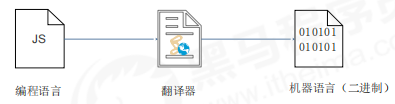

翻译器翻译的方式有两种：一个是 **编译**，另外一个是 **解释**。两种方式之间的区别在于 **翻译的时间点不同**：

- 编译器是在代码执行之前进行编译，生成中间代码文件。
  
- 解释器是在运行时进行及时解释，并立即执行(当编译器以解释方式运行的时候，也称之为解释器)。

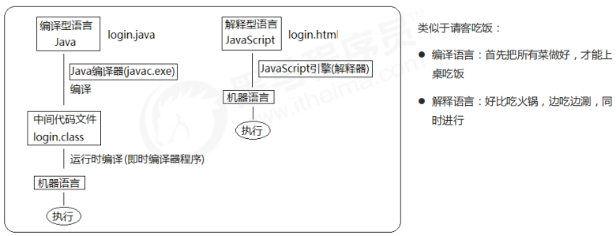

### 4.2 标识符、关键字、保留字

#### 4.2.1 标识符

标识(`zhi`)符：就是指开发人员为变量、属性、函数、参数取的名字。

**标识符不能是关键字或保留字**。

#### 4.2.2 关键字

关键字：是指 `JS` 本身已经使用了的字，不能再用它们充当变量名、方法名。

```:no-line-numbers
包括：break、case、catch、continue、default、delete、do、else、finally、for、function、if、in、
instanceof、new、return、switch、this、throw、try、typeof、var、void、while、with 等。
```

#### 4.2.3 保留字

保留字：实际上就是预留的“关键字”，意思是现在虽然还不是关键字，但是未来可能会成为关键字，同样不能使用它们当变量名或方法名。

```:no-line-numbers
包括：boolean、byte、char、class、const、debugger、double、enum、export、extends、
fimal、float、goto、implements、import、int、interface、long、mative、package、
private、protected、public、short、static、super、synchronized、throws、transient、
volatile 等。
```

> 注意：如果将保留字用作变量名或函数名，那么除非将来的浏览器实现了该保留字，否则很可能收不到任何错误消息。当浏览器将其实现后，该单词将被看做关键字，如此将出现关键字错误。


## 5. `JavaScript` 运算符

运算符（`operator`）也被称为操作符，是用于实现赋值、比较和执行算数运算等功能的符号。

`JavaScript` 中常用的运算符有：

- 算数运算符
  
- 递增和递减运算符
  
- 比较运算符
  
- 逻辑运算符 
  
- 赋值运算符

### 5.1 算术运算符

概念：算术运算使用的符号，用于执行两个变量或值的算术运算。

|**运算符**|**描述**|**实例**|
|:-|:-|:-|
|`+`|加|`10 + 20 = 30`|
|`-`|减|`10 - 20 = -10`|
|`*`|乘|`10 * 20 = 200`|
|`/`|除|`10 / 20 = 0.5`|
|`%`|取余数（取模）|返回除法的余数 `9 % 2 = 1`|

#### 5.1.1 浮点数的精度问题

浮点数值的最高精度是 `17` 位小数，但在进行算术计算时其精确度远远不如整数。

```js:no-line-numbers
var result = 0.1 + 0.2; // 结果不是 0.3，而是：0.30000000000000004
console.log(0.07 * 100); // 结果不是 7， 而是：7.000000000000001
```

所以：**不要直接判断两个浮点数是否相等!**

#### 5.1.2 表达式和返回值

表达式：是由数字、运算符、变量等以能求得数值的有意义排列方法所得的组合。

> 简单理解：是由数字、运算符、变量等组成的式子

表达式最终都会有一个结果，返回给我们，我们称为 **返回值**。

### 5.2 递增和递减运算符

如果需要反复给数字变量添加或减去 `1`，可以使用递增（`++`）和递减（`--`）运算符来完成。 

在 `JavaScript` 中，递增（`++`）和递减（`--`）既可以放在变量前面，也可以放在变量后面：

1. 放在变量前面时，我们可以称为前置递增（递减）运算符；
   
2. 放在变量后面时，我们可以称为后置递增（递减）运算符。
   
> 注意：递增和递减运算符必须和变量配合使用。

#### 5.2.1 前置递增运算符

`++num` 前置递增，就是自加 `1`，类似于 `num = num + 1`，但是 `++num` 写起来更简单。

使用口诀：**先自加，后返回值**

```js:no-line-numbers
var num = 10;
alert(++num + 10); // 21
```

#### 5.2.2 后置递增运算符

`num++` 后置递增，就是自加 `1`，类似于 `num = num + 1` ，但是 `num++` 写起来更简单。

使用口诀：**先返回原值，后自加**

```js:no-line-numbers
var num = 10;
alert(10 + num++); // 20
```

#### 5.2.3 小结

- 前置递增和后置递增运算符可以简化代码的编写，让变量的值 `+1` 比以前写法更简单
  
- 单独使用时，运行结果相同
  
- 与其他代码联用时，执行结果会不同
  
- 后置：先原值运算，后自加
  
- 前置：先自加，后运算 
  
- 开发时，大多使用后置递增/减，并且代码独占一行，例如：`num++;` 或者 `num--;`

### 5.3 比较运算符（关系运算符）

概念：比较运算符（关系运算符）是两个数据进行比较时所使用的运算符，比较运算后，会返回一个布尔值（`true`/`false`）作为比较运算的结果。

|**运算符名称**|**说明**|**案例**|**结果**|
|:-|:-|:-|:-|
|`<`|小于号|`1 < 2`|`true`|
|`>`|大于号|`1 > 2`|`false`|
|`>=`|大于等于号|`2 >= 2`|`true`|
|`<=`|小于等于号|`3 <= `|`false`|
|`==`|判等号（会转型）|`37 == 37`|`true`|
|`!=`|不等号|`37 != 37`|`false`|
|`===` 和 `!==`|全等和不全等（全等要求值和数据类型都一致）|`37 === '37'`|`false`|

#### 5.3.1 `=`、`==`、`===` 小结

|**符号**|**作用**|**用法**|
|:-|:-|:-|
|`=`|赋值|把右边给左边|
|`==`|判断|判断两边的值是否相等（注意此时有隐式转换）|
|`===`|全等|判断两边的值和数据类型是否完全相同|

```js:no-line-numbers
console.log(18 == '18');  // true
console.log(18 === '18'); // false
```

### 5.4 逻辑运算符

概念：逻辑运算符是用来进行布尔值运算的运算符，其返回值也是布尔值。后面开发中经常用于多个条件的判断。

|**逻辑运算符**|**说明**|**案例**|
|:-|:-|:-|
|`&&`|逻辑与，简称：与，`and`|`true && false`|
|`\|\|`|逻辑或，简称：或，`or`|`true \|\| false`|
|`\|`|逻辑非，简称：非，`not`|`!true`|

#### 5.4.1 逻辑与：`&&`

两边都是 `true` 才返回 `true`，否则返回 `false`。

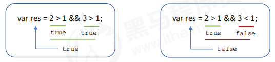

#### 5.4.2 逻辑或：`||`

两边都为 `false` 才返回 `false`，否则都为 `true`。

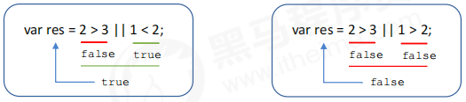

#### 5.4.3 逻辑非：`|`

逻辑非（`!`）也叫作取反符，用来取一个布尔值相反的值，如 `true` 的相反值是 `false`。

```js:no-line-numbers
var isOk = !true;
console.log(isOk); // false
```

#### 5.4.4 短路运算（逻辑中断）

短路运算的原理：当有多个表达式（值）时，左边的表达式值可以确定结果时，就不再继续运算右边的表达式的值。

**逻辑与**

```:no-line-numbers
语法：表达式1 && 表达式2

- 如果第一个表达式的值为真，则返回表达式2 
- 如果第一个表达式的值为假，则返回表达式1
```

```js:no-line-numbers
console.log(123 && 456); // 456
console.log(0 && 456); // 0
console.log(123 && 456 && 789); // 789
```

**逻辑或**

```:no-line-numbers
语法：表达式1 || 表达式2

- 如果第一个表达式的值为真，则返回表达式1
- 如果第一个表达式的值为假，则返回表达式2
```

```js:no-line-numbers
console.log(123 || 456); // 123
console.log(0 || 456); // 456
console.log(123 || 456 || 789); // 123
```

### 5.5 赋值运算符

概念：用来把数据赋值给变量的运算符。

|**赋值运算符**|**说明**|**案例**|
|:-|:-|:-|
|`=`|直接赋值|`var usrName = '我是值';`|
|`+=`、`-=`|加、减一个数后再赋值|`var age = 10; age += 5; // 5`|
|`*=`、`/=`、`%=`|乘、除、取模后再赋值|`var age = 2; age *= 5; //10`|

```js:no-line-numbers
var age = 10;
age += 5; // 相当于 age = age + 5;
age -= 5; // 相当于 age = age - 5;
age *= 10; // 相当于 age = age * 10;
```

### 5.6 运算符优先级

|**优先级**|**运算符**|**顺序**|
|:-|:-|:-|
|`1`|小括号|`()`|
|`2`|一元运算符|`++`、`--`、`!`|
|`3`|算术运算符|先 `*`、`/`、`%` 后 `+`、`-`|
|`4`|关系运算符|`>`、`>=`、`<`、`<=`|
|`5`|相等运算符|`==`、`!=`、`===`、`!==`|
|`6`|逻辑运算符|先 `&&` 后 `\|\|`|
|`7`|赋值运算符|`=`|
|`8`|逗号运算符|`,`|

> 一元运算符里面的逻辑非优先级很高；
> 
> 逻辑与比逻辑或优先级高。


## 6. `JavaScript` 流程控制结构

流程控制就是来控制我们的代码按照什么结构顺序来执行。

流程控制主要有三种结构，分别是 **顺序结构**、**分支结构** 和 **循环结构**，这三种结构代表三种代码执行的顺序。

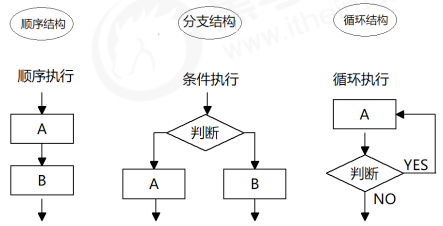

### 6.1 顺序结构

顺序结构是程序中最简单、最基本的流程控制，它没有特定的语法结构，程序会按照代码的先后顺序，依次执行，程序中大多数的代码都是这样执行的。

### 6.2 分支结构

由上到下执行代码的过程中，根据不同的条件，执行不同的路径代码（执行代码多选一的过程），从而得到不同的结果。

`JS` 语言提供了两种分支结构语句：

- `if` 语句

- `switch` 语句

#### 6.2.1 `if` 语句

**`if` 语句**

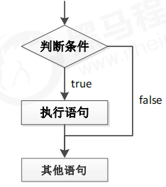

```js:no-line-numbers
// 条件成立执行代码，否则什么也不做
if (条件表达式) {
    // 条件成立执行的代码语句
}
```

```js:no-line-numbers
var usrAge = prompt('请输入您的年龄：');
if (usrAge >= 18) {
    alert('您的年龄合法，欢迎来天际网吧享受学习的乐趣！');
}
```

**`if-else` 语句（双分支语句）**

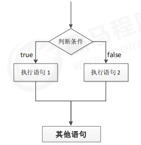

```js:no-line-numbers
// 条件成立 执行 if 里面代码，否则执行else 里面的代码
if (条件表达式) {
    // [如果] 条件成立执行的代码
} else {
    // [否则] 执行的代码
}
```

```js:no-line-numbers
if (year % 4 == 0 && year % 100 != 0 || year % 400 == 0) {
    alert("这个年份是闰年");
} else { // 剩下的是平年
    alert("这个年份是平年");
}
```

**`if-else if` 语句（多分支语句）**

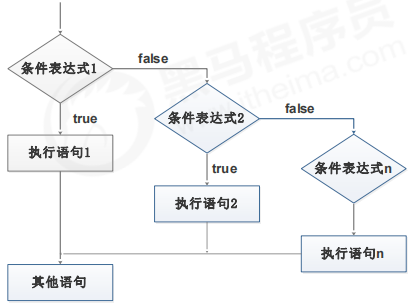

```js:no-line-numbers
// 适合于检查多重条件。
if (条件表达式1) {
    语句1；
} else if (条件表达式2) {
    语句2；
} else if (条件表达式3) {
    语句3；
....
} else {
    // 上述条件都不成立执行此处代码
}
```

```js:no-line-numbers
var score = prompt('请您输入分数:');
if (score >= 90) {
    alert('宝贝，你是我的骄傲');
} else if (score >= 80) {
    alert('宝贝，你已经很出色了');
} else if (score >= 70) {
    alert('你要继续加油喽');
} else if (score >= 60) {
    alert('孩子，你很危险');
} else {
    alert('熊孩子，我不想和你说话，我只想用鞭子和你说话');
}
```

#### 6.2.2 三元表达式

三元表达式也能做一些简单的条件选择。由三元运算符组成的式子称为三元表达式。

**语法**

```:no-line-numbers
表达式1 ? 表达式2 : 表达式3;
```

```:no-line-numbers
如果表达式1为 true ，则返回表达式2的值，
如果表达式1为 false，则返回表达式3的值 

简单理解：就类似于 if-else（双分支）的简写。
```

```js:no-line-numbers
var time = prompt('请您输入一个 0 ~ 59 之间的一个数字');
// 三元表达式 表达式 ？ 表达式1 ：表达式2 
var result = time < 10 ? '0' + time : time; // 把返回值赋值给一个变量
alert(result);
```

#### 6.2.3 `switch` 语句

`switch` 语句也是多分支语句，它用于基于不同的条件来执行不同的代码。当要针对变量设置一系列的特定值的选项时，就可以使用 `switch`。

```js:no-line-numbers
switch( 表达式 ){ 
    case value1:
        // 表达式 等于 value1 时要执行的代码
        break;
    case value2:
        // 表达式 等于 value2 时要执行的代码
        break;
    default:
        // 表达式 不等于任何一个 value 时要执行的代码
}
```

```:no-line-numbers
- switch：开关 转换，case：小例子、选项；
- 关键字 switch 后面括号内可以是表达式或值，通常是一个变量；
- 关键字 case，后跟一个选项的表达式或值，后面跟一个冒号；
- switch 表达式的值会与结构中的 case 的值做比较；
- 如果存在匹配全等（===） ，则与该 case 关联的代码块会被执行，并在遇到 break 时停止，整个 switch 语句代码执行结束；
- 如果所有的 case 的值都和表达式的值不匹配，则执行 default 里的代码。
```

> 注意：执行 `case` 里面的语句时，如果没有 `break`，则继续执行下一个 `case` 里面的语句。

```js:no-line-numbers
var fruit = prompt('请您输入查询的水果:');
switch (fruit) {
    case '苹果':
        lert('苹果的价格是 3.5/斤');
        reak;
    case '榴莲':
        alert('榴莲的价格是 35/斤');
        break;
    default:
        alert('没有此水果');
}
```

#### 6.2.4 `switch` 语句和 `if-else if` 语句的区别

```:no-line-numbers
- 一般情况下，它们两个语句可以相互替换；
- switch...case 语句通常处理 case 为比较确定值的情况， 而 if…else… 语句更加灵活，常用于范围判断（大于、等于某个范围）；
- switch 语句进行条件判断后直接执行到程序的条件语句，效率更高。而 if…else 语句有几种条件，就得判断多少次；
- 当分支比较少时，if… else 语句的执行效率比 switch 语句高；
- 当分支比较多时，switch 语句的执行效率比较高，而且结构更清晰。
```

### 6.3 循环结构

在实际问题中，有许多具有规律性的重复操作，因此在程序中要完成这类操作就需要重复执行某些语句。

在程序中，一组被重复执行的语句被称之为 **循环体**，能否继续重复执行，取决于循环的 **终止条件**。由循环体
及循环的终止条件组成的语句，被称之为 **循环语句**。

在 `JS` 中，主要有三种类型的循环语句：

- `for` 循环
  
- `while` 循环
  
- `do...while` 循环

#### 6.3.1 `for` 循环

`for` 循环主要用于把某些代码循环若干次，通常跟计数有关系。

**语法结构：**

```:no-line-numbers
for(初始化变量; 条件表达式; 操作表达式 ){
    //循环体
}
```

> **初始化变量：** 通常被用于初始化一个计数器，该表达式可以使用 `var` 关键字声明新的变量，这个变量帮我们来记录次数。
> 
> **条件表达式：** 用于确定每一次循环是否能被执行。如果结果是 `true` 就继续循环，否则退出循环。
> 
> **操作表达式：** 每次循环的最后都要执行的表达式。通常被用于更新或者递增计数器变量。当然，递减变量也是可以的。

**执行过程：**

```:no-line-numbers
1. 初始化变量，初始化操作在整个 for 循环只会执行一次。
2. 执行条件表达式，如果为 true，则执行循环体语句，否则退出循环，循环结束。
3. 执行操作表达式，此时第一轮结束。
4. 第二轮开始，直接去执行条件表达式（不再初始化变量），如果为 true ，则去执行循环体语句，否则退出循环。
5. 继续执行操作表达式，第二轮结束。
6. 后续跟第二轮一致，直至条件表达式为假，结束整个 for 循环。
```

**示例1：**

```js:no-line-numbers
for (var i = 1; i <= 100; i++) {
    console.log('这个人今年' + i + '岁了');
}
```

**示例2：**

```js:no-line-numbers
// for 里面是可以添加其他语句的
for (var i = 1; i <= 100; i++) {
    if (i == 1) {
        console.log('这个人今年1岁了， 它出生了');
    } else if (i == 100) {
        console.log('这个人今年100岁了，它死了');
    } else {
        console.log('这个人今年' + i + '岁了');
    } 
}
```

**示例3：求 1-100 之间所有整数的累加和**

```js:no-line-numbers
var sum = 0;
for (var i = 1;i <= 100; i++) {
    sumNum += i;
}
console.log('1-100之间整数的和 = ' + sum);
```

**示例4：求学生成绩**

```js:no-line-numbers
var num = prompt('请输入班级总的人数:'); // num 班级总的人数
var sum = 0; // 总成绩
var average = 0; // 平均成绩
for (var i = 1; i <= num; i++) {
    var score = prompt('请输入第' + i + '个学生的成绩');
    sum = sum + parseFloat(score); 
}
average = sum / num;
alert('班级总的成绩是：' + sum);
alert('班级总的平均成绩是：' + average);
```

**示例5：一行打印五个星星**

```js:no-line-numbers
var star = '';
for (var i = 1; i <= 5; i++) {
    star += '☆' 
}
console.log(star);
```

#### 6.3.2 双重 `for` 循环

很多情况下，单层 `for` 循环并不能满足我们的需求，比如我们要打印一个 5 行 5 列的图形、打印一个倒直角三角形等，此时就可以通过循环嵌套来实现。

循环嵌套是指在一个循环语句中再定义一个循环语句的语法结构，例如在 `for` 循环语句中，可以再嵌套一个 `for` 循环，这样的 `for` 循环语句我们称之为 **双重 `for` 循环**。

```:no-line-numbers
for (外循环的初始; 外循环的条件; 外循环的操作表达式) {
    for (内循环的初始; 内循环的条件; 内循环的操作表达式) { 
        需执行的代码; 
    } 
}
```

```:no-line-numbers
- 内层循环可以看做外层循环的语句；
- 内层循环执行的顺序也要遵循 for 循环的执行顺序 ；
- 外层循环执行一次，内层循环要执行全部次数。
```

**示例1： 打印五行五列星星**


```:no-line-numbers
核心：
1. 内层循环负责一行打印五个星星；
2. 外层循环负责打印五行。
```

```js:no-line-numbers
var str = '';
for (var i = 1; i <= 5; i++) { // 外层循环负责打印五行
    for (var j = 1; j <= 5; j++) { // 里层循环负责一行打印五个星星
        str = str + '★';
    }
    // 如果一行打印完毕5个星星就要另起一行加 \n
    str = str + '\n';
}
console.log(str);
```

**示例2：打印 n 行 n 列的星星**

```js:no-line-numbers
var rows = prompt('请您输入行数:');
var cols = prompt('请您输入列数:');
var str = '';
for (var i = 1; i <= rows; i++) {
    for (var j = 1; j <= cols; j++) {
        str = str + '★';
    }
    str += '\n';
}
console.log(str);
```

**示例3：打印倒三角形**


```js:no-line-numbers
var str = '';
for (var i = 1; i <= 10; i++) { // 外层循环控制行数
    for (var j = i; j <= 10; j++) { // 里层循环打印的个数不一样  j = i
        str = str + '★';
    }
    str += '\n';
}
console.log(str);
```

**示例4：九九乘法表**

```js:no-line-numbers
// 外层的 for 循环控制行数 i ，循环9次 ，可以打印 9 行  
// 内层的 for 循环控制每行公式  j  
// 核心算法：每一行 公式的个数正好和行数一致，j <= i;
// 每行打印完毕，都需要重新换一行
var str = '';
for (var i = 1; i <= 9; i++) { // 外层循环控制行数
    for (var j = 1; j <= i; j++) { // 里层循环控制每一行的个数  j <= i
        // 1 × 2 = 2
        // str = str + '★';
        str += j + '×' + i + '=' + i * j + '\t';
    }
    str += '\n';
}
console.log(str);
```

#### 6.3.3 `while` 循环

`while` 语句可以在条件表达式为真的前提下，循环执行指定的一段代码，直到表达式不为真时结束循环。

**语法结构：**

```:no-line-numbers
while (条件表达式) {
    // 循环体代码
}
```

**执行过程：**

```:no-line-numbers
1. 先执行条件表达式，如果结果为 true，则执行循环体代码；如果为 false，则退出循环，执行后面代码；
2. 执行循环体代码；
3. 循环体代码执行完毕后，程序会继续判断执行条件表达式，如条件仍为true，则会继续执行循环体，直到循环条件为 false 时，整个循环过程才会结束。
```

**注意：**

```:no-line-numbers
1. 使用 while 循环时一定要注意，它必须要有退出条件，否则会成为死循环；
2. while 循环和 for 循环的不同之处在于 while 循环可以做较为复杂的条件判断，比如判断用户名和密码。
```

**示例1：计算 1 ~ 100 之间所有整数的和**

```js:no-line-numbers
var sum = 0;
var j = 1;
while (j <= 100) {
    sum += j;
    j++
}
console.log(sum);
```

#### 6.3.4 `do while` 循环

`do... while` 语句其实是 `while` 语句的一个变体。该循环会先执行一次代码块，然后对条件表达式进行判断，如果条件为真，就会重复执行循环体，否则退出循环。

**语法结构：**

```:no-line-numbers
do {
    // 循环体代码 - 条件表达式为 true 时重复执行循环体代码
} while(条件表达式);
```

**执行过程：**

```:no-line-numbers
1. 先执行一次循环体代码；
2. 再执行条件表达式，如果结果为 true，则继续执行循环体代码，如果为 false，则退出循环，继续执行后面代码。
```

**注意：**

```:no-line-numbers
先再执行循环体，再判断，我们会发现 do…while 循环语句至少会执行一次循环体代码。
```

**示例1：计算 1 ~ 100 之间所有整数的和**

```js:no-line-numbers
var sum = 0;
var j = 1;
do {
    sum += j;
    j++;
} while (j <= 100)
console.log(sum);
```

#### 6.3.5 `continue` & `break`

**`continue` 关键字**

```:no-line-numbers
continue 关键字用于立即跳出本次循环，继续下一次循环（本次循环体中 continue 之后的代码就会少执行一次）。
```

```js:no-line-numbers
// 求1~100 之间， 除了能被7整除之外的整数和 
var sum = 0;
for (var i = 1; i <= 100; i++) {
    if (i % 7 == 0) {
        continue;
    }
    sum += i;
}
console.log(sum);
```

**`break` 关键字**

```:no-line-numbers
break 关键字用于立即跳出整个循环（循环结束）。
```

```js:no-line-numbers
for (var i = 1; i <= 5; i++) {
    if (i == 3) {
        break;
    }
    console.log('我正在吃第' + i + '个包子');
}
```

## 7. 断点调试

断点调试是指自己在程序的某一行设置一个断点，调试时，程序运行到这一行就会停住，然后你可以一步一步往下调试，调试过程中可以看各个变量当前的值，出错的话，调试到出错的代码行即显示错误，停下。

断点调试可以帮我们观察程序的运行过程。

```:no-line-numbers
浏览器中按 F12 --> sources --> 找到需要调试的文件 --> 在程序的某一行设置断点
```

```:no-line-numbers
Watch: 监视，通过 watch 可以监视变量的值的变化，非常的常用。
F11: 程序单步执行，让程序一行一行的执行，这个时候，观察 watch 中变量的值的变化。
```

## 8. `JavaScript` 命名规范

### 8.1 标识符命名规范

```:no-line-numbers
- 变量、函数的命名必须要有意义；
- 变量的名称一般用名词；
- 函数的名称一般用动词。
```

### 8.2 运算符（操作符）规范

```js:no-line-numbers
// 操作符的左右两侧各保留一个空格
for (var i = 1; i <= 5; i++) {
    if (i == 3) {
        break; // 直接退出整个 for 循环，跳到整个for循环下面的语句
    }
    console.log('我正在吃第' + i + '个包子呢');
}
```

### 8.3 单行注释规范

```js:no-line-numbers
for (var i = 1; i <= 5; i++) {
    if (i == 3) {
        break; // 单行注释前面注意有个空格
    }
    console.log('我正在吃第' + i + '个包子呢');
}
```

### 8.4 其他规范

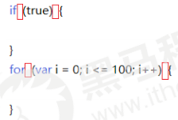

## 9. `JavaScript` 数组

### 9.1 什么是数组

数组是指一组数据的集合，其中的每个数据被称作元素，在数组中可以存放任意类型的元素。

数组是一种将一组数据存储在单个变量名下的优雅方式。

### 9.2 创建数组

`JS` 中创建数组有两种方式：

- 利用 `new` 创建数组；
  
- 利用数组字面量创建数组。

#### 9.2.1 利用 `new` 创建数组

```:no-line-numbers
var 数组名 = new Array() ；
var arr = new Array(); // 创建一个新的空数组
```

```:no-line-numbers
- 这种方式暂且了解，等学完对象再看；
- 注意 Array()，A 要大写。
```

#### 9.2.2 利用数组字面量创建数组

```:no-line-numbers
// 1. 使用数组字面量方式创建空的数组
var 数组名 = []；
// 2. 使用数组字面量方式创建带初始值的数组
var 数组名 = ['小白', '小黑', '大黄', '瑞奇'];
```

```:no-line-numbers
- 数组的字面量是方括号 [] 
- 声明数组并赋值称为数组的初始化
- 这种字面量方式也是我们以后最多使用的方式
```

#### 9.2.3 数组元素的类型

数组中可以存放 **任意类型** 的数据，例如字符串，数字，布尔值等。

```js:no-line-numbers
var arrStus = ['小白', 12, true, 28.9];
```

### 9.3 获取数组中的元素

**数组的索引**

```:no-line-numbers
索引（下标）：用来访问数组元素的序号（数组下标从 0 开始）。
```

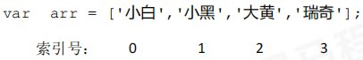

数组可以通过索引来访问、设置、修改对应的数组元素，我们可以通过 “`数组名[索引]`” 的形式来获取数组中的元素。

```js:no-line-numbers
// 定义数组
var arrStus = [1,2,3];
// 获取数组中的第2个元素
alert(arrStus[1]);
```

### 9.4 数组的长度

使用 “`数组名.length`” 可以访问数组元素的数量（数组长度）。

```js:no-line-numbers
var arrStus = [1,2,3];
alert(arrStus.length); // 3
```

**注意：**

```:no-line-numbers
1. 此处数组的长度是数组元素的个数，不要和数组的索引号混淆。
2. 当我们数组里面的元素个数发生了变化，这个 length 属性跟着一起变化。
```

### 9.5 遍历数组

**遍历：** 就是把数组中的每个元素从头到尾都访问一次。

我们可以通过 `for` 循环索引遍历数组中的每一项：

```js:no-line-numbers
var arr = ['red', 'green', 'blue'];
for(var i = 0; i < arr.length; i++){
    console.log(arrStus[i]);
}
```

**示例1：数组求和及平均值**

```js:no-line-numbers
var arr = [2, 6, 1, 7, 4];
var sum = 0;
var average = 0;
for (var i = 0; i < arr.length; i++) {
    sum += arr[i];
}
average = sum / arr.length;
console.log('这组数的和是：' + sum);
console.log('这组数的平均值是：' + average);
```

**示例2：数组最大值**

```js:no-line-numbers
var arr = [2, 6, 1, 77, 52, 25, 7, 99];
var max = arr[0];
for (var i = 1; i < arr.length; i++) {
    if (arr[i] > max) {
        max = arr[i];
    }
}
console.log('该数组里面的最大值是：' + max);
```

**示例3：数组转换为字符串**

```js:no-line-numbers
// 要求：将数组 ['red', 'green', 'blue', 'pink'] 转换为字符串，并且用 | 或其他符号分割
// 输出：'red|green|blue|pink'
var arr = ['red', 'green', 'blue', 'pink'];
var str = '';
var separator = '|'
for (var i = 0; i < arr.length; i++) {
    str += arr[i] + separator;
}
console.log(str);
```

### 9.6 数组中新增元素

#### 9.6.1 通过修改 `length` 长度新增数组元素

```:no-line-numbers
- 可以通过修改 length 长度来实现数组扩容的目的；
- length 属性是可读写的。
```

```js:no-line-numbers
var arr = ['red', 'green', 'blue', 'pink'];
arr.length = 7;
console.log(arr);
console.log(arr[4]);
console.log(arr[5]);
console.log(arr[6]);
```

其中索引号是 `4`，`5`，`6` 的空间没有给值，也就是声明变量未给值，默认值就是 `undefined`。

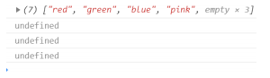

#### 9.6.2 通过修改数组索引新增数组元素

```:no-line-numbers
- 可以通过修改数组索引的方式追加数组元素
- 不能直接给数组名赋值，否则会覆盖掉以前的数据
```

```js:no-line-numbers
var arr = ['red', 'green', 'blue', 'pink'];
arr[4] = 'hotpink';
console.log(arr);
arr = '有点意思';
console.log(arr); // 不能直接给数组名赋值，否则会覆盖掉以前的数据
```

> 这种方式也是我们最常用的一种方式。

**示例1：数组新增元素**

```:no-line-numbers
新建一个数组，里面存放 10 个整数（1~10）
核心原理：使用循环来追加数组。
1. 声明一个空数组 arr。
2. 循环中的计数器 i  可以作为数组元素存入。
3. 由于数组的索引号是从 0 开始的， 因此计数器从 0 开始更合适，存入的数组元素要 +1。
```

```js:no-line-numbers
var arr = []; // 声明一个空数组
for (var i = 0; i < 100; i++) {
    // arr = i; 不要直接给数组名赋值 否则以前的元素都没了
    arr[i] = i + 1;
}
console.log(arr);
```

**示例2：筛选数组**

```:no-line-numbers
将数组 [2, 0, 6, 1, 77, 0, 52, 0, 25, 7] 中大于等于 10 的元素选出来，放入新数组。
1. 声明一个新的数组用于存放新数据newArr。
2. 遍历原来的旧数组，找出大于等于 10 的元素。
3. 依次追加给新数组 newArr。
```

```js:no-line-numbers
// 方法1
var arr = [2, 0, 6, 1, 77, 0, 52, 0, 25, 7];
var newArr = [];
var j = 0;
for (var i = 0; i < arr.length; i++) {
    if (arr[i] >= 10) {
        // 新数组索引号应该从0开始 依次递增
        newArr[j] = arr[i];
        j++;
    }
}
console.log(newArr);
```

```js:no-line-numbers
// 方法2 
var arr = [2, 0, 6, 1, 77, 0, 52, 0, 25, 7];
var newArr = [];
// 刚开始 newArr.length 就是 0
for (var i = 0; i < arr.length; i++) {
    if (arr[i] >= 10) {
        // 新数组索引号应该从0开始 依次递增
        newArr[newArr.length] = arr[i];
    }
}
console.log(newArr);
```

### 9.7 数组案例

#### 9.7.1  删除指定数组元素

```:no-line-numbers
将数组[2, 0, 6, 1, 77, 0, 52, 0, 25, 7]中的 0 去掉后，形成一个不包含 0 的新数组。
1. 需要一个新数组用于存放筛选之后的数据。
2. 遍历原来的数组，把不是 0 的数据添加到新数组里面（此时要注意采用数组名 + 索引的格式接收数据）。
3. 新数组里面的个数，用 length 不断累加。
```

```js:no-line-numbers
var arr = [2, 0, 6, 1, 77, 0, 52, 0, 25, 7];
var newArr = [];
for (var i = 0; i < arr.length; i++) {
    if (arr[i] != 0) {
        newArr[newArr.length] = arr[i];
    }
}
console.log(newArr);
```

#### 9.7.2 翻转数组

```:no-line-numbers
将数组 ['red', 'green', 'blue', 'pink', 'purple'] 的内容反过来存放
1. 声明一个新数组 newArr
2. 把旧数组索引号第 4 个取过来（arr.length - 1)，给新数组索引号第 0 个元素（newArr.length）
3. 我们采取递减的方式 i--
```

```js:no-line-numbers
var arr = ['red', 'green', 'blue', 'pink', 'purple', 'hotpink'];
var newArr = [];
for (var i = arr.length - 1; i >= 0; i--) {
    newArr[newArr.length] = arr[i]
}
console.log(newArr);
```

#### 9.7.3 交换两个变量

```js:no-line-numbers
var num1 = 'pink';
var num2 = 'yellow';
var temp;
temp = num1;
num1 = num2;
num2 = temp;
console.log(num1, num2);
```

#### 9.7.4 冒泡排序

```:no-line-numbers
冒泡排序：是一种算法，把一系列的数据按照一定的顺序进行排列显示（从小到大或从大到小）。
```

```js:no-line-numbers
var arr = [4, 1, 2, 3, 5];
for (var i = 0; i <= arr.length - 1; i++) { // 外层循环管趟数 
    for (var j = 0; j <= arr.length - i - 1; j++) { // 里面的循环管 每一趟的交换次数
        // 内部交换2个变量的值 前一个和后面一个数组元素相比较
        if (arr[j] < arr[j + 1]) {
            var temp = arr[j];
            arr[j] = arr[j + 1];
            arr[j + 1] = temp;
        }
    }
}
console.log(arr);
```

## 10. `JavaScript` 函数

### 10.1 什么是函数

函数：就是封装了一段可被重复调用执行的代码块。通过此代码块可以实现大量代码的重复使用。

> 虽然 `for` 循环语句也能实现一些简单的重复操作，但是比较具有局限性。

### 10.2 函数的使用

函数在使用时分为两步：声明函数和调用函数。

#### 10.2.1 声明函数

```:no-line-numbers
// 声明函数
function 函数名() {
    //函数体代码
}
```

```:no-line-numbers
- function 是声明函数的关键字，必须小写；
- 由于函数一般是为了实现某个功能才定义的，所以通常我们将函数名命名为动词，比如 getSum。
```

#### 10.2.2 调用函数

```:no-line-numbers
// 调用函数
函数名(); // 通过调用函数名来执行函数体代码
```

```:no-line-numbers
- 调用的时候千万不要忘记添加小括号。
- 口诀：函数不调用，自己不执行。
```

> 注意：声明函数本身并不会执行代码，只有调用函数时才会执行函数体代码。

#### 10.2.1 函数的封装

函数的封装是把一个或者多个功能通过函数的方式封装起来，对外只提供一个简单的函数接口。

**示例：**

```js:no-line-numbers
/* 
    计算1-100之间值的函数
*/
// 声明函数
function getSum(){
    var sumNum = 0;// 准备一个变量，保存数字和
    for (var i = 1; i <= 100; i++) {
        sumNum += i;// 把每个数值 都累加 到变量中
    }
    alert(sumNum);
}

// 调用函数
getSum();
```

### 10.3 函数的参数

#### 10.3.1 形参 & 实参

在声明函数时，可以在函数名称后面的小括号中添加一些参数，这些参数被称为 **形参**。

而在调用该函数时，同样也需要传递相应的参数，这些参数被称为 **实参**。

**参数的作用：** 在函数内部某些值不能固定，我们可以通过参数在调用函数时传递不同的值进去。

```:no-line-numbers
// 带参数的函数声明
function 函数名(形参1, 形参2 , 形参3...) { // 可以定义任意多的参数，用逗号分隔
    // 函数体
}

// 带参数的函数调用
函数名(实参1, 实参2, 实参3...);
```

#### 10.3.2 函数参数的传递过程

**示例：利用函数求任意两个数的和**

```js:no-line-numbers
function getSum(num1, num2) {
    console.log(num1 + num2);
}

getSum(1, 3); // 4
getSum(6, 5); // 11
```

```:no-line-numbers
1. 调用的时候实参值是传递给形参的；
2. 形参简单理解为：不用声明的变量；
3. 实参和形参的多个参数之间用逗号（,）分隔。
```

#### 10.3.3 函数形参与实参个数不匹配问题

|**参数个数**|**说明**|
|:-|:-|
|实参个数等于形参个数|输出正确结果|
|实参个数多于形参个数|只取到形参的个数|
|实参个数小于形参个数|多的形参定义为 `undefined`，结果为 `NaN`|

**示例：**

```js:no-line-numbers
function sum(num1, num2) {
    console.log(num1 + num2);
}
sum(100, 200); // 形参和实参个数相等，输出正确结果
sum(100, 400, 500, 700); // 实参个数多于形参，只取到形参的个数
sum(200); // 实参个数少于形参，多的形参定义为 undefined，结果为 NaN
```

> 注意：在 `JavaScript` 中，形参的默认值是 `undefined`。

#### 10.3.4 小结

- 函数可以带参数也可以不带参数；
  
- 声明函数的时候，函数名括号里面的是形参，形参的默认值为 `undefined`；
  
- 调用函数的时候，函数名括号里面的是实参；
  
- 多个参数中间用逗号分隔；
  
- 形参的个数可以和实参个数不匹配，但是结果不可预计，我们尽量要匹配。

### 10.4 函数的返回值

#### 10.4.1 `return` 语句

有的时候，我们会希望函数将值返回给调用者，此时通过使用 `return` 语句就可以实现。

`return` 语句的语法格式如下：

```:no-line-numbers
// 声明函数
function 函数名（）{
    ...
    return 需要返回的值;
}

// 调用函数
函数名(); // 此时调用函数就可以得到函数体内 return 后面的值
```

```:no-line-numbers
- 在使用 return 语句时，函数会停止执行，并返回指定的值；
- 如果函数没有 return ，返回的值是 undefined。
```

**示例1：利用函数求任意两个数的最大值**

```js:no-line-numbers
function getMax(num1, num2) {
    return num1 > num2 ? num1 : num2;
}
console.log(getMax(1, 2));
console.log(getMax(11, 2));
```

**示例2：利用函数求任意一个数组中的最大值**

```js:no-line-numbers
// 定义一个获取数组中最大数的函数
function getMaxFromArr(numArray){
    var maxNum = 0;
    for (var i =0; i < numArray.length; i++) {
        if (numArray[i] > maxNum) {
            maxNum = numArray[i];
        }
    }
    return maxNum;
}

var arrNum = [5,2,99,101,67,77];
var maxN = getMaxFromArr(arrNum); // 这个实参是个数组
alert('最大值为：'+ maxN);
```

#### 10.4.2 `return` 终止函数（`return` 语句之后的代码不被执行）

```js:no-line-numbers
function add(num1，num2){
    //函数体
    return num1 + num2; // 注意：return 后的代码不执行
    alert('我不会被执行，因为前面有 return');
}

var resNum = add(21,6); // 调用函数，传入两个实参，并通过 resNum 接收函数返回值
alert(resNum); // 27
```

#### 10.4.3 `return` 的返回值（`return` 只能返回一个值）

`return` 只能返回一个值。如果用逗号隔开多个值，以最后一个为准。

```js:no-line-numbers
function add(num1，num2){
    //函数体
    return num1，num2;
}

var resNum = add(21,6); // 调用函数，传入两个实参，并通过 resNum 接收函数返回值
alert(resNum); // 6
```

**示例：：创建一个函数，实现两个数之间的加减乘除运算，并将结果返回**

```js:no-line-numbers
var a = parseFloat(prompt('请输入第一个数'));
var b = parseFloat(prompt('请输入第二个数'));

function count(a, b) {
    var arr = [a + b, a - b, a * b, a / b];
    return arr;
}

var result = count(a, b); // 返回的是一个数组
console.log(result);
```

#### 10.4.4 函数没有 `return` 返回 `undefined`

函数都是有返回值的，因此：

1. 如果有 `return` 则返回 `return` 后面的值；
 
2. 如果没有 `return` 则返回 `undefined`。

    ```js:no-line-numbers
    function fun2() {

    }

    console.log(fun2()); // 函数返回的结果是 undefined
    ```

#### 10.4.5  `break`、`continue`、`return` 的区别

```:no-line-numbers
- break：结束当前的循环体（如 for、while）
- continue：跳出本次循环，继续执行下次循环（如 for、while）
- return：不仅可以退出循环，还能够返回 return 语句中的值，同时还可以结束当前的函数体内的代码。
```


### 10.5 `arguments` 的使用

当我们不确定有多少个参数传递的时候，可以用 `arguments` 来获取。

在 `JavaScript` 中，`arguments` 实际上是当前函数的一个内置对象。所有函数都内置了一个 `arguments` 对象，`arguments` 对象中存储了传递的所有实参。

`arguments` 展示形式是一个伪数组，因此可以进行遍历。伪数组具有以下特点：

- 具有 `length` 属性；
  
- 按索引方式储存数据；
  
- 不具有数组的 `push`，`pop` 等方法。

**示例：利用函数求任意个数的最大值**

```js:no-line-numbers
function maxValue() {
    var max = arguments[0];
    for (var i = 0; i < arguments.length; i++) {
        if (max < arguments[i]) {
            max = arguments[i];
        } 
    }
    return max;
}

console.log(maxValue(2, 4, 5, 9));
console.log(maxValue(12, 4, 9));
```

### 10.6 函数案例

#### 10.6.1 翻转任意一个数组

```js:no-line-numbers
function reverse(arr) {
    var newArr = [];
    for (var i = arr.length - 1; i >= 0; i--) {
        newArr[newArr.length] = arr[i];
    }
    return newArr;
}

var arr1 = reverse([1, 3, 4, 6, 9]);
console.log(arr1);
var arr2 = reverse(['red', 'pink', 'blue']);
console.log(arr2);
```

#### 10.6.2 利用函数冒泡排序

```js:no-line-numbers
function sort(arr) {
    for (var i = 0; i < arr.length - 1; i++) {
        for (var j = 0; j < arr.length - i - 1; j++) {
            if (arr[j] > arr[j + 1]) {
                var temp = arr[j];
                arr[j] = arr[j + 1];
                arr[j + 1] = temp;
            }
        }
    }
    return arr;
}

var arr1 = sort([1, 4, 2, 9]);
console.log(arr1);
var arr2 = sort([11, 7, 22, 999]);
console.log(arr2);
```

#### 10.6.3 利用函数判断闰年

```js:no-line-numbers
function isRunYear(year) {
    // 如果是闰年我们返回 true  否则 返回 false 
    var flag = false;
    if (year % 4 == 0 && year % 100 != 0 || year % 400 == 0) {
        flag = true;
    }
    return flag;
}

console.log(isRunYear(2000));
console.log(isRunYear(1999));
```

#### 10.6.4 函数中调用另外一个函数

```js:no-line-numbers
function fn1() {
    console.log(111);
    fn2();
    console.log('fn1');
}

function fn2() {
    console.log(222);
    console.log('fn2');
}

fn1();
```

#### 10.6.5 用户输入年份，输出当前年份2月份的天数

```js:no-line-numbers
function backDay() {
    var year = prompt('请您输入年份:');
    if (isRunYear(year)) { // 调用函数需要加小括号
        alert('当前年份是闰年2月份有29天');
    } else {
        alert('当前年份是平年2月份有28天');
    }
}

backDay();

// 判断是否为闰年的函数
function isRunYear(year) {
    // 如果是闰年我们返回 true  否则 返回 false 
    var flag = false;
    if (year % 4 == 0 && year % 100 != 0 || year % 400 == 0) {
        flag = true;
    }
    return flag;
}
```

### 10.7 函数的两种声明方式

#### 10.7.1 自定义函数方式（又称命名函数）

利用函数关键字 `function` 自定义函数方式。

```js:no-line-numbers
// 声明定义方式
function fn() {...}

// 调用
fn();
```

```:no-line-numbers
- 因为有名字，所以也被称为命名函数；
- 调用函数的代码既可以放到声明函数的前面，也可以放在声明函数的后面。
```

#### 10.7.2 函数表达式方式（又称匿名函数）

利用函数表达式方式的写法如下：

```js:no-line-numbers
// 这是函数表达式写法，匿名函数后面跟分号结束
var fn = function(){...};

// 调用的方式，函数调用必须写到函数体下面
fn();
```

```js:no-line-numbers
var fun = function(aru) {
    console.log('我是函数表达式');
    console.log(aru);
}

fun('pink老师');
```

```:no-line-numbers
- 因为函数没有名字，所以也被称为匿名函数
- fun 是变量名，不是函数名。fn 变量里面存储的是一个函数
- 函数表达式也可以进行传递参数
- 函数表达式方式原理跟声明变量方式是一致的 
- 函数调用的代码必须写到函数体后面
```

## 11. `JavaScript` 作用域

### 11.1 什么是作用域

通常来说，一段程序代码中所用到的名字并不总是有效和可用的，而限定这个名字的可用性的代码范围就是这个名字的作用域。

作用域的使用提高了程序逻辑的局部性，增强了程序的可靠性，减少了名字冲突。

`JavaScript`（`ES6` 前）中的作用域有两种：

- 全局作用域
  
- 局部作用域（函数作用域）

#### 11.1.1 全局作用域

作用于所有代码执行的环境（整个 `script` 标签内部）或者一个独立的 `js` 文件。

#### 11.1.2 局部作用域（函数作用域）

作用于函数内的代码环境，就是局部作用域。因为跟函数有关系，所以也称为函数作用域。

#### 11.1.3 `JS` 没有块级作用域（在 `ES6` 之前）

`JS` 没有块级作用域（在 `ES6` 之前）。

```:no-line-numbers
- 块作用域由 { } 包括。 
- 在其他编程语言中（如 java、c# 等），在 if 语句、循环语句中创建的变量，仅仅只能在本 if 语句、本循环语句中使用。
```

```java:no-line-numbers
// 如下面的 Java 代码：
if (true) {
    int num = 123;
    system.out.print(num); // 123
}
system.out.print(num); // 报错
```

### 11.2 变量的作用域

#### 11.2.1 据作用域不同，对变量的分类

在 `JavaScript` 中，根据作用域的不同，变量可以分为两种：

- 全局变量

- 局部变量

##### 11.2.1.1 全局变量

在全局作用域下声明的变量叫做全局变量（在函数外部定义的变量）。

```:no-line-numbers
- 全局变量在代码的任何位置都可以使用；
- 在全局作用域下 var 声明的变量 是全局变量；
- 特殊情况下，在函数内不使用 var 声明的变量也是全局变量（不建议使用）。
```

##### 11.2.1.2 局部变量

在局部作用域下声明的变量叫做局部变量（在函数内部定义的变量）。

```:no-line-numbers
- 局部变量只能在该函数内部使用；
- 在函数内部 var 声明的变量是局部变量；
- 函数的形参实际上就是局部变量。
```

#### 11.2.2 全局变量和局部变量的区别

```:no-line-numbers
- 全局变量：在任何一个地方都可以使用，只有在浏览器关闭时才会被销毁，因此比较占内存。
- 局部变量：只在函数内部使用，当其所在的代码块被执行时，会被初始化；当代码块运行结束后，就会被销毁，因此更节省内存空间。
```

### 11.3 作用域链

作用域链：内部函数访问外部函数的变量，采取的是链式查找的方式来决定取哪个值（就近原则），这种结构我们称为作用域链。

```:no-line-numbers
- 只要是代码，就至少有一个作用域；
- 写在函数内部的局部作用域；
- 如果函数（外部函数）中还有函数（内部函数），那么在这个作用域中就又可以诞生一个作用域；
- 根据在内部函数中可以访问外部函数变量的这种机制，用链式查找决定哪些数据能被内部函数访问，就称作 作用域链；
- 作用域链：采取就近原则的方式来查找变量最终的值。
```

**示例1：**

```js:no-line-numbers
var num = 10;

function outFun() { // 外部函数
    var num = 20;
    function inFun() { // 内部函数
        console.log(num);
    }
    inFun();
}
outFun();
```

**示例2：**

```js:no-line-numbers
function f1() {
    var num = 123;
    function f2() {
        var num = 0;
        console.log(num); // 结果是几？（站在目标出发，一层一层的往外查找）
    }
    f2();
}
var num = 456;
f1();
```

**示例3：**

```js:no-line-numbers
var a = 1;
function fn1() {
    var a = 2;
    var b = '22';
    fn2();
    function fn2() {
        var a = 3;
        fn3();
        function fn3() {
            var a = 4;
            console.log(a); // a 的值 ?
            console.log(b); // b 的值 ?
        }
    }
}
fn1();
```

## 12. 预解析

### 12.1 什么是预解析

**思考1：**

```js:no-line-numbers
// 1问  结果是多少？
console.log(num);

// 2问  结果是多少？
console.log(num); // undefined  坑 1
var num = 10;
// 相当于执行了以下代码
// var num;
// console.log(num);
// num = 10;
```

**思考2：**

```js:no-line-numbers
// 3问  
function fn() {
    console.log(11);
}
fn();

// 4问
fun(); // 报错  坑2 
var fun = function() {
    console.log(22);
}
// 函数表达式 调用必须写在函数表达式的下面
// 相当于执行了以下代码
// var fun;
// fun();
// fun = function() {
//     console.log(22);
// }
```

`JS` 代码是由浏览器中的 `JS` 解析器来执行的。`JS` 解析器在运行 `JS` 代码的时候分为两步：**预解析** 和 **代码执行**。

- 预解析：在当前作用域下，`JS` 代码执行之前，浏览器会默认把带有 `var` 和 `function` 声明的变量在内存中进行提前声明或者定义（提前到当前作用域的最前面）。

- 代码执行：从上到下执行 `JS` 语句。

预解析只会发生在通过 `var` 定义的变量和 `function` 上。

学习预解析能够让我们知道为什么在变量声明之前访问变量的值是 `undefined`，为什么在函数声明之前就可以调用函数。

> 预解析也叫做变量、函数提升。

### 12.2 变量预解析（变量提升）

**变量提升：** 变量的声明会被提升到当前作用域的最上面，变量的赋值不会提升。

### 12.3 函数预解析（函数提升）

**函数提升：** 函数的声明会被提升到当前作用域的最上面，但是不会调用函数。

### 12.4 预解析案例

**案例1：**

```js:no-line-numbers
var num = 10;
fun();

function fun() {
    console.log(num);
    var num = 20;
}

// 相当于执行了以下操作
// var num;
// function fun() {
//     var num;
//     console.log(num);
//     num = 20;
// }
// num = 10;
// fun();
```

**案例2：**

```js:no-line-numbers
var num = 10;

function fn() {
    console.log(num);
    var num = 20;
    console.log(num);
}
fn();

// 相当于以下代码
// var num;
// function fn() {
//     var num;
//     console.log(num);
//     num = 20;
//     console.log(num);
// }
// num = 10;
// fn();
```

**案例3：**

```js:no-line-numbers
var a = 18;
f1();

function f1() {
    var b = 9;
    console.log(a);
    console.log(b);
    var a = '123';
}

// 相当于以下代码
// var a;
// function f1() {
//     var b;
//     var a;
//     b = 9;
//     console.log(a);
//     console.log(b);
//     a = '123';
// }
// a = 18;
// f1();
```

**案例4：**

```js:no-line-numbers
f1();
console.log(c);
console.log(b);
console.log(a);

function f1() {
    var a = b = c = 9;
    console.log(a);
    console.log(b);
    console.log(c);
}

// 相当于以下代码
// function f1() {
//     var a;
//     a = b = c = 9;
//     // 相当于 var a = 9; b = 9; c = 9; b 和 c 直接赋值，没有 var 声明，当全局变量看
//     // 集体声明  var a = 9, b = 9, c = 9;
//     console.log(a);
//     console.log(b);
//     console.log(c);
// }
// f1();
// console.log(c);
// console.log(b);
// console.log(a);
```

## 13. `JavaScript` 对象

### 13.1 什么是对象 & 为什么需要对象

现实生活中：万物皆对象，对象是一个具体的事物，看得见摸得着的实物。例如，一本书、一辆汽车、一个人可以是“对象”，一个数据库、一张网页、一个与远程服务器的连接也可以是“对象”。

在 `JavaScript` 中，对象是一组无序的相关属性和方法的集合，所有的事物都是对象，例如字符串、数值、数组、函数等。

对象是由 **属性** 和 **方法** 组成的。

- 属性：事物的特征，在对象中用属性来表示（常用名词）

- 方法：事物的行为，在对象中用方法来表示（常用动词）

保存一个值时，可以使用变量，保存多个值（一组值）时，可以使用数组。如果要保存一个人的完整信息呢？此时，`JS` 中的对象表达结构更清晰，更强大。

### 13.2 创建对象的三种方式

在 `JavaScript` 中，现阶段我们可以采用三种方式创建对象（`object`）：

- 利用字面量创建对象
  
- 利用 `new Object` 创建对象
  
- 利用构造函数创建对象

#### 13.2.1 利用字面量创建对象

**对象字面量：** 就是花括号 `{ }` 里面包含了表达这个具体事物（对象）的属性和方法。

`{ }` 里面采取键值对的形式表示：

- 键：相当于属性名；

- 值：相当于属性值，可以是任意类型的值（数字类型、字符串类型、布尔类型，函数类型等）。

**示例1：创建空对象**

```js:no-line-numbers
var obj = {};
```

**示例2：**

```js:no-line-numbers
// 多个属性或者方法中间用逗号隔开
// 方法冒号后面跟的是一个匿名函数
var obj = {
        uname: '张三疯',
        age: 18,
        sex: '男',
        sayHi: function() {
            console.log('hi~');
        }
    };
```

##### 13.2.1.1 对象的调用

- 调用对象的属性我们采取 `对象名.属性名`

- 调用属性还有一种方法 `对象名['属性名']`
  
- 调用对象的方法 `对象名.方法名()`

    > 注意这个方法名后面一定加括号。

```js:no-line-numbers
var obj = {
        uname: '张三疯',
        age: 18,
        sex: '男',
        sayHi: function() {
            console.log('hi~');
        }
    }

console.log(obj.uname);
console.log(obj['age']);
obj.sayHi();
```

##### 13.2.1.2 变量、属性、函数、方法总结

- 变量：单独声明赋值，单独存在；
  
- 属性：对象里面的变量称为属性，不需要声明，用来描述该对象的特征；
  
- 函数：单独存在的，通过“函数名()”的方式就可以调用；
  
- 方法：对象里面的函数称为方法，方法不需要声明，使用“对象.方法名()”的方式就可以调用，方法用来描述该对象的行为和功能。

#### 13.2.2 利用 `new Object` 创建对象

```js:no-line-numbers
// 创建空对象
var obj = new Object();

// 为对象添加属性和方法
obj.uname = '张三疯';
obj.age = 18;
obj.sex = '男';
obj.sayHi = function() {
        console.log('hi~');
    }

// 访问对象的属性和方法
console.log(obj.uname);
console.log(obj['sex']);
obj.sayHi();
```

#### 13.2.3 利用构造函数创建对象

**为什么需要构造函数**

按照前面两种创建对象的方式，当创建多个对象时，如果对象里面有很多相同的属性和方法，那么每次创建时都需要复制粘贴一遍。
因此，我们可以通过函数封装这些相同的属性和方法，我们就把这个函数称为 **构造函数**。

**什么是构造函数**

构造函数：是一种特殊的函数，主要用来初始化对象，即为对象成员变量赋初始值，它总与 `new` 运算符一起使用。我们可以把对象中一些公共的属性和方法抽取出来，然后封装到这个函数里面。

在 `js` 中，使用构造函数要时要注意以下两点：

- 构造函数用于创建某一类对象，其首字母要大写；

- 构造函数要和 `new` 一起使用才有意义。

**示例：**

```js:no-line-numbers
function Person(name, age, sex) {
    this.name = name;
    this.age = age;
    this.sex = sex;
    this.sayHi = function() {
        alert('我的名字叫：' + this.name + '，年龄：' + this.age + '，性别：' + this.sex);
    } 
}

var bigbai = new Person('大白', 100, '男');
var smallbai = new Person('小白', 21, '男');

console.log(bigbai.name);
console.log(smallbai.name);
```

**注意：**

1. 构造函数约定 **首字母大写**；
   
2. 函数内的属性和方法前面需要添加 `this`，表示当前对象的属性和方法；
   
3. 构造函数中不需要 `return` 返回结果；
   
4. 当我们创建对象的时候，必须用 `new` 来调用构造函数。

**构造函数和对象**

- 构造函数，如 `Star()`，抽象了对象的公共部分封装到了函数里面。它泛指某一大类，类似于 `java` 语言里面的 类（`class`）

    ```js:no-line-numbers
    function Star(uname, age, sex) {
        this.name = uname;
        this.age = age;
        this.sex = sex;
        this.sing = function(sang) {
            console.log(sang);

        }
    }
    ```    

- 对象特指是一个具体的事物。如：刘德华 == `{name: "刘德华", age: 18, sex: "男", sing: ƒ}`

    ```js:no-line-numbers
    var ldh = new Star('刘德华', 18, '男'); // 调用构造函数返回的是一个对象
    ```

- 利用构造函数创建对象的过程也称为 **对象的实例化**。

### 13.3 `new` 关键字执行过程

`new` 关键字执行过程：

1. 在内存中创建一个新的空对象。
   
2. 让 `this` 指向这个新的对象。
   
3. 执行构造函数里面的代码，给这个新对象添加属性和方法。
   
4. 返回这个新对象（所以构造函数里面不需要 `return`）。

### 13.4 遍历对象属性：`for...in` 语句

`for...in` 语句用于对数组或者对象的属性进行循环操作。

其语法如下：

```:no-line-numbers
for (变量 in 对象名字) {
    // 在此执行代码
}
```

> 语法中的变量是自定义的，它需要符合命名规范，通常我们会将这个变量写为 `k` 或者 `key`。

**示例：**

```js:no-line-numbers
var obj = {
    name: 'pink老师',
    age: 18,
    sex: '男',
    fn: function() {}
}

for (var k in obj) {
    console.log(k); // 这里的 k 是属性名
    console.log(obj[k]); // 这里的 obj[k] 是属性值
}
```

## 14. `JavaScript` 内置对象

`JavaScript` 中的对象分为 `3` 种：自定义对象、内置对象、浏览器对象。

> 前面两种对象是 `JS` 基础内容，属于 `ECMAScript`；
> 
> 第三个浏览器对象属于我们 `JS` 独有的，在 `JS API` 讲解。

### 14.1 什么是内置对象

内置对象就是指 `JS` 语言自带的一些对象，这些对象供开发者使用，并提供了一些常用的或是最基本而必要的功能（属性和方法）。

内置对象最大的优点就是帮助我们快速开发。

`JavaScript` 提供了多个内置对象：`Math`、`Date`、`Array`、`String` 等。

### 14.2 查文档（`MDN`）学内置对象

学习一个内置对象的使用，只要学会其常用成员的使用即可，我们可以通过查文档学习，如通过 `MDN`、`W3C` 来查询。

`Mozilla` 开发者网络（[`MDN`](https://developer.mozilla.org/zh-CN/)）提供了有关开放网络技术（`Open Web`）的信息，包括 `HTML`、`CSS` 和万维网及 `HTML5` 应用的 `API`。

如何学习对象中的方法：

```:no-line-numbers
1. 查阅该方法的功能；
2. 查看里面参数的意义和类型；
3. 查看返回值的意义和类型；
4. 通过 demo 进行测试。
```

### 14.3 `Math` 对象

`Math` 对象不是构造函数，它具有数学常数和函数的属性和方法。跟数学相关的运算（求绝对值、取整、最大值等）可以使用 `Math` 中的成员。

> `Math` 对象不是一个构造函数，所以我们不需要 `new` 来调用，而是直接使用里面的属性和方法即可。

```js:no-line-numbers
Math.PI // 圆周率
Math.floor() // 向下取整
Math.ceil() // 向上取整
Math.round() // 四舍五入版 就近取整 注意 -3.5 结果是 -3 
Math.abs() // 绝对值
Math.max() // 求最大值
Math.min() // 求最小值
```

> 注意：上面的方法必须带括号。

```js:no-line-numbers
console.log(Math.PI); // 一个属性 圆周率
console.log(Math.max(1, 99, 3)); // 99
console.log(Math.max(-1, -10)); // -1
console.log(Math.max(1, 99, 'pink老师')); // NaN
console.log(Math.max()); // -Infinity
```

#### 14.3.1 封装自己的 `Math` 对象

```js:no-line-numbers
var myMath = {
    PI: 3.141592653,
    max: function() {
        var max = arguments[0];
        for (var i = 1; i < arguments.length; i++) {
            if (arguments[i] > max) {
                max = arguments[i];
            }
        }
        return max;
    },
    min: function() {
        var min = arguments[0];
        for (var i = 1; i < arguments.length; i++) {
            if (arguments[i] < min) {
                min = arguments[i];
            }
        }
        return min;
    }
}

console.log(myMath.PI);
console.log(myMath.max(1, 5, 9));
console.log(myMath.min(1, 5, 9));
```

#### 14.3.2 `Math` 绝对值和三个取整方法

```js:no-line-numbers
// 1. 绝对值方法
console.log(Math.abs(1)); // 1
console.log(Math.abs(-1)); // 1
console.log(Math.abs('-1')); // 隐式转换 会把字符串型 -1 转换为数字型
console.log(Math.abs('pink')); // NaN 

// 2. 三个取整方法
// (1) Math.floor() 地板 向下取整 往最小了取值
console.log(Math.floor(1.1)); // 1
console.log(Math.floor(1.9)); // 1
// (2) Math.ceil() 天花板 向上取整 往最大了取值
console.log(Math.ceil(1.1)); // 2
console.log(Math.ceil(1.9)); // 2
// (3) Math.round() 四舍五入
console.log(Math.round(1.1)); // 1
console.log(Math.round(1.5)); // 2
console.log(Math.round(1.9)); // 2
console.log(Math.round(-1.1)); // -1
console.log(Math.round(-1.5)); // 这个结果是 -1
```

#### 14.3.3 随机数方法：`random()`

`random()` 方法可以随机返回一个小数，其取值范围是 `[0，1)`。

##### 14.3.3.1 获取任意两个数之间的随机数（包括两个数在内）

```js:no-line-numbers
function getRandom(min, max) {
    return Math.floor(Math.random() * (max - min + 1)) + min;
}

console.log(getRandom(1, 10));

// 随机点名  
var arr = ['张三', '张三丰', '张三疯子', '李四', '李思思', 'pink老师'];
console.log(arr[getRandom(0, arr.length - 1)]);
```

### 14.4 `Date` 日期对象

`Date` 对象和 `Math` 对象不一样，他是一个构造函数，所以我们需要实例化后才能使用。

#### 14.4.1 获取系统的当前时间

```js:no-line-numbers
// 如果没有参数，那么返回系统的当前时间
var date = new Date();
console.log(date);
```

#### 14.4.2 获取指定的时间

```js:no-line-numbers
var date1 = new Date(2019, 10, 1);
console.log(date1); // 返回的是 11 月，不是 10 月 

var date2 = new Date('2019-10-1 8:8:8');
console.log(date2);
```

**注意：**

```
如果 Date() 括号里面没有参数，就返回当前时间。

如果括号里面有时间，就返回参数里面的时间。
例如日期格式字符串为 '2019-5-1'，可以写成 new Date('2019-5-1') 或者 new Date('2019/5/1')
```

#### 14.4.3 日期格式化

`JS` 无法像 `Java` 那样通过某个类（DateFormat）传入格式化字符串来进行日期格式化。

`JS` 中通过获取日期中的各个部分（年、月、日、时、分、秒），然后手动拼接成指定的格式化字符串。

`JS` 获取日期中的各个部分的方法如下：

|**方法名**|**说明**|
|:-|:-|
|`getFullYear()`|获取年|
|`getMonth()`|获取月（从 `0` 到 `11`）|
|`getDate()`|获取日|
|`getDay()`|获取星期几（`0` 表示周日，`6` 表示周六）|
|`getHours()`|获取小时|
|`getMinutes()`|获取分钟|
|`getSeconds()`|获取秒|

**示例1：年月日格式化显示**

```js:no-line-numbers
// 格式化日期 年月日 
var date = new Date();
console.log(date.getFullYear()); // 返回当前日期的年  2019
console.log(date.getMonth() + 1); // 月份 返回的月份小1个月   记得月份+1 呦
console.log(date.getDate()); // 返回的是 几号
console.log(date.getDay()); // 3  周一返回的是 1 周六返回的是 6 但是 周日返回的是 0
// 我们写一个 2019年 5月 1日 星期三
var year = date.getFullYear();
var month = date.getMonth() + 1;
var dates = date.getDate();
var arr = ['星期日', '星期一', '星期二', '星期三', '星期四', '星期五', '星期六'];
var day = date.getDay();
console.log('今天是：' + year + '年' + month + '月' + dates + '日 ' + arr[day]);
```

**示例2：时分秒格式化显示**

```js:no-line-numbers
var date = new Date();
console.log(date.getHours()); // 时
console.log(date.getMinutes()); // 分
console.log(date.getSeconds()); // 秒
// 要求封装一个函数返回当前的时分秒 格式 08:08:08
function getTimer() {
    var time = new Date();
    var h = time.getHours();
    h = h < 10 ? '0' + h : h;
    var m = time.getMinutes();
    m = m < 10 ? '0' + m : m;
    var s = time.getSeconds();
    s = s < 10 ? '0' + s : s;
    return h + ':' + m + ':' + s;
}
console.log(getTimer());
```

#### 14.4.4 获取日期的总的毫秒形式

`Date` 对象是基于1970年1月1日（世界标准时间）起的毫秒数，即：不是当前时间的毫秒数，而是距离1970年1月1号过了多少毫秒数。

我们经常利用总的毫秒数来计算时间，因为它更精确。

```js:no-line-numbers
// 1. 通过 valueOf()、getTime()
var date = new Date();
console.log(date.valueOf());
console.log(date.getTime());

// 2. 简单的写法 (最常用的写法)
var date1 = +new Date(); // +new Date() 返回的就是总的毫秒数
console.log(date1);

// 3. H5 新增的获得总的毫秒数
console.log(Date.now());
```

#### 14.4.5 倒计时效果

```js:no-line-numbers
// 倒计时效果
// 1.核心算法：输入的时间减去现在的时间就是剩余的时间，即倒计时，但是不能拿着时分秒相减，比如 05 分减去 25 分，结果是负数的。
// 2.用时间戳来做。用户输入时间总的毫秒数减去现在时间的总的毫秒数，得到的就是剩余时间的毫秒数。
// 3.把剩余时间总的毫秒数转换为天、时、分、秒（时间戳转换为时分秒）
//      转换公式如下： 
//       d = parseInt(总秒数/ 60/60 /24);    //  计算天数
//       h = parseInt(总秒数/ 60/60 %24)   //   计算小时
//       m = parseInt(总秒数 /60 %60 );     //   计算分数
//       s = parseInt(总秒数%60);            //   计算当前秒数
function countDown(time) {
    var nowTime = +new Date(); // 返回的是当前时间总的毫秒数
    var inputTime = +new Date(time); // 返回的是用户输入时间总的毫秒数
    var times = (inputTime - nowTime) / 1000; // times是剩余时间总的秒数 
    var d = parseInt(times / 60 / 60 / 24); // 天
    d = d < 10 ? '0' + d : d;
    var h = parseInt(times / 60 / 60 % 24); //时
    h = h < 10 ? '0' + h : h;
    var m = parseInt(times / 60 % 60); // 分
    m = m < 10 ? '0' + m : m;
    var s = parseInt(times % 60); // 当前的秒
    s = s < 10 ? '0' + s : s;
    return d + '天' + h + '时' + m + '分' + s + '秒';
}
console.log(countDown('2019-5-1 18:00:00'));
var date = new Date();
console.log(date);
```

### 14.5 数组对象

#### 14.5.1 创建数组对象的两种方式

### 14.6 字符串对象

