## 1. ` Web APIs 简介`

### 1.1 `Web APIs` 和 `JS` 基础的关联性

#### 1.1.1 `JS` 的组成

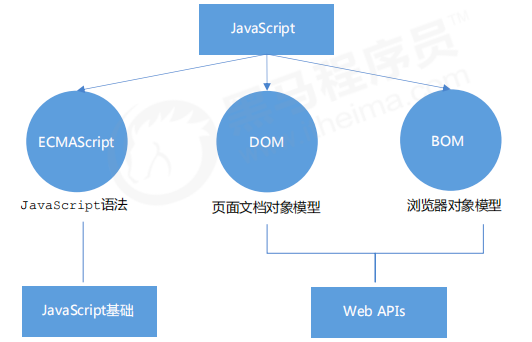

#### 1.1.2 JS 基础阶段与 `Web APIs` 阶段的对比

<table>
    <tr>
        <th>JS 基础阶段</th>
        <th>Web APIs 阶段</th>
    </tr>
    <tr>
        <td>
            <ul>
                <li>我们学习的是 ECMAScript 标准规定的基本语法</li>
                <li>要求同学们掌握 JS 基础语法</li>
                <li>只学习基本语法，做不了常用的网页交互效果</li>
                <li>目的是为了 JS 后面的课程打基础、做铺垫</li>
            </ul>
        </td>
        <td>
            <ul>
                <li>Web APIs 是 W3C 组织的标准</li>
                <li>Web APIs 我们主要学习 DOM 和 BOM</li>
                <li>Web APIs 是我们 JS 所独有的部分</li>
                <li>我们主要学习页面交互功能</li>
                <li>需要使用 JS 基础的课程内容做基础</li>
            </ul>
        </td>
    </tr>
</table>

### 1.2 `API` 和 `Web API` 的概念

**`API`：**

```:no-line-numbers
API（Application Programming Interface,应用程序编程接口）是一些预先定义的函数，
目的是提供应用程序与开发人员基于某软件或硬件得以访问一组例程的能力，而又无需访问源码，或理解内部工作机制的细节。

简单理解：API 是给程序员提供的一种工具，以便能更轻松的实现想要完成的功能。
```

**`Web API`：**

```:no-line-numbers
Web API 是浏览器提供的一套操作浏览器功能和页面元素的 API（BOM 和 DOM）。
现阶段我们主要针对于浏览器讲解常用的 API，主要针对浏览器做交互效果。

因为 Web API 很多，所以我们将这个阶段称为 Web APIs
```

> `MDN` 详细文档：[https://developer.mozilla.org/zh-CN/docs/Web/API](https://developer.mozilla.org/zh-CN/docs/Web/API)


## 2. `DOM`（文档对象模型）

### 2.1 `DOM` 简介

#### 2.1.1 什么是 `DOM`

文档对象模型（`Document Object Model`，简称 `DOM`），是 `W3C` 组织推荐的处理可扩展标记语言（`HTML` 或者 `XML`）的标准编程接口。

`W3C` 已经定义了一系列的 `DOM` 接口，通过这些 `DOM` 接口可以改变网页的内容、结构和样式。

#### 2.1.2 `DOM` 树

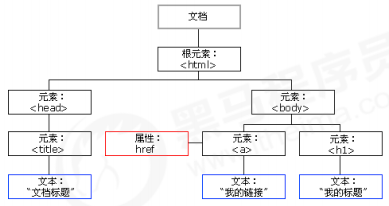

```:no-line-numbers
- 文档：一个页面就是一个文档，DOM 中使用 document 表示
- 元素：页面中的所有标签都是元素，DOM 中使用 element 表示
- 节点：网页中的所有内容都是节点（标签、属性、文本、注释等），DOM 中使用 node 表示

DOM 把以上内容都看做是对象
```

### 2.2 获取元素

`DOM` 在我们实际开发中主要用来操作元素。我们如何来获取页面中的元素呢?获取页面中的元素可以使用以下几种方式：

1. 根据 `ID` 获取
   
2. 根据标签名获取
   
3. 通过 `HTML5` 新增的方法获取
   
4. 特殊元素获取

#### 2.2.1 根据 `ID` 获取：`document.getElementById('id')`

```js:no-line-numbers
// 使用 getElementById() 方法可以获取带有 ID 的元素对象。
document.getElementById('id');
```

**示例：**

```html:no-line-numbers
<!DOCTYPE html>
<html lang="en">

<head>
    <meta charset="UTF-8">
    <meta name="viewport" content="width=device-width, initial-scale=1.0">
    <meta http-equiv="X-UA-Compatible" content="ie=edge">
    <title>Document</title>
</head>

<body>
    <div id="time">2019-9-9</div>
    <script>
        // 1. 因为我们文档页面从上往下加载，所以先得有标签，所以我们script写到标签的下面
        // 3. 参数 id 是大小写敏感的字符串
        // 4. 返回的是一个元素对象
        var timer = document.getElementById('time');
        console.log(timer);
        console.log(typeof timer);
        // 5. console.dir 打印我们返回的元素对象 更好的查看里面的属性和方法
        console.dir(timer);
    </script>
</body>

</html>
```

#### 2.2.2 根据标签名获取：`document.getElementsByTagName('标签名')`

```js:no-line-numbers
// 使用 getElementsByTagName() 方法可以返回带有指定标签名的对象的集合。
document.getElementsByTagName('标签名');
```

```:no-line-numbers
注意：
1. 因为得到的是一个对象的集合，所以我们想要操作里面的元素就需要遍历；
2. 得到元素对象是动态的；
3. 如果获取不到元素，则返回为空的伪数组(因为获取不到对象)。
```

##### 2.2.2.1 获取某个元素内部所有指定标签名的子元素：`element.getElementsByTagName('标签名')`

```js:no-line-numbers
// 获取某个元素 element（父元素） 内部所有指定标签名的子元素
element.getElementsByTagName('标签名');
```

```:no-line-numbers
注意：
父元素必须是单个对象（必须指明是哪一个元素对象），获取的时候不包括父元素自己。
```

**示例：**

```html:no-line-numbers
<!DOCTYPE html>
<html lang="en">

<head>
    <meta charset="UTF-8">
    <meta name="viewport" content="width=device-width, initial-scale=1.0">
    <meta http-equiv="X-UA-Compatible" content="ie=edge">
    <title>Document</title>
</head>

<body>
    <ul>
        <li>知否知否，应是等你好久11</li>
        <li>知否知否，应是等你好久11</li>
        <li>知否知否，应是等你好久11</li>
        <li>知否知否，应是等你好久11</li>

    </ul>
    <ol id="ol">
        <li>生僻字</li>
        <li>生僻字</li>
        <li>生僻字</li>
        <li>生僻字</li>

    </ol>

    <script>
        // 1.返回的是 获取过来元素对象的集合 以伪数组的形式存储的
        var lis = document.getElementsByTagName('li');
        console.log(lis);
        console.log(lis[0]);
        // 2. 我们想要依次打印里面的元素对象我们可以采取遍历的方式
        for (var i = 0; i < lis.length; i++) {
            console.log(lis[i]);

        }
        // 3. 如果页面中只有一个li 返回的还是伪数组的形式 
        // 4. 如果页面中没有这个元素 返回的是空的伪数组的形式
        // 5. element.getElementsByTagName('标签名'); 父元素必须是指定的单个元素
        // var ol = document.getElementsByTagName('ol'); // [ol]
        // console.log(ol[0].getElementsByTagName('li'));
        var ol = document.getElementById('ol');
        console.log(ol.getElementsByTagName('li'));
    </script>
</body>

</html>
```

#### 2.2.3 通过 `HTML5` 新增的方法获取

##### 2.2.3.1 根据类名获取：`document.getElementsByClassName(‘类名’)`

```js:no-line-numbers
// 1. 根据类名返回元素对象集合
document.getElementsByClassName(‘类名’)
```

##### 2.2.3.2 根据选择器获取：`document.querySelector('选择器')` & ` document.querySelectorAll('选择器');`

```js:no-line-numbers
// 2. 根据指定选择器返回第一个元素对象
document.querySelector('选择器');
```

```js:no-line-numbers
// 3. 根据指定选择器返回所有元素对象集合
 document.querySelectorAll('选择器');
```

```:no-line-numbers
注意：
querySelector 和 querySelectorAll 里面的选择器需要加符号，比如：document.querySelector('#nav');
```

**示例：**

```html:no-line-numbers
<!DOCTYPE html>
<html lang="en">

<head>
    <meta charset="UTF-8">
    <meta name="viewport" content="width=device-width, initial-scale=1.0">
    <meta http-equiv="X-UA-Compatible" content="ie=edge">
    <title>Document</title>
</head>

<body>
    <div class="box">盒子1</div>
    <div class="box">盒子2</div>
    <div id="nav">
        <ul>
            <li>首页</li>
            <li>产品</li>
        </ul>
    </div>
    <script>
        // 1. getElementsByClassName 根据类名获得某些元素集合
        var boxs = document.getElementsByClassName('box');
        console.log(boxs);
        // 2. querySelector 返回指定选择器的第一个元素对象  切记 里面的选择器需要加符号 .box  #nav
        var firstBox = document.querySelector('.box');
        console.log(firstBox);
        var nav = document.querySelector('#nav');
        console.log(nav);
        var li = document.querySelector('li');
        console.log(li);
        // 3. querySelectorAll()返回指定选择器的所有元素对象集合
        var allBox = document.querySelectorAll('.box');
        console.log(allBox);
        var lis = document.querySelectorAll('li');
        console.log(lis);
    </script>
</body>

</html>
```

#### 2.2.4 特殊元素获取（`body`、`html`）

##### 2.2.4.1 获取 `body` 元素：`doucumnet.body`

```js:no-line-numbers
// 返回 body 元素对象
doucumnet.body
```

##### 2.2.4.2 获取 `html` 元素：`doucumnet.documentElement`

```js:no-line-numbers
// 返回 html 元素对象
doucumnet.documentElement
```

**示例：**

```js:no-line-numbers
<!DOCTYPE html>
<html lang="en">

<head>
    <meta charset="UTF-8">
    <meta name="viewport" content="width=device-width, initial-scale=1.0">
    <meta http-equiv="X-UA-Compatible" content="ie=edge">
    <title>Document</title>
</head>

<body>
    <script>
        // 1.获取body 元素
        var bodyEle = document.body;
        console.log(bodyEle);
        console.dir(bodyEle);
        // 2.获取html 元素
        // var htmlEle = document.html;
        var htmlEle = document.documentElement;
        console.log(htmlEle);
    </script>
</body>

</html>
```

### 2.3 事件基础

`JavaScript` 使我们有能力创建动态页面，而事件是可以被 `JavaScript` 侦测到的行为。

> 简单理解： 触发——响应机制。

网页中的每个元素都可以产生某些可以触发 `JavaScript` 的事件，例如，我们可以在用户点击某按钮时产生一个事件，然后去执行某些操作。

#### 2.3.1 事件三要素

1. 事件源（谁）
   
2. 事件类型（什么事件）
   
3. 事件处理程序（做啥）

```html:no-line-numbers
<!DOCTYPE html>
<html lang="en">

<head>
    <meta charset="UTF-8">
    <meta name="viewport" content="width=device-width, initial-scale=1.0">
    <meta http-equiv="X-UA-Compatible" content="ie=edge">
    <title>Document</title>
</head>

<body>
    <button id="btn">唐伯虎</button>
    <script>
        // 点击一个按钮，弹出对话框
        //(1) 事件源：事件被触发的对象 —— 谁 —— 按钮
        var btn = document.getElementById('btn');
        //(2) 事件类型：如何触发 什么事件 比如鼠标点击(onclick) 还是鼠标经过 还是键盘按下
        //(3) 事件处理程序：通过一个函数赋值的方式 完成
        btn.onclick = function() {
            alert('点秋香');
        }
    </script>
</body>

</html>
```

#### 2.3.2 执行事件的步骤

```:no-line-numbers
1. 获取事件源
2. 注册事件（绑定事件）
3. 添加事件处理程序（采取函数赋值形式）
```

```html:no-line-numbers
<body>
    <div>123</div>
    <script>
        // 执行事件步骤
        // 点击div 控制台输出 我被选中了
        // 1. 获取事件源
        var div = document.querySelector('div');
        // 2.绑定事件 注册事件
        // div.onclick 
        // 3.添加事件处理程序 
        div.onclick = function() {
            console.log('我被选中了');
        }
    </script>
</body>
```

#### 2.3.3 常见的鼠标事件

|**鼠标事件**|**触发条件**|
|:-|:-|
|`onclick`|鼠标点击左键触发|
|`onmouseover`|鼠标经过触发|
|`onmouseout`|鼠标离开触发|
|`onfocus`|获得鼠标焦点触发|
|`onblur`|失去鼠标焦点触发|
|`onmousemove`|鼠标移动触发|
|`onmouseup`|鼠标弹起触发|
|`onmousedown`|鼠标按下触发|

### 2.4 操作元素

`JavaScript` 的 `DOM` 操作可以改变网页内容、结构和样式，我们可以利用 `DOM` 操作元素来改变元素里面的内容 、属性等。

> 注意：操作元素，就是修改元素的属性。

#### 2.4.1 操作元素内容：`element.innerText` & `element.innerHTML`

```js:no-line-numbers
// 从起始位置到终止位置的内容, 但它去除 html 标签， 同时空格和换行也会去掉
element.innerText
    
// 起始位置到终止位置的全部内容，包括 html 标签，同时保留空格和换行
element.innerHTML
```

##### 2.4.1.1 示例1：显示当前系统时间

```html:no-line-numbers
<!DOCTYPE html>
<html lang="en">

<head>
    <meta charset="UTF-8">
    <meta name="viewport" content="width=device-width, initial-scale=1.0">
    <meta http-equiv="X-UA-Compatible" content="ie=edge">
    <title>Document</title>
    <style>
        div,
        p {
            width: 300px;
            height: 30px;
            line-height: 30px;
            color: #fff;
            background-color: pink;
        }
    </style>
</head>

<body>
    <button>显示当前系统时间</button>
    <div>某个时间</div>
    <p>1123</p>
    <script>
        // 当我们点击了按钮，  div里面的文字会发生变化
        // 1. 获取元素 
        var btn = document.querySelector('button');
        var div = document.querySelector('div');
        // 2.注册事件
        btn.onclick = function() {
            // div.innerText = '2019-6-6';
            div.innerHTML = getDate();
        }

        function getDate() {
            var date = new Date();
            // 我们写一个 2019年 5月 1日 星期三
            var year = date.getFullYear();
            var month = date.getMonth() + 1;
            var dates = date.getDate();
            var arr = ['星期日', '星期一', '星期二', '星期三', '星期四', '星期五', '星期六'];
            var day = date.getDay();
            return '今天是：' + year + '年' + month + '月' + dates + '日 ' + arr[day];
        }
        // 我们元素可以不用添加事件
        var p = document.querySelector('p');
        p.innerHTML = getDate();
    </script>
</body>

</html>
```

##### 2.4.1.2 示例2：`innerText` 和 `innerHTML` 的区别 

```html:no-line-numbers
<!DOCTYPE html>
<html lang="en">

<head>
    <meta charset="UTF-8">
    <meta name="viewport" content="width=device-width, initial-scale=1.0">
    <meta http-equiv="X-UA-Compatible" content="ie=edge">
    <title>Document</title>
</head>

<body>
    <div></div>
    <p>
        我是文字
        <span>123</span>
    </p>
    <script>
        // innerText 和 innerHTML的区别 
        // 1. innerText 不识别html标签 非标准  去除空格和换行
        var div = document.querySelector('div');
        // div.innerText = '<strong>今天是：</strong> 2019';
        // 2. innerHTML 识别html标签 W3C标准 保留空格和换行的
        div.innerHTML = '<strong>今天是：</strong> 2019';
        // 这两个属性是可读写的  可以获取元素里面的内容
        var p = document.querySelector('p');
        console.log(p.innerText);
        console.log(p.innerHTML);
    </script>
</body>

</html>
```

#### 2.4.2 操作常用元素的属性

```:no-line-numbers
1. innerText、innerHTML 改变元素内容
2. src、href
3. id、alt、title
```

##### 2.4.2.1 示例1

```html:no-line-numbers
<!DOCTYPE html>
<html lang="en">

<head>
    <meta charset="UTF-8">
    <meta name="viewport" content="width=device-width, initial-scale=1.0">
    <meta http-equiv="X-UA-Compatible" content="ie=edge">
    <title>Document</title>
    <style>
        img {
            width: 300px;
        }
    </style>
</head>

<body>
    <button id="ldh">刘德华</button>
    <button id="zxy">张学友</button> <br>
    

    <script>
        // 修改元素属性  src
        // 1. 获取元素
        var ldh = document.getElementById('ldh');
        var zxy = document.getElementById('zxy');
        var img = document.querySelector('img');
        // 2. 注册事件  处理程序
        zxy.onclick = function() {
            img.src = 'images/zxy.jpg';
            img.title = '张学友思密达';
        }
        ldh.onclick = function() {
            img.src = 'images/ldh.jpg';
            img.title = '刘德华';
        }
    </script>
</body>

</html>
```

##### 2.4.2.2 示例2

```html:no-line-numbers
<!DOCTYPE html>
<html lang="en">

<head>
    <meta charset="UTF-8">
    <meta name="viewport" content="width=device-width, initial-scale=1.0">
    <meta http-equiv="X-UA-Compatible" content="ie=edge">
    <title>Document</title>
    <style>
        img {
            width: 300px;
        }
    </style>
</head>

<body>
    
    <div>上午好</div>
    <script>
        // 根据系统不同时间来判断，所以需要用到日期内置对象
        // 利用多分支语句来设置不同的图片
        // 需要一个图片，并且根据时间修改图片，就需要用到操作元素src属性
        // 需要一个div元素，显示不同问候语，修改元素内容即可
        // 1.获取元素
        var img = document.querySelector('img');
        var div = document.querySelector('div');
        // 2. 得到当前的小时数
        var date = new Date();
        var h = date.getHours();
        // 3. 判断小时数改变图片和文字信息
        if (h < 12) {
            img.src = 'images/s.gif';
            div.innerHTML = '亲，上午好，好好写代码';
        } else if (h < 18) {
            img.src = 'images/x.gif';
            div.innerHTML = '亲，下午好，好好写代码';
        } else {
            img.src = 'images/w.gif';
            div.innerHTML = '亲，晚上好，好好写代码';

        }
    </script>
</body>

</html>
```

#### 2.4.3 操作表单元素的属性

利用 `DOM` 可以操作如下表单元素的属性：

```:no-line-numbers
type、value、checked、selected、disabled
```

##### 2.4.3.1 示例1

```html:no-line-numbers
<!DOCTYPE html>
<html lang="en">

<head>
    <meta charset="UTF-8">
    <meta name="viewport" content="width=device-width, initial-scale=1.0">
    <meta http-equiv="X-UA-Compatible" content="ie=edge">
    <title>Document</title>
</head>

<body>
    <button>按钮</button>
    <input type="text" value="输入内容">
    <script>
        // 1. 获取元素
        var btn = document.querySelector('button');
        var input = document.querySelector('input');
        // 2. 注册事件 处理程序
        btn.onclick = function() {
            // input.innerHTML = '点击了';  这个是 普通盒子 比如 div 标签里面的内容
            // 表单里面的值 文字内容是通过 value 来修改的
            input.value = '被点击了';
            // 如果想要某个表单被禁用 不能再点击 disabled  我们想要这个按钮 button禁用
            // btn.disabled = true;
            this.disabled = true;
            // this 指向的是事件函数的调用者 btn
        }
    </script>
</body>

</html>
```

##### 2.4.3.2 示例2：仿京东显示隐藏密码

```html:no-line-numbers
<!DOCTYPE html>
<html lang="en">

<head>
    <meta charset="UTF-8">
    <meta name="viewport" content="width=device-width, initial-scale=1.0">
    <meta http-equiv="X-UA-Compatible" content="ie=edge">
    <title>Document</title>
    <style>
        .box {
            position: relative;
            width: 400px;
            border-bottom: 1px solid #ccc;
            margin: 100px auto;
        }
        
        .box input {
            width: 370px;
            height: 30px;
            border: 0;
            outline: none;
        }
        
        .box img {
            position: absolute;
            top: 2px;
            right: 2px;
            width: 24px;
        }
    </style>
</head>

<body>
    <div class="box">
        <label for="">
            
        </label>
        <input type="password" name="" id="pwd">
    </div>
    <script>
        // 1. 获取元素
        var eye = document.getElementById('eye');
        var pwd = document.getElementById('pwd');
        // 2. 注册事件 处理程序
        var flag = 0;
        eye.onclick = function() {
            // 点击一次之后， flag 一定要变化
            if (flag == 0) {
                pwd.type = 'text';
                eye.src = 'images/open.png';
                flag = 1; // 赋值操作
            } else {
                pwd.type = 'password';
                eye.src = 'images/close.png';
                flag = 0;
            }
        }
    </script>
</body>

</html>
```

#### 2.4.4 操作元素的样式属性：`element.style` & `element.className`

我们可以通过 `JS` 修改元素的大小、颜色、位置等样式。

```:no-line-numbers
1. element.style 行内样式操作
2. element.className 类名样式操作
```

```:no-line-numbers
注意：
1. JS 里面的样式采取驼峰命名法，比如 fontSize、backgroundColor
2. JS 修改 style 样式操作，产生的是行内样式，CSS 权重比较高
3. 如果样式修改较多，可以采取操作类名方式更改元素样式。
4. class 因为是个保留字，因此使用className来操作元素类名属性
5. className 会直接更改元素的类名，会覆盖原先的类名。
```

##### 2.4.4.1 示例1

```html:no-line-numbers
<!DOCTYPE html>
<html lang="en">

<head>
    <meta charset="UTF-8">
    <meta name="viewport" content="width=device-width, initial-scale=1.0">
    <meta http-equiv="X-UA-Compatible" content="ie=edge">
    <title>Document</title>
    <style>
        div {
            width: 200px;
            height: 200px;
            background-color: pink;
        }
    </style>
</head>

<body>
    <div></div>
    <script>
        // 1. 获取元素
        var div = document.querySelector('div');
        // 2. 注册事件 处理程序
        div.onclick = function() {
            // div.style里面的属性 采取驼峰命名法 
            this.style.backgroundColor = 'purple';
            this.style.width = '250px';
        }
    </script>
</body>

</html>
```

##### 2.4.4.2 示例2：关闭淘宝二维码案例

```html:no-line-numbers
<!DOCTYPE html>
<html lang="en">

<head>
    <meta charset="UTF-8">
    <meta name="viewport" content="width=device-width, initial-scale=1.0">
    <meta http-equiv="X-UA-Compatible" content="ie=edge">
    <title>Document</title>
    <style>
        .box {
            position: relative;
            width: 74px;
            height: 88px;
            border: 1px solid #ccc;
            margin: 100px auto;
            font-size: 12px;
            text-align: center;
            color: #f40;
            /* display: block; */
        }
        
        .box img {
            width: 60px;
            margin-top: 5px;
        }
        
        .close-btn {
            position: absolute;
            top: -1px;
            left: -16px;
            width: 14px;
            height: 14px;
            border: 1px solid #ccc;
            line-height: 14px;
            font-family: Arial, Helvetica, sans-serif;
            cursor: pointer;
        }
    </style>
</head>

<body>
    <div class="box">
        淘宝二维码
        
        <i class="close-btn">×</i>
    </div>
    <script>
        // 1. 获取元素 
        var btn = document.querySelector('.close-btn');
        var box = document.querySelector('.box');
        // 2.注册事件 程序处理
        btn.onclick = function() {
            box.style.display = 'none';
        }
    </script>
</body>

</html>
```

##### 2.4.4.3 示例3：循环精灵图背景

```html:no-line-numbers
<!DOCTYPE html>
<html lang="en">

<head>
    <meta charset="UTF-8">
    <meta name="viewport" content="width=device-width, initial-scale=1.0">
    <meta http-equiv="X-UA-Compatible" content="ie=edge">
    <title>Document</title>
    <style>
        * {
            margin: 0;
            padding: 0;
        }
        
        li {
            list-style-type: none;
        }
        
        .box {
            width: 250px;
            margin: 100px auto;
        }
        
        .box li {
            float: left;
            width: 24px;
            height: 24px;
            background-color: pink;
            margin: 15px;
            background: url(images/sprite.png) no-repeat;
        }
    </style>
</head>

<body>
    <div class="box">
        <ul>
            <li></li>
            <li></li>
            <li></li>
            <li></li>
            <li></li>
            <li></li>
            <li></li>
            <li></li>
            <li></li>
            <li></li>
            <li></li>
            <li></li>
        </ul>
    </div>
    <script>
        // 1. 获取元素 所有的小li 
        var lis = document.querySelectorAll('li');
        for (var i = 0; i < lis.length; i++) {
            // 让索引号 乘以 44 就是每个li 的背景y坐标  index就是我们的y坐标
            // i*44 就是精灵图片 sprite.png 中每个小图标相对于整个精灵图的y坐标偏移量
            var index = i * 44;
            lis[i].style.backgroundPosition = '0 -' + index + 'px';
        }
    </script>
</body>

</html>
```

##### 2.4.4.4 示例4：显示隐藏文本框内容

当鼠标点击文本框时，里面的默认文字隐藏，当鼠标离开文本框时，里面的文字显示。

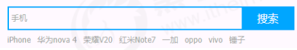

```html:no-line-numbers
<!DOCTYPE html>
<html lang="en">

<head>
    <meta charset="UTF-8">
    <meta name="viewport" content="width=device-width, initial-scale=1.0">
    <meta http-equiv="X-UA-Compatible" content="ie=edge">
    <title>Document</title>
    <style>
        input {
            color: #999;
        }
    </style>
</head>

<body>
    <input type="text" value="手机">
    <script>
        // 1.获取元素
        var text = document.querySelector('input');
        // 2.注册事件 获得焦点事件 onfocus 
        text.onfocus = function() {
                // console.log('得到了焦点');
                if (this.value === '手机') {
                    this.value = '';
                }
                // 获得焦点需要把文本框里面的文字颜色变黑
                this.style.color = '#333';
            }
            // 3. 注册事件 失去焦点事件 onblur
        text.onblur = function() {
            // console.log('失去了焦点');
            if (this.value === '') {
                this.value = '手机';
            }
            // 失去焦点需要把文本框里面的文字颜色变浅色
            this.style.color = '#999';
        }
    </script>

</body>

</html>
```

##### 2.4.4.5 示例5：通过 `className` 更改元素样式

```html:no-line-numbers
<!DOCTYPE html>
<html lang="en">

<head>
    <meta charset="UTF-8">
    <meta name="viewport" content="width=device-width, initial-scale=1.0">
    <meta http-equiv="X-UA-Compatible" content="ie=edge">
    <title>Document</title>
    <style>
        div {
            width: 100px;
            height: 100px;
            background-color: pink;
        }
        
        .change {
            background-color: purple;
            color: #fff;
            font-size: 25px;
            margin-top: 100px;
        }
    </style>
</head>


<body>
    <div class="first">文本</div>
    <script>
        // 1. 使用 element.style 获得修改元素样式  如果样式比较少 或者 功能简单的情况下使用
        var test = document.querySelector('div');
        test.onclick = function() {
            // this.style.backgroundColor = 'purple';
            // this.style.color = '#fff';
            // this.style.fontSize = '25px';
            // this.style.marginTop = '100px';
            // 让我们当前元素的类名改为了 change

            // 2. 我们可以通过 修改元素的className更改元素的样式 适合于样式较多或者功能复杂的情况
            // 3. 如果想要保留原先的类名，我们可以这么做 多类名选择器
            // this.className = 'change';
            this.className = 'first change';
        }
    </script>
</body>

</html>
```

##### 2.4.4.6 示例6：密码框格式提示错误信息

用户如果离开密码框，里面输入个数不是 6~16，则提示错误信息，否则提示输入正确信息。

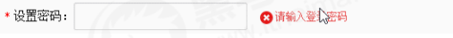

```html:no-line-numbers
<!DOCTYPE html>
<html lang="en">

<head>
    <meta charset="UTF-8">
    <meta name="viewport" content="width=device-width, initial-scale=1.0">
    <meta http-equiv="X-UA-Compatible" content="ie=edge">
    <title>Document</title>
    <style>
        div {
            width: 600px;
            margin: 100px auto;
        }
        
        .message {
            display: inline-block;
            font-size: 12px;
            color: #999;
            background: url(images/mess.png) no-repeat left center;
            padding-left: 20px;
        }
        
        .wrong {
            color: red;
            background-image: url(images/wrong.png);
        }
        
        .right {
            color: green;
            background-image: url(images/right.png);
        }
    </style>
</head>

<body>
    <div class="register">
        <input type="password" class="ipt">
        <p class="message">请输入6~16位密码</p>
    </div>
    <script>
        // 首先判断的事件是表单失去焦点 onblur
        // 如果输入正确则提示正确的信息颜色为绿色小图标变化
        // 如果输入不是6到16位，则提示错误信息颜色为红色 小图标变化
        // 因为里面变化样式较多，我们采取className修改样式
        // 1.获取元素
        var ipt = document.querySelector('.ipt');
        var message = document.querySelector('.message');
        //2. 注册事件 失去焦点
        ipt.onblur = function() {
            // 根据表单里面值的长度 ipt.value.length
            if (this.value.length < 6 || this.value.length > 16) {
                // console.log('错误');
                message.className = 'message wrong';
                message.innerHTML = '您输入的位数不对要求6~16位';
            } else {
                message.className = 'message right';
                message.innerHTML = '您输入的正确';
            }
        }
    </script>
</body>

</html>
```

##### 2.4.4.7 示例7：开关灯

```html:no-line-numbers
<!DOCTYPE html>
<html lang="en">

<head>
    <meta charset="UTF-8">
    <meta name="viewport" content="width=device-width, initial-scale=1.0">
    <meta http-equiv="X-UA-Compatible" content="ie=edge">
    <title>Document</title>
</head>

<body>
    <button id="btn">开关灯</button>
    <script>
        var btn = document.getElementById('btn');
        var flag = 0;
        btn.onclick = function() {
            if (flag == 0) {
                document.body.style.backgroundColor = 'black';
                flag = 1;
            } else {
                document.body.style.backgroundColor = '#fff';
                flag = 0;
            }
        }
    </script>
</body>

</html>
```

#### 2.4.5 操作元素小结

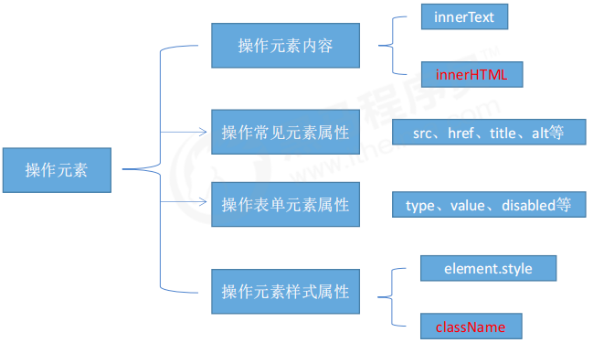

#### 2.4.6 排他思想

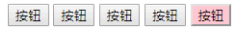

如果有同一组元素，我们想要某一个元素实现某种样式，需要用到循环的排他思想算法：

1. 所有元素全部清除样式（干掉其他人）
   
2. 给当前元素设置样式（留下我自己）
   
3. 注意顺序不能颠倒，首先干掉其他人，再设置自己

```html:no-line-numbers
<!DOCTYPE html>
<html lang="en">

<head>
    <meta charset="UTF-8">
    <meta name="viewport" content="width=device-width, initial-scale=1.0">
    <meta http-equiv="X-UA-Compatible" content="ie=edge">
    <title>Document</title>
</head>

<body>
    <button>按钮1</button>
    <button>按钮2</button>
    <button>按钮3</button>
    <button>按钮4</button>
    <button>按钮5</button>
    <script>
        // 1. 获取所有按钮元素
        var btns = document.getElementsByTagName('button');
        // btns得到的是伪数组  里面的每一个元素 btns[i]
        for (var i = 0; i < btns.length; i++) {
            btns[i].onclick = function() {
                // (1) 我们先把所有的按钮背景颜色去掉  干掉所有人
                for (var i = 0; i < btns.length; i++) {
                    btns[i].style.backgroundColor = '';
                }
                // (2) 然后才让当前的元素背景颜色为pink 留下我自己
                this.style.backgroundColor = 'pink';

            }
        }
        //2. 首先先排除其他人，然后才设置自己的样式 这种排除其他人的思想我们成为排他思想
    </script>
</body>

</html>
```

##### 2.4.6.1 示例1：百度换肤效果

```:no-line-numbers
案例分析
① 这个案例练习的是给一组元素注册事件
② 给4个小图片利用循环注册点击事件
③ 当我们点击了这个图片，让我们页面背景改为当前的图片
④ 核心算法： 把当前图片的src 路径取过来，给 body 做为背景即可
```

```html:no-line-numbers
<!DOCTYPE html>
<html lang="en">

<head>
    <meta charset="UTF-8">
    <meta name="viewport" content="width=device-width, initial-scale=1.0">
    <meta http-equiv="X-UA-Compatible" content="ie=edge">
    <title>Document</title>
    <style>
        * {
            margin: 0;
            padding: 0;
        }
        
        body {
            background: url(images/1.jpg) no-repeat center top;
        }
        
        li {
            list-style: none;
        }
        
        .baidu {
            overflow: hidden;
            margin: 100px auto;
            background-color: #fff;
            width: 410px;
            padding-top: 3px;
        }
        
        .baidu li {
            float: left;
            margin: 0 1px;
            cursor: pointer;
        }
        
        .baidu img {
            width: 100px;
        }
    </style>
</head>

<body>
    <ul class="baidu">
        <li></li>
        <li></li>
        <li></li>
        <li></li>
    </ul>
    <script>
        // 1. 获取元素 
        var imgs = document.querySelector('.baidu').querySelectorAll('img');
        // console.log(imgs);
        // 2. 循环注册事件 
        for (var i = 0; i < imgs.length; i++) {
            imgs[i].onclick = function() {
                // this.src 就是我们点击图片的路径   images/2.jpg
                // console.log(this.src);
                // 把这个路径 this.src 给body 就可以了
                document.body.style.backgroundImage = 'url(' + this.src + ')';
            }
        }
    </script>
</body>

</html>
```

##### 2.4.6.2 示例2：表格隔行变色

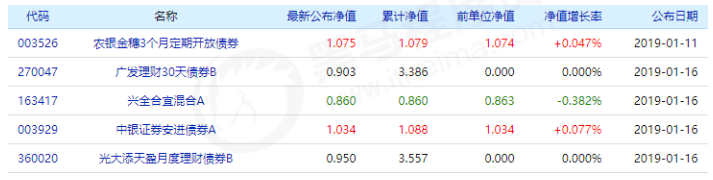

```:no-line-numbers
案例分析
① 用到新的鼠标事件 鼠标经过 onmouseover 鼠标离开 onmouseout
② 核心思路：鼠标经过 tr 行，当前的行变背景颜色， 鼠标离开去掉当前的背景颜色
③ 注意： 第一行（thead里面的行）不需要变换颜色，因此我们获取的是 tbody 里面的行
```

```html:no-line-numbers
<!DOCTYPE html>
<html lang="en">

<head>
    <meta charset="UTF-8">
    <meta name="viewport" content="width=device-width, initial-scale=1.0">
    <meta http-equiv="X-UA-Compatible" content="ie=edge">
    <title>Document</title>
    <style>
        table {
            width: 800px;
            margin: 100px auto;
            text-align: center;
            border-collapse: collapse;
            font-size: 14px;
        }
        
        thead tr {
            height: 30px;
            background-color: skyblue;
        }
        
        tbody tr {
            height: 30px;
        }
        
        tbody td {
            border-bottom: 1px solid #d7d7d7;
            font-size: 12px;
            color: blue;
        }
        
        .bg {
            background-color: pink;
        }
    </style>
</head>

<body>
    <table>
        <thead>
            <tr>
                <th>代码</th>
                <th>名称</th>
                <th>最新公布净值</th>
                <th>累计净值</th>
                <th>前单位净值</th>
                <th>净值增长率</th>
            </tr>
        </thead>
        <tbody>
            <tr>
                <td>003526</td>
                <td>农银金穗3个月定期开放债券</td>
                <td>1.075</td>
                <td>1.079</td>
                <td>1.074</td>
                <td>+0.047%</td>
            </tr>
            <tr>
                <td>003526</td>
                <td>农银金穗3个月定期开放债券</td>
                <td>1.075</td>
                <td>1.079</td>
                <td>1.074</td>
                <td>+0.047%</td>
            </tr>
            <tr>
                <td>003526</td>
                <td>农银金穗3个月定期开放债券</td>
                <td>1.075</td>
                <td>1.079</td>
                <td>1.074</td>
                <td>+0.047%</td>
            </tr>
            <tr>
                <td>003526</td>
                <td>农银金穗3个月定期开放债券</td>
                <td>1.075</td>
                <td>1.079</td>
                <td>1.074</td>
                <td>+0.047%</td>
            </tr>
            <tr>
                <td>003526</td>
                <td>农银金穗3个月定期开放债券</td>
                <td>1.075</td>
                <td>1.079</td>
                <td>1.074</td>
                <td>+0.047%</td>
            </tr>
            <tr>
                <td>003526</td>
                <td>农银金穗3个月定期开放债券</td>
                <td>1.075</td>
                <td>1.079</td>
                <td>1.074</td>
                <td>+0.047%</td>
            </tr>
        </tbody>
    </table>
    <script>
        // 1.获取元素 获取的是 tbody 里面所有的行
        var trs = document.querySelector('tbody').querySelectorAll('tr');
        // 2. 利用循环绑定注册事件
        for (var i = 0; i < trs.length; i++) {
            // 3. 鼠标经过事件 onmouseover
            trs[i].onmouseover = function() {
                    // console.log(11);
                    this.className = 'bg';
                }
                // 4. 鼠标离开事件 onmouseout
            trs[i].onmouseout = function() {
                this.className = '';
            }
        }
    </script>
</body>

</html>
```

##### 2.4.6.3 示例3：全选反选

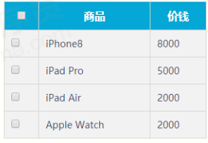

```:no-line-numbers
业务需求：
1. 点击上面全选复选框，下面所有的复选框都选中（全选）
2. 再次点击全选复选框，下面所有的复选框都不中选（取消全选）
3. 如果下面复选框全部选中，上面全选按钮就自动选中
4. 如果下面复选框有一个没有选中，上面全选按钮就不选中
5. 所有复选框一开始默认都没选中状态

案例分析：
① 全选和取消全选做法： 让下面所有复选框的checked属性（选中状态） 跟随 全选按钮即可
② 下面复选框需要全部选中，上面全选才能选中做法： 给下面所有复选框绑定点击事件，每次点击，都
    要循环查看下面所有的复选框是否有没选中的，如果有一个没选中的， 上面全选就不选中。
③ 可以设置一个变量，来控制全选是否选中
```

```html:no-line-numbers
<!DOCTYPE html>
<html>

<head lang="en">
    <meta charset="UTF-8">
    <title></title>
    <style>
        * {
            padding: 0;
            margin: 0;
        }
        
        .wrap {
            width: 300px;
            margin: 100px auto 0;
        }
        
        table {
            border-collapse: collapse;
            border-spacing: 0;
            border: 1px solid #c0c0c0;
            width: 300px;
        }
        
        th,
        td {
            border: 1px solid #d0d0d0;
            color: #404060;
            padding: 10px;
        }
        
        th {
            background-color: #09c;
            font: bold 16px "微软雅黑";
            color: #fff;
        }
        
        td {
            font: 14px "微软雅黑";
        }
        
        tbody tr {
            background-color: #f0f0f0;
        }
        
        tbody tr:hover {
            cursor: pointer;
            background-color: #fafafa;
        }
    </style>

</head>

<body>
    <div class="wrap">
        <table>
            <thead>
                <tr>
                    <th>
                        <input type="checkbox" id="j_cbAll" />
                    </th>
                    <th>商品</th>
                    <th>价钱</th>
                </tr>
            </thead>
            <tbody id="j_tb">
                <tr>
                    <td>
                        <input type="checkbox" />
                    </td>
                    <td>iPhone8</td>
                    <td>8000</td>
                </tr>
                <tr>
                    <td>
                        <input type="checkbox" />
                    </td>
                    <td>iPad Pro</td>
                    <td>5000</td>
                </tr>
                <tr>
                    <td>
                        <input type="checkbox" />
                    </td>
                    <td>iPad Air</td>
                    <td>2000</td>
                </tr>
                <tr>
                    <td>
                        <input type="checkbox" />
                    </td>
                    <td>Apple Watch</td>
                    <td>2000</td>
                </tr>

            </tbody>
        </table>
    </div>
    <script>
        // 1. 全选和取消全选做法：  让下面所有复选框的checked属性（选中状态） 跟随 全选按钮即可
        // 获取元素
        var j_cbAll = document.getElementById('j_cbAll'); // 全选按钮
        var j_tbs = document.getElementById('j_tb').getElementsByTagName('input'); // 下面所有的复选框
        // 注册事件
        j_cbAll.onclick = function() {
                // this.checked 它可以得到当前复选框的选中状态如果是true 就是选中，如果是false 就是未选中
                console.log(this.checked);
                for (var i = 0; i < j_tbs.length; i++) {
                    j_tbs[i].checked = this.checked;
                }
            }
            // 2. 下面复选框需要全部选中， 上面全选才能选中做法： 给下面所有复选框绑定点击事件，
            //      每次点击，都要循环查看下面所有的复选框是否有没选中的，如果有一个没选中的， 上面全选就不选中。
        for (var i = 0; i < j_tbs.length; i++) {
            j_tbs[i].onclick = function() {
                // flag 控制全选按钮是否选中
                var flag = true;
                // 每次点击下面的复选框都要循环检查者4个小按钮是否全被选中
                for (var i = 0; i < j_tbs.length; i++) {
                    if (!j_tbs[i].checked) {
                        flag = false;
                        break; // 退出for循环 这样可以提高执行效率 因为只要有一个没有选中，剩下的就无需循环判断了
                    }
                }
                j_cbAll.checked = flag;
            }
        }
    </script>
</body>

</html>
```

#### 2.4.7 操作自定义属性

##### 2.4.7.1 获取属性值：`element.属性` & `element.getAttribute('属性')`

```:no-line-numbers
方式1：element.属性     // 获取内置属性值（元素本身自带的属性）
方式2：element.getAttribute('属性');    // 主要获得自定义的属性（标准） 我们程序员自定义的属性
```

##### 2.4.7.2 设置属性值：`element.属性='值'` & `element.setAttribute('属性','值')`

```:no-line-numbers
方式1：element.属性 = '值'      // 设置内置属性值。
方式2：element.setAttribute('属性', '值');      // 主要设置自定义的属性（标准）
```

##### 2.4.7.3 移除属性：`element.removeAttribute('属性')`

```:no-line-numbers
element.removeAttribute('属性');
```

##### 2.4.7.4 示例1

```html:no-line-numbers
<!DOCTYPE html>
<html lang="en">

<head>
    <meta charset="UTF-8">
    <meta name="viewport" content="width=device-width, initial-scale=1.0">
    <meta http-equiv="X-UA-Compatible" content="ie=edge">
    <title>Document</title>
</head>

<body>
    <div id="demo" index="1" class="nav"></div>
    <script>
        var div = document.querySelector('div');
        // 1. 获取元素的属性值
        // (1) element.属性
        console.log(div.id);
        //(2) element.getAttribute('属性')  get得到获取 attribute 属性的意思 我们程序员自己添加的属性我们称为自定义属性 index
        console.log(div.getAttribute('id'));
        console.log(div.getAttribute('index'));
        // 2. 设置元素属性值
        // (1) element.属性= '值'
        div.id = 'test';
        div.className = 'navs';
        // (2) element.setAttribute('属性', '值');  主要针对于自定义属性
        div.setAttribute('index', 2);
        div.setAttribute('class', 'footer'); // class 特殊  这里面写的就是class 不是className
        // 3 移除属性 removeAttribute(属性)    
        div.removeAttribute('index');
    </script>
</body>

</html>
```

##### 2.4.7.5 示例2：`tab` 栏切换

当鼠标点击上面相应的选项卡（`tab`），下面内容跟随变化

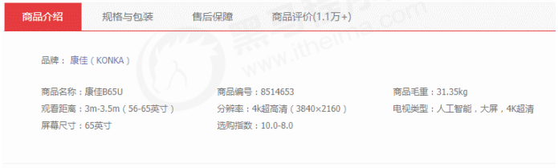

```:no-line-numbers
案例分析
① Tab栏切换有2个大的模块
② 上的模块选项卡，点击某一个，当前这一个底色会是红色，其余不变（排他思想） 修改类名的方式
③ 下面的模块内容，会跟随上面的选项卡变化。所以下面模块变化写到点击事件里面。
④ 规律：下面的模块显示内容和上面的选项卡一一对应，相匹配。
⑤ 核心思路： 给上面的tab_list 里面的所有小li 添加自定义属性，属性值从0开始编号。
⑥ 当我们点击tab_list 里面的某个小li，让tab_con 里面对应序号的 内容显示，其余隐藏（排他思想）
```

```html:no-line-numbers
<!DOCTYPE html>
<html lang="en">

<head>
    <meta charset="UTF-8">
    <meta name="viewport" content="width=device-width, initial-scale=1.0">
    <meta http-equiv="X-UA-Compatible" content="ie=edge">
    <title>Document</title>
    <style>
        * {
            margin: 0;
            padding: 0;
        }
        
        li {
            list-style-type: none;
        }
        
        .tab {
            width: 978px;
            margin: 100px auto;
        }
        
        .tab_list {
            height: 39px;
            border: 1px solid #ccc;
            background-color: #f1f1f1;
        }
        
        .tab_list li {
            float: left;
            height: 39px;
            line-height: 39px;
            padding: 0 20px;
            text-align: center;
            cursor: pointer;
        }
        
        .tab_list .current {
            background-color: #c81623;
            color: #fff;
        }
        
        .item_info {
            padding: 20px 0 0 20px;
        }
        
        .item {
            display: none;
        }
    </style>
</head>

<body>
    <div class="tab">
        <div class="tab_list">
            <ul>
                <li class="current">商品介绍</li>
                <li>规格与包装</li>
                <li>售后保障</li>
                <li>商品评价（50000）</li>
                <li>手机社区</li>
            </ul>
        </div>
        <div class="tab_con">
            <div class="item" style="display: block;">
                商品介绍模块内容
            </div>
            <div class="item">
                规格与包装模块内容
            </div>
            <div class="item">
                售后保障模块内容
            </div>
            <div class="item">
                商品评价（50000）模块内容
            </div>
            <div class="item">
                手机社区模块内容
            </div>

        </div>
    </div>
    <script>
        // 获取元素
        var tab_list = document.querySelector('.tab_list');
        var lis = tab_list.querySelectorAll('li');
        var items = document.querySelectorAll('.item');
        // for循环绑定点击事件
        for (var i = 0; i < lis.length; i++) {
            // 开始给5个小li 设置索引号 
            lis[i].setAttribute('index', i);
            lis[i].onclick = function() {
                // 1. 上的模块选项卡，点击某一个，当前这一个底色会是红色，其余不变（排他思想） 修改类名的方式

                // 干掉所有人 其余的li清除 class 这个类
                for (var i = 0; i < lis.length; i++) {
                    lis[i].className = '';
                }
                // 留下我自己 
                this.className = 'current';
                // 2. 下面的显示内容模块
                var index = this.getAttribute('index');
                console.log(index);
                // 干掉所有人 让其余的item 这些div 隐藏
                for (var i = 0; i < items.length; i++) {
                    items[i].style.display = 'none';
                }
                // 留下我自己 让对应的item 显示出来
                items[index].style.display = 'block';
            }
        }
    </script>
</body>

</html>
```

#### 2.4.8 `H5` 自定义属性

##### 2.4.8.1 自定义属性目的：为了保存并使用数据

自定义属性目的：是为了保存并使用数据。有些数据可以保存到页面中而不用保存到数据库中。

自定义属性获取是通过 `getAttribute(‘属性’)` 获取。

有些自定义属性很容易引起歧义，不容易判断是元素的内置属性还是自定义属性。于是，`H5` 给我们新增了自定义属性：

- `H5` 规定自定义属性以 `data-` 开头做为属性名并且赋值。
  
- 设置 `H5` 自定义属性
  
    ```:no-line-numbers
    比如：<div data-index="1"></div>
    或者使用 JS 设置： element.setAttribute('data-index', 2)
    ```

-  获取 `H5` 自定义属性

    ```:no-line-numbers
    兼容性的方式获取：element.getAttribute(‘data-index’);
    H5 新增（IE 11 才开始支持）的方式获取： element.dataset.index 或者 element.dataset['index'] 
    ```

**示例：**

```html:no-line-numbers
<!DOCTYPE html>
<html lang="en">

<head>
    <meta charset="UTF-8">
    <meta name="viewport" content="width=device-width, initial-scale=1.0">
    <meta http-equiv="X-UA-Compatible" content="ie=edge">
    <title>Document</title>
</head>

<body>
    <div getTime="20" data-index="2" data-list-name="andy"></div>
    <script>
        var div = document.querySelector('div');
        // console.log(div.getTime);
        console.log(div.getAttribute('getTime'));
        div.setAttribute('data-time', 20);
        console.log(div.getAttribute('data-index'));
        console.log(div.getAttribute('data-list-name'));
        // h5新增的获取自定义属性的方法 它只能获取data-开头的
        // dataset 是一个集合里面存放了所有以data开头的自定义属性
        console.log(div.dataset);
        console.log(div.dataset.index);
        console.log(div.dataset['index']);
        // 如果自定义属性里面有多个-链接的单词，我们获取的时候采取 驼峰命名法
        console.log(div.dataset.listName);
        console.log(div.dataset['listName']);
    </script>
</body>

</html>
```

### 2.5 节点（`node`）操作

#### 2.5.1 节点操作的优势

获取元素通常使用两种方式：

<table>
    <tr>
        <th>1.  利用 DOM 提供的方法获取元素</th>
        <th>2.  利用节点层级关系获取元素</th>
    </tr>
    <tr>
        <td>
            <ul>
                <li>document.getElementById()</li>
                <li>document.getElementsByTagName()</li>
                <li>document.querySelector 等</li>
                <li>逻辑性不强、繁琐</li>
            </ul>
        </td>
        <td>
            <ul>
                <li>利用父子兄节点关系获取元素</li>
                <li>逻辑性强， 但是兼容性稍差</li>
            </ul>
        </td>
    </tr>
</table>

> 这两种方式都可以获取元素节点，我们后面都会使用，但是节点操作更简单。

#### 2.5.2 网页中的所有内容都是节点

网页中的所有内容都是节点（标签、属性、文本、注释等），在 `DOM` 中，节点使用 `node` 来表示。

`HTML` `DOM` 树中的所有节点均可通过 `JavaScript` 进行访问，所有 `HTML` 元素（节点）均可被修改，也可以创建或删除。

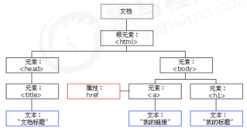

#### 2.5.3 节点的三个基本属性：`nodeType` & `nodeName` & `nodeValue`

一般地，节点至少拥有 `nodeType`（节点类型）、`nodeName`（节点名称）和 `nodeValue`（节点值）这三个基本属性。

#### 2.5.4 三种类型的节点：元素节点 & 属性节点 & 文本节点

```:no-line-numbers
- 元素节点 nodeType 为 1 
- 属性节点 nodeType 为 2 
- 文本节点 nodeType 为 3 （文本节点包含文字、空格、换行等）
```

#### 2.5.5 节点操作主要操作的是元素节点

我们在实际开发中，节点操作主要操作的是元素节点

#### 2.5.6 节点层级

利用 `DOM` 树可以把节点划分为不同的层级关系，常见的是 **父子兄层级关系**。

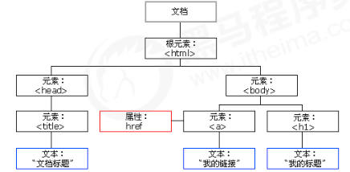

##### 2.5.6.1 父级节点：`node.parentNode`（最近的一个父节点）

```:no-line-numbers
node.parentNode

- parentNode 属性可返回某节点的父节点，注意是最近的一个父节点
- 如果指定的节点没有父节点则返回 null
```

##### 2.5.6.2 子节点

###### 2.5.6.2.1 `node.childNodes` & `node.children`

```:no-line-numbers
1. parentNode.childNodes（标准）

    parentNode.childNodes 返回包含指定节点的子节点的集合，该集合为即时更新的集合。
    注意：返回值里面包含了所有的子节点，包括元素节点，文本节点等。
    如果只想要获得里面的元素节点，则需要专门处理。 所以我们一般不提倡使用 childNodes

    var ul = document. querySelector(‘ul’);
    for(var i = 0; i < ul.childNodes.length;i++) {
        if (ul.childNodes[i].nodeType == 1) {
            // 专门处理：ul.childNodes[i] 是元素节点
            console.log(ul.childNodes[i]);
        } 
    }
```

```:no-line-numbers
2. parentNode.children（非标准）

    parentNode.children 是一个只读属性，返回所有的子元素节点。
    它只返回子元素节点，其余节点不返回（这个是我们重点掌握的）
    虽然 children 是一个非标准，但是得到了各个浏览器的支持，因此我们可以放心使用。
```

###### 2.5.6.2.2 `node.firstChild` & `node.lastChild`

```:no-line-numbers
1. parentNode.firstChild

    firstChild 返回第一个子节点，找不到则返回 null。同样，也是包含所有的节点（元素节点，文本节点等）。
```

```:no-line-numbers
2. parentNode.lastChild

    lastChild 返回最后一个子节点，找不到则返回 null。同样，也是包含所有的节点（元素节点，文本节点等）。
```

###### 2.5.6.2.3 `node.firstElementChild` & `node.lastElementChild`

```:no-line-numbers
1. parentNode.firstElementChild

    firstElementChild 返回第一个子元素节点，找不到则返回 null。
```

```:no-line-numbers
2. parentNode.lastElementChild

    lastElementChild 返回最后一个子元素节点，找不到则返回 null。
```

> **注意：** 这两个方法有兼容性问题，`IE9` 以上才支持。

###### 2.5.6.2.4 何获取第一个子元素节点或最后一个子元素节点

实际开发中，`firstChild` 和 `lastChild` 包含其他节点，操作不方便，而 `firstElementChild` 和 `lastElementChild` 又有兼容性问题，那么我们如何获取第一个子元素节点或最后一个子元素节点呢？

```:no-line-numbers
解决方案：
1. 如果想要第一个子元素节点，可以使用 parentNode.chilren[0] 
2. 如果想要最后一个子元素节点，可以使用 parentNode.chilren[parentNode.chilren.length - 1]
```

**示例：**

```html:no-line-numbers
<!DOCTYPE html>
<html lang="en">

<head>
    <meta charset="UTF-8">
    <meta name="viewport" content="width=device-width, initial-scale=1.0">
    <meta http-equiv="X-UA-Compatible" content="ie=edge">
    <title>Document</title>
</head>

<body>
    <ol>
        <li>我是li1</li>
        <li>我是li2</li>
        <li>我是li3</li>
        <li>我是li4</li>
        <li>我是li5</li>
    </ol>
    <script>
        var ol = document.querySelector('ol');
        // 1. firstChild 第一个子节点 不管是文本节点还是元素节点
        console.log(ol.firstChild);
        console.log(ol.lastChild);
        // 2. firstElementChild 返回第一个子元素节点 ie9才支持
        console.log(ol.firstElementChild);
        console.log(ol.lastElementChild);
        // 3. 实际开发的写法  既没有兼容性问题又返回第一个子元素
        console.log(ol.children[0]);
        console.log(ol.children[ol.children.length - 1]);
    </script>
</body>

</html>
```

###### 2.5.6.2.5 示例：新浪下拉菜单

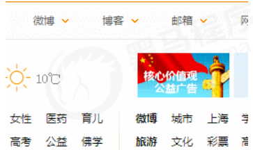

```:no-line-numbers
案例分析：
① 导航栏里面的 li 都要有鼠标经过效果，所以需要循环注册鼠标事件
② 核心原理：当鼠标经过 li 里面的第二个孩子 ul 显示，当鼠标离开，则 ul 隐藏
```

```html:no-line-numbers
<!DOCTYPE html>
<html lang="en">

<head>
    <meta charset="UTF-8">
    <meta name="viewport" content="width=device-width, initial-scale=1.0">
    <meta http-equiv="X-UA-Compatible" content="ie=edge">
    <title>Document</title>
    <style>
        * {
            margin: 0;
            padding: 0;
        }
        
        li {
            list-style-type: none;
        }
        
        a {
            text-decoration: none;
            font-size: 14px;
        }
        
        .nav {
            margin: 100px;
        }
        
        .nav>li {
            position: relative;
            float: left;
            width: 80px;
            height: 41px;
            text-align: center;
        }
        
        .nav li a {
            display: block;
            width: 100%;
            height: 100%;
            line-height: 41px;
            color: #333;
        }
        
        .nav>li>a:hover {
            background-color: #eee;
        }
        
        .nav ul {
            display: none;
            position: absolute;
            top: 41px;
            left: 0;
            width: 100%;
            border-left: 1px solid #FECC5B;
            border-right: 1px solid #FECC5B;
        }
        
        .nav ul li {
            border-bottom: 1px solid #FECC5B;
        }
        
        .nav ul li a:hover {
            background-color: #FFF5DA;
        }
    </style>
</head>

<body>
    <ul class="nav">
        <li>
            <a href="#">微博</a>
            <ul>
                <li>
                    <a href="">私信</a>
                </li>
                <li>
                    <a href="">评论</a>
                </li>
                <li>
                    <a href="">@我</a>
                </li>
            </ul>
        </li>
        <li>
            <a href="#">微博</a>
            <ul>
                <li>
                    <a href="">私信</a>
                </li>
                <li>
                    <a href="">评论</a>
                </li>
                <li>
                    <a href="">@我</a>
                </li>
            </ul>
        </li>
        <li>
            <a href="#">微博</a>
            <ul>
                <li>
                    <a href="">私信</a>
                </li>
                <li>
                    <a href="">评论</a>
                </li>
                <li>
                    <a href="">@我</a>
                </li>
            </ul>
        </li>
        <li>
            <a href="#">微博</a>
            <ul>
                <li>
                    <a href="">私信</a>
                </li>
                <li>
                    <a href="">评论</a>
                </li>
                <li>
                    <a href="">@我</a>
                </li>
            </ul>
        </li>
    </ul>
    <script>
        // 1. 获取元素
        var nav = document.querySelector('.nav');
        var lis = nav.children; // 得到4个小li
        // 2.循环注册事件
        for (var i = 0; i < lis.length; i++) {
            lis[i].onmouseover = function() {
                this.children[1].style.display = 'block';
            }
            lis[i].onmouseout = function() {
                this.children[1].style.display = 'none';
            }
        }
    </script>
</body>

</html>
```

##### 2.5.6.3 兄弟节点

###### 2.5.6.3.1 `node.nextSibling` & `node.previousSibling`

```:no-line-numbers
1. node.nextSibling

    nextSibling 返回当前元素的下一个兄弟元素节点，找不到则返回 null。同样，也是包含所有的节点（元素节点，文本节点等）。
```

```:no-line-numbers
2. node.previousSibling

    previousSibling 返回当前元素上一个兄弟元素节点，找不到则返回null。同样，也是包含所有的节点（元素节点，文本节点等）。
```

###### 2.5.6.3.2 `node.nextElementSibling` & `node.previousElementSibling`

```:no-line-numbers
1. node.nextElementSibling

    nextElementSibling 返回当前元素下一个兄弟元素节点，找不到则返回 null。
```

```:no-line-numbers
2. node.previousElementSibling

    previousElementSibling 返回当前元素上一个兄弟节点，找不到则返回 null。
```

> **注意：** 这两个方法有兼容性问题，`IE9` 以上才支持。

###### 2.5.6.3.3 如何解决兼容性问题

```:no-line-numbers
问：如何解决兼容性问题 ？
答：自己封装一个兼容性的函数
```

```js:no-line-numbers
function getNextElementSibling(element) {
    var el = element;
    while (el = el.nextSibling) {
        if (el.nodeType === 1) {
            return el;
        }
    }
    return null;
}
```

#### 2.5.7 创建节点（动态创建元素节点）：`document.createElement('tagName')`

```:no-line-numbers
document.createElement('tagName')

    createElement 方法创建由 tagName 指定的 HTML 元素。
    因为这些元素原先不存在，是根据我们的需求动态生成的，所以我们也称为动态创建元素节点。
```

#### 2.5.8 添加节点：`node.appendChild(child)` & `node.insertBefore(child, 指定元素)`

```:no-line-numbers
1. node.appendChild(child)

    node.appendChild() 方法将一个节点添加到指定父节点的子节点列表末尾。
    类似于 CSS 里面的 after 伪元素。
```

```:no-line-numbers
2. node.insertBefore(child, 指定元素)

    node.insertBefore() 方法将一个节点添加到父节点的指定子节点前面。
    类似于 CSS 里面的 before 伪元素
```

##### 2.5.8.1 示例1：创建并添加节点

```html:no-line-numbers
<!DOCTYPE html>
<html lang="en">

<head>
    <meta charset="UTF-8">
    <meta name="viewport" content="width=device-width, initial-scale=1.0">
    <meta http-equiv="X-UA-Compatible" content="ie=edge">
    <title>Document</title>
</head>

<body>
    <ul>
        <li>123</li>
    </ul>
    <script>
        // 1. 创建节点元素节点
        var li = document.createElement('li');
        // 2. 添加节点 node.appendChild(child)  node 父级  child 是子级 后面追加元素  类似于数组中的push
        var ul = document.querySelector('ul');
        ul.appendChild(li);
        // 3. 添加节点 node.insertBefore(child, 指定元素);
        var lili = document.createElement('li');
        ul.insertBefore(lili, ul.children[0]);
        // 4. 我们想要页面添加一个新的元素：1. 创建元素 2. 添加元素
    </script>
</body>

</html>
```

##### 2.5.8.2 示例2：简单版发布留言案例

```:no-line-numbers
案例分析：
① 核心思路： 点击按钮之后，就动态创建一个li，添加到ul 里面。
② 创建li 的同时，把文本域里面的值通过li.innerHTML 赋值给 li
③ 如果想要新的留言后面显示就用 appendChild 如果想要前面显示就用insertBefore
```

```html:no-line-numbers
<!DOCTYPE html>
<html lang="en">

<head>
    <meta charset="UTF-8">
    <meta name="viewport" content="width=device-width, initial-scale=1.0">
    <meta http-equiv="X-UA-Compatible" content="ie=edge">
    <title>Document</title>
    <style>
        * {
            margin: 0;
            padding: 0;
        }
        
        body {
            padding: 100px;
        }
        
        textarea {
            width: 200px;
            height: 100px;
            border: 1px solid pink;
            outline: none;
            resize: none;
        }
        
        ul {
            margin-top: 50px;
        }
        
        li {
            width: 300px;
            padding: 5px;
            background-color: rgb(245, 209, 243);
            color: red;
            font-size: 14px;
            margin: 15px 0;
        }
    </style>
</head>

<body>
    <textarea name="" id=""></textarea>
    <button>发布</button>
    <ul>

    </ul>
    <script>
        // 1. 获取元素
        var btn = document.querySelector('button');
        var text = document.querySelector('textarea');
        var ul = document.querySelector('ul');
        // 2. 注册事件
        btn.onclick = function() {
            if (text.value == '') {
                alert('您没有输入内容');
                return false;
            } else {
                // console.log(text.value);
                // (1) 创建元素
                var li = document.createElement('li');
                // 先有li 才能赋值
                li.innerHTML = text.value;
                // (2) 添加元素
                // ul.appendChild(li);
                ul.insertBefore(li, ul.children[0]);
            }
        }
    </script>
</body>

</html>
```

#### 2.5.9 删除节点：`node.removeChild(child)`

```:no-line-numbers
node.removeChild(child)

    node.removeChild() 方法从 DOM 中删除一个子节点，返回删除的节点。
```

##### 2.5.9.1 示例1

```html:no-line-numbers
<!DOCTYPE html>
<html lang="en">

<head>
    <meta charset="UTF-8">
    <meta name="viewport" content="width=device-width, initial-scale=1.0">
    <meta http-equiv="X-UA-Compatible" content="ie=edge">
    <title>Document</title>
</head>

<body>
    <button>删除</button>
    <ul>
        <li>熊大</li>
        <li>熊二</li>
        <li>光头强</li>
    </ul>
    <script>
        // 1.获取元素
        var ul = document.querySelector('ul');
        var btn = document.querySelector('button');
        // 2. 删除元素  node.removeChild(child)
        // ul.removeChild(ul.children[0]);
        // 3. 点击按钮依次删除里面的孩子
        btn.onclick = function() {
            if (ul.children.length == 0) {
                this.disabled = true;
            } else {
                ul.removeChild(ul.children[0]);
            }
        }
    </script>
</body>

</html>
```

##### 2.5.9.2 示例2：删除留言案例

```:no-line-numbers
案例分析：
① 当我们把文本域里面的值赋值给li 的时候，多添加一个删除的链接
② 需要把所有的链接获取过来，当我们点击当前的链接的时候，删除当前链接所在的li
③ 阻止链接跳转需要添加 javascript:void(0); 或者 javascript:;
```

```html:no-line-numbers
<!DOCTYPE html>
<html lang="en">

<head>
    <meta charset="UTF-8">
    <meta name="viewport" content="width=device-width, initial-scale=1.0">
    <meta http-equiv="X-UA-Compatible" content="ie=edge">
    <title>Document</title>
    <style>
        * {
            margin: 0;
            padding: 0;
        }
        
        body {
            padding: 100px;
        }
        
        textarea {
            width: 200px;
            height: 100px;
            border: 1px solid pink;
            outline: none;
            resize: none;
        }
        
        ul {
            margin-top: 50px;
        }
        
        li {
            width: 300px;
            padding: 5px;
            background-color: rgb(245, 209, 243);
            color: red;
            font-size: 14px;
            margin: 15px 0;
        }
        
        li a {
            float: right;
        }
    </style>
</head>

<body>
    <textarea name="" id=""></textarea>
    <button>发布</button>
    <ul>

    </ul>
    <script>
        // 1. 获取元素
        var btn = document.querySelector('button');
        var text = document.querySelector('textarea');
        var ul = document.querySelector('ul');
        // 2. 注册事件
        btn.onclick = function() {
            if (text.value == '') {
                alert('您没有输入内容');
                return false;
            } else {
                // console.log(text.value);
                // (1) 创建元素
                var li = document.createElement('li');
                // 先有li 才能赋值
                li.innerHTML = text.value + "<a href='javascript:;'>删除</a>";
                // (2) 添加元素
                // ul.appendChild(li);
                ul.insertBefore(li, ul.children[0]);
                // (3) 删除元素 删除的是当前链接的li  它的父亲
                var as = document.querySelectorAll('a');
                for (var i = 0; i < as.length; i++) {
                    as[i].onclick = function() {
                        // node.removeChild(child); 删除的是 li 当前a所在的li  this.parentNode;
                        ul.removeChild(this.parentNode);
                    }
                }
            }
        }
    </script>
</body>

</html>
```

#### 2.5.10 复制节点（克隆节点）：`node.cloneNode()`

```:no-line-numbers
node.cloneNode()

    node.cloneNode() 方法返回调用该方法的节点的一个副本。也称为克隆节点/拷贝节点
    注意：
        1. 如果括号参数为空或者为 false ，则是浅拷贝，即只克隆复制节点本身，不克隆里面的子节点。
        2. 如果括号参数为 true ，则是深度拷贝，会复制节点本身以及里面所有的子节点。
```

##### 2.5.10.1 示例1

```html:no-line-numbers
<!DOCTYPE html>
<html lang="en">

<head>
    <meta charset="UTF-8">
    <meta name="viewport" content="width=device-width, initial-scale=1.0">
    <meta http-equiv="X-UA-Compatible" content="ie=edge">
    <title>Document</title>
</head>

<body>
    <ul>
        <li>1111</li>
        <li>2</li>
        <li>3</li>
    </ul>
    <script>
        var ul = document.querySelector('ul');
        // 1. node.cloneNode(); 括号为空或者里面是 false 浅拷贝 只复制标签不复制里面的内容
        // 2. node.cloneNode(true); 括号为true 深拷贝 复制标签复制里面的内容
        var lili = ul.children[0].cloneNode(true);
        ul.appendChild(lili);
    </script>
</body>

</html>
```

##### 2.5.10.2 示例2：动态生成表格

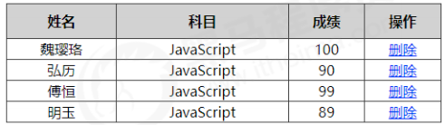

```:no-line-numbers
案例分析：
① 因为里面的学生数据都是动态的，我们需要js 动态生成。 这里我们模拟数据，自己定义好数据。 数据我们采取对象形式存储。
② 所有的数据都是放到tbody里面的行里面。
③ 因为行很多，我们需要循环创建多个行（对应多少人）
④ 每个行里面又有很多单元格（对应里面的数据），我们还继续使用循环创建多个单元格，并且把数据存入里面（双重for循环）
⑤ 最后一列单元格是删除，需要单独创建单元格。
⑥ 最后添加删除操作，单击删除，可以删除当前行。
```

```html:no-line-numbers
<!DOCTYPE html>
<html lang="en">

<head>
    <meta charset="UTF-8">
    <meta name="viewport" content="width=device-width, initial-scale=1.0">
    <meta http-equiv="X-UA-Compatible" content="ie=edge">
    <title>Document</title>
    <style>
        table {
            width: 500px;
            margin: 100px auto;
            border-collapse: collapse;
            text-align: center;
        }
        
        td,
        th {
            border: 1px solid #333;
        }
        
        thead tr {
            height: 40px;
            background-color: #ccc;
        }
    </style>
</head>

<body>
    <table cellspacing="0">
        <thead>
            <tr>
                <th>姓名</th>
                <th>科目</th>
                <th>成绩</th>
                <th>操作</th>
            </tr>
        </thead>
        <tbody>

        </tbody>
    </table>
    <script>
        // 1.先去准备好学生的数据
        var datas = [{
            name: '魏璎珞',
            subject: 'JavaScript',
            score: 100
        }, {
            name: '弘历',
            subject: 'JavaScript',
            score: 98
        }, {
            name: '傅恒',
            subject: 'JavaScript',
            score: 99
        }, {
            name: '明玉',
            subject: 'JavaScript',
            score: 88
        }, {
            name: '大猪蹄子',
            subject: 'JavaScript',
            score: 0
        }];
        // 2. 往tbody 里面创建行： 有几个人（通过数组的长度）我们就创建几行
        var tbody = document.querySelector('tbody');
        for (var i = 0; i < datas.length; i++) { // 外面的for循环管行 tr
            // 1. 创建 tr行
            var tr = document.createElement('tr');
            tbody.appendChild(tr);
            // 2. 行里面创建单元格(跟数据有关系的3个单元格) td 单元格的数量取决于每个对象里面的属性个数  for循环遍历对象 datas[i]
            for (var k in datas[i]) { // 里面的for循环管列 td
                // 创建单元格 
                var td = document.createElement('td');
                // 把对象里面的属性值 datas[i][k] 给 td  
                // console.log(datas[i][k]);
                td.innerHTML = datas[i][k];
                tr.appendChild(td);
            }
            // 3. 创建有删除2个字的单元格 
            var td = document.createElement('td');
            td.innerHTML = '<a href="javascript:;">删除 </a>';
            tr.appendChild(td);

        }
        // 4. 删除操作 开始 
        var as = document.querySelectorAll('a');
        for (var i = 0; i < as.length; i++) {
            as[i].onclick = function() {
                // 点击a 删除 当前a 所在的行(链接的爸爸的爸爸)  node.removeChild(child)  
                tbody.removeChild(this.parentNode.parentNode)
            }
        }
        // for(var k in obj) {
        //     k 得到的是属性名
        //     obj[k] 得到是属性值
        // }
    </script>
</body>

</html>
```

#### 2.5.11 替换节点：`node.replaceChild(newChild, oldChild);`

```:no-line-numbers
parentNode.replaceChild(newChild, oldChild);

    用指定的节点替换当前节点的一个子节点，并返回被替换掉的节点。
```

#### 2.5.12 三种动态创建元素的区别：`document.write()` & `element.innerHTML` & `document.createElement()`

```:no-line-numbers
区别
1. document.write 是直接将内容写入页面的内容流，但是文档流执行完毕，则它会导致页面全部重绘
2. innerHTML 是将内容写入某个 DOM 节点，不会导致页面全部重绘
3. innerHTML 创建多个元素效率更高（不要拼接字符串，采取数组形式拼接），结构稍微复杂
4. createElement() 创建多个元素效率稍低一点点，但是结构更清晰
```

> 总结：不同浏览器下，`innerHTML` 效率要比 `creatElement` 高

**示例1：**

```html:no-line-numbers
<!DOCTYPE html>
<html lang="en">

<head>
    <meta charset="UTF-8">
    <meta name="viewport" content="width=device-width, initial-scale=1.0">
    <meta http-equiv="X-UA-Compatible" content="ie=edge">
    <title>Document</title>
</head>

<body>
    <button>点击</button>
    <p>abc</p>
    <div class="inner"></div>
    <div class="create"></div>
    <script>
        // window.onload = function() {
        //         document.write('<div>123</div>');

        //     }
        // 三种创建元素方式区别 
        // 1. document.write() 创建元素  如果页面文档流加载完毕，再调用这句话会导致页面重绘
        // var btn = document.querySelector('button');
        // btn.onclick = function() {
        //     document.write('<div>123</div>');
        // }

        // 2. innerHTML 创建元素
        var inner = document.querySelector('.inner');
        // for (var i = 0; i <= 100; i++) {
        //     inner.innerHTML += '<a href="#">百度</a>'
        // }
        var arr = [];
        for (var i = 0; i <= 100; i++) {
            arr.push('<a href="#">百度</a>');
        }
        inner.innerHTML = arr.join('');
        // 3. document.createElement() 创建元素
        var create = document.querySelector('.create');
        for (var i = 0; i <= 100; i++) {
            var a = document.createElement('a');
            create.appendChild(a);
        }
    </script>
</body>

</html>
```

**示例2：`innerHTML` 拼接效率测试**

```html:no-line-numbers
<!DOCTYPE html>
<html lang="en">

<head>
    <meta charset="UTF-8">
    <title>效率测试</title>
</head>

<body>
</body>
<script>
    function fn() {
        var d1 = +new Date();

        var str = '';
        for (var i = 0; i < 1000; i++) {
            document.body.innerHTML += '<div style="width:100px; height:2px; border:1px solid blue;"></div>';
        }
        var d2 = +new Date();
        console.log(d2 - d1);
    }
    fn();
</script>

</html>
```

**示例3：`innerHTML` 数组效率测试**

```html:no-line-numbers
<!DOCTYPE html>
<html lang="en">

<head>
    <meta charset="UTF-8">
    <title>效率测试</title>

</head>

<body>

</body>

<script>
    function fn() {
        var d1 = +new Date();
        var array = [];
        for (var i = 0; i < 1000; i++) {
            array.push('<div style="width:100px; height:2px; border:1px solid blue;"></div>');
        }
        document.body.innerHTML = array.join('');
        var d2 = +new Date();
        console.log(d2 - d1);
    }
    fn();
</script>

</html>
```

**示例4：`createElement` 效率测试**

```html:no-line-numbers
<!DOCTYPE html>
<html lang="en">

<head>
    <meta charset="UTF-8">
    <title>效率测试</title>
</head>

<body>

</body>

<script>
    function fn() {
        var d1 = +new Date();

        for (var i = 0; i < 1000; i++) {
            var div = document.createElement('div');
            div.style.width = '100px';
            div.style.height = '2px';
            div.style.border = '1px solid red';
            document.body.appendChild(div);
        }
        var d2 = +new Date();
        console.log(d2 - d1);
    }
    fn();
</script>

</html>
```

## 3. 事件高级

### 3.1 注册事件（绑定事件）

给元素添加事件，称为注册事件或者绑定事件。

注册事件有两种方式：**传统方式** 和 **方法监听注册方式**。

#### 3.1.2 传统注册方式

```:no-line-numbers
- 利用 on 开头的事件 onclick 
    <button onclick=“alert('hi~')”></button>
    btn.onclick = function() {} 
- 特点：注册事件的唯一性
- 同一个元素同一个事件只能设置一个处理函数，最后注册的处理函数将会覆盖前面注册的处理函数
```

#### 3.1.3 方法监听注册方式

```:no-line-numbers
- w3c 标准 推荐方式
- addEventListener() 它是一个方法
- IE9 之前的 IE 不支持此方法，可使用 attachEvent() 代替
- 特点：同一个元素同一个事件可以注册多个监听器
- 按注册顺序依次执行
```

##### 3.1.3.1 `addEventListener` 事件监听方式（IE9+ 版本支持）

```:no-line-numbers
eventTarget.addEventListener(type, listener[, useCapture])

    eventTarget.addEventListener() 方法将指定的监听器注册到 eventTarget（目标对象）上，
    当该对象触发指定的事件时，就会执行事件处理函数。
    该方法接收三个参数：
        - type：事件类型字符串，比如 click、mouseover，注意这里不要带 on
        - listener：事件处理函数，事件发生时，会调用该监听函数
        - useCapture：可选参数，是一个布尔值，默认是 false。学完 DOM 事件流后，我们再进一步学习
```

##### 3.1.3.2 `attachEvent` 事件监听方式（IE8 及早期版本支持）

```:no-line-numbers
eventTarget.attachEvent(eventNameWithOn, callback)

    eventTarget.attachEvent()方法将指定的监听器注册到 eventTarget（目标对象）上，
    当该对象触发指定的事件时，指定的回调函数就会被执行。
    该方法接收两个参数：
        - eventNameWithOn：事件类型字符串，比如 onclick 、onmouseover，这里要带 on
        - callback：事件处理函数，当目标触发事件时回调函数被调用
    注意：IE8 及早期版本支持
```

##### 3.1.3.3 注册事件兼容性解决方案

```js:no-line-numbers
function addEventListener(element, eventName, fn) {
    // 判断当前浏览器是否支持 addEventListener 方法
    if (element.addEventListener) {
        element.addEventListener(eventName, fn); // 第三个参数 默认是false
    } else if (element.attachEvent) {
        element.attachEvent('on' + eventName, fn);
    } else {
        // 相当于 element.onclick = fn;
        element['on' + eventName] = fn;
    }
}
```

> 兼容性处理的原则：首先照顾大多数浏览器，再处理特殊浏览器。

#### 3.1.4 示例：注册事件两种方式

```html:no-line-numbers
<!DOCTYPE html>
<html lang="en">

<head>
    <meta charset="UTF-8">
    <meta name="viewport" content="width=device-width, initial-scale=1.0">
    <meta http-equiv="X-UA-Compatible" content="ie=edge">
    <title>Document</title>
</head>

<body>
    <button>传统注册事件</button>
    <button>方法监听注册事件</button>
    <button>ie9 attachEvent</button>
    <script>
        var btns = document.querySelectorAll('button');
        // 1. 传统方式注册事件
        btns[0].onclick = function() {
            alert('hi');
        }
        btns[0].onclick = function() {
                alert('hao a u');
            }
            // 2. 事件侦听注册事件 addEventListener 
            // (1) 里面的事件类型是字符串 必定加引号 而且不带on
            // (2) 同一个元素 同一个事件可以添加多个侦听器（事件处理程序）
        btns[1].addEventListener('click', function() {
            alert(22);
        })
        btns[1].addEventListener('click', function() {
                alert(33);
            })
            // 3. attachEvent ie9以前的版本支持
        btns[2].attachEvent('onclick', function() {
            alert(11);
        })
    </script>
</body>

</html>
```

### 3.2 删除事件（解绑事件）

#### 3.2.1 删除采用传统方式注册的事件

```:no-line-numbers
eventTarget.onclick = null;
```

#### 3.2.2 删除采用方法监听注册的事件

```:no-line-numbers
① eventTarget.removeEventListener(type, listener[, useCapture]);
② eventTarget.detachEvent(eventNameWithOn, callback);
```

#### 3.2.3 删除事件兼容性解决方案

```js:no-line-numbers
function removeEventListener(element, eventName, fn) {
    // 判断当前浏览器是否支持 removeEventListener 方法
    if (element.removeEventListener) {
        element.removeEventListener(eventName, fn); // 第三个参数 默认是false
    } else if (element.detachEvent) {
        element.detachEvent('on' + eventName, fn);
    } else {
        element['on' + eventName] = null;
    }
}
```

#### 3.2.4 示例：删除事件

```html:no-line-numbers
<!DOCTYPE html>
<html lang="en">

<head>
    <meta charset="UTF-8">
    <meta name="viewport" content="width=device-width, initial-scale=1.0">
    <meta http-equiv="X-UA-Compatible" content="ie=edge">
    <title>Document</title>
    <style>
        div {
            width: 100px;
            height: 100px;
            background-color: pink;
        }
    </style>
</head>

<body>
    <div>1</div>
    <div>2</div>
    <div>3</div>
    <script>
        var divs = document.querySelectorAll('div');
        divs[0].onclick = function() {
                alert(11);
                // 1. 传统方式删除事件
                divs[0].onclick = null;
            }
            // 2. removeEventListener 删除事件
        divs[1].addEventListener('click', fn) // 里面的fn 不需要调用加小括号

        function fn() {
            alert(22);
            divs[1].removeEventListener('click', fn);
        }
        // 3. detachEvent
        divs[2].attachEvent('onclick', fn1);

        function fn1() {
            alert(33);
            divs[2].detachEvent('onclick', fn1);
        }
    </script>
</body>

</html>
```

### 3.3 `DOM` 事件流（事件在元素节点之间的传播过程）

事件流描述的是从页面中接收事件的顺序。

事件发生时会在元素节点之间按照特定的顺序传播，这个 **传播过程** 即 **`DOM` 事件流**。

#### 3.3.1 `DOM` 事件流的 3 个阶段：捕获、当前目标、冒泡阶段

`DOM` 事件流分为 3 个阶段：

1. 捕获阶段

    ```:no-line-numbers
    事件捕获：网景最早提出，由 DOM 最顶层节点开始，然后逐级向下传播到到最具体的元素接收的过程。
    ```
   
2. 当前目标阶段
   
3. 冒泡阶段

    ```:no-line-numbers
    事件冒泡：IE 最早提出，事件开始时由最具体的元素接收，然后逐级向上传播到到 DOM 最顶层节点的过程。
    ```

我们向水里面扔一块石头，首先它会有一个下降的过程，这个过程就可以理解为从最顶层向事件发生的最具体元素（目标点）的捕获过程；之后会产生泡泡，会在最低点（最具体元素）之后漂浮到水面上，这个过程相当于事件冒泡。

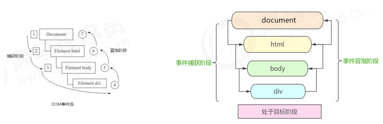

**注意：**

```:no-line-numbers
1. JS 代码中只能执行捕获或者冒泡其中的一个阶段。
2. onclick 和 attachEvent 只能得到冒泡阶段。
3. addEventListener(type, listener[, useCapture]) 第三个参数如果是 true，
    表示在事件捕获阶段调用事件处理程序；如果是 false（不写默认就是false），表示在事件冒泡阶段调用事件处理程序。
4. 实际开发中我们很少使用事件捕获，我们更关注事件冒泡。
5. 有些事件是没有冒泡的，比如 onblur、onfocus、onmouseenter、onmouseleave
6. 事件冒泡有时候会带来麻烦，有时候又会帮助很巧妙的做某些事件，我们后面讲解。
```

**示例：**

```html:no-line-numbers
<!DOCTYPE html>
<html lang="en">

<head>
    <meta charset="UTF-8">
    <meta name="viewport" content="width=device-width, initial-scale=1.0">
    <meta http-equiv="X-UA-Compatible" content="ie=edge">
    <title>Document</title>
    <style>
        .father {
            overflow: hidden;
            width: 300px;
            height: 300px;
            margin: 100px auto;
            background-color: pink;
            text-align: center;
        }
        
        .son {
            width: 200px;
            height: 200px;
            margin: 50px;
            background-color: purple;
            line-height: 200px;
            color: #fff;
        }
    </style>
</head>

<body>
    <div class="father">
        <div class="son">son盒子</div>
    </div>
    <script>
        // dom 事件流 三个阶段
        // 1. JS 代码中只能执行捕获或者冒泡其中的一个阶段。
        // 2. onclick 和 attachEvent（ie） 只能得到冒泡阶段。
        // 3. 捕获阶段 如果addEventListener 第三个参数是 true 那么则处于捕获阶段  document -> html -> body -> father -> son
        // var son = document.querySelector('.son');
        // son.addEventListener('click', function() {
        //     alert('son');
        // }, true);
        // var father = document.querySelector('.father');
        // father.addEventListener('click', function() {
        //     alert('father');
        // }, true);
        // 4. 冒泡阶段 如果addEventListener 第三个参数是 false 或者 省略 那么则处于冒泡阶段  son -> father ->body -> html -> document
        var son = document.querySelector('.son');
        son.addEventListener('click', function() {
            alert('son');
        }, false);
        var father = document.querySelector('.father');
        father.addEventListener('click', function() {
            alert('father');
        }, false);
        document.addEventListener('click', function() {
            alert('document');
        })
    </script>
</body>

</html>
```

### 3.4 事件对象

#### 3.4.1 什么是事件对象

```js:no-line-numbers
 eventTarget.onclick = function(event) {
    // 这个 event 就是事件对象，我们还喜欢的写成 e 或者 evt 
 } 

 eventTarget.addEventListener('click', function(event) {
    // 这个 event 就是事件对象，我们还喜欢的写成 e 或者 evt 
 }）
```

```:no-line-numbers
官方解释：
    event 对象代表事件的状态，比如键盘按键的状态、鼠标的位置、鼠标按钮的状态。
简单理解：
    事件发生后，跟事件相关的一系列信息数据的集合都放到这个对象里面，这个对象就是事件对象 event，它有很多属性和方法。
    比如： 
    1. 谁绑定了这个事件。
    2. 鼠标触发事件的话，会得到鼠标的相关信息，如鼠标位置。
    3. 键盘触发事件的话，会得到键盘的相关信息，如按了哪个键。
```

#### 3.4.2 事件对象的使用语法

```js:no-line-numbers
 eventTarget.onclick = function(event) {
    // 这个 event 就是事件对象，我们还喜欢的写成 e 或者 evt 
 } 

 eventTarget.addEventListener('click', function(event) {
    // 这个 event 就是事件对象，我们还喜欢的写成 e 或者 evt 
 }）
```

```:no-line-numbers
这个 event 是个形参，系统帮我们设定为事件对象，不需要传递实参过去。
当我们注册事件时，event 对象就会被系统自动创建，并依次传递给事件监听器（事件处理函数）。
```

#### 3.4.3 事件对象的兼容性方案

事件对象本身的获取存在兼容问题：

1. 标准浏览器中是浏览器给方法传递的参数，只需要定义形参 `e` 就可以获取到。
   
2. 在 `IE6~8` 中，浏览器不会给方法传递参数，如果需要的话，需要到 `window.event` 中获取查找。

```:no-line-numbers
解决方式: 
e = e || window.event;
```

#### 3.4.4 事件对象的常见属性和方法

|**事件对象属性方法**|**说明**|
|:-|:-|
|`e.target`|返回触发事件的对象（标准）|
|`e.srcElement`|返回触发事件的对象（非标准，`IE6~8` 使用）|
|`e.type`|返回事件的类型，比如 `click`、`mouseover`，不带 `on`|
|`e.cancelBubble`|该属性阻止冒泡（非标准，`IE6~8` 使用）|
|`e.returnValue`|该属性阻止默认事件（默认行为）（非标准，`IE6~8` 使用），比如不让链接跳转|
|`e.preventDefault()`|该方法阻止默认事件（默认行为）（标准），比如不让链接跳转|
|`e.stopPropagation()`|阻止冒泡（标准）|

```:no-line-numbers
e.target 和 this 的区别：
    e.target 是事件触发的元素。
    this 是事件绑定的元素，这个函数的调用者（绑定这个事件的元素）
```

#### 3.4.5 示例1：`e.target` 与 `this` 的区别 & 兼容性方案

```html:no-line-numbers
<!DOCTYPE html>
<html lang="en">

<head>
    <meta charset="UTF-8">
    <meta name="viewport" content="width=device-width, initial-scale=1.0">
    <meta http-equiv="X-UA-Compatible" content="ie=edge">
    <title>Document</title>
    <style>
        div {
            width: 100px;
            height: 100px;
            background-color: pink;
        }
    </style>
</head>

<body>
    <div>123</div>
    <ul>
        <li>abc</li>
        <li>abc</li>
        <li>abc</li>
    </ul>
    <script>
        // 常见事件对象的属性和方法
        // 1. e.target 返回的是触发事件的对象（元素）  this 返回的是绑定事件的对象（元素）
        // 区别 ： e.target 点击了那个元素，就返回那个元素 this 那个元素绑定了这个点击事件，那么就返回谁
        var div = document.querySelector('div');
        div.addEventListener('click', function(e) {
            console.log(e.target);
            console.log(this);

        })
        var ul = document.querySelector('ul');
        ul.addEventListener('click', function(e) {
                // 我们给ul 绑定了事件  那么this 就指向ul  
                console.log(this);
                console.log(e.currentTarget);

                // e.target 指向我们点击的那个对象 谁触发了这个事件 我们点击的是li e.target 指向的就是li
                console.log(e.target);

            })
            // 了解兼容性
            // div.onclick = function(e) {
            //     e = e || window.event;
            //     var target = e.target || e.srcElement;
            //     console.log(target);
            // }
        // 2. 了解 跟 this 有个非常相似的属性 currentTarget  ie678不认识
    </script>
</body>

</html>
```

#### 3.4.6 示例2：事件对象阻止默认行为

```html:no-line-numbers
<!DOCTYPE html>
<html lang="en">

<head>
    <meta charset="UTF-8">
    <meta name="viewport" content="width=device-width, initial-scale=1.0">
    <meta http-equiv="X-UA-Compatible" content="ie=edge">
    <title>Document</title>
    <style>

    </style>
</head>

<body>
    <div>123</div>
    <a href="http://www.baidu.com">百度</a>
    <form action="http://www.baidu.com">
        <input type="submit" value="提交" name="sub">
    </form>
    <script>
        // 常见事件对象的属性和方法
        // 1. 返回事件类型
        var div = document.querySelector('div');
        div.addEventListener('click', fn);
        div.addEventListener('mouseover', fn);
        div.addEventListener('mouseout', fn);

        function fn(e) {
            console.log(e.type);
        }
        // 2. 阻止默认行为（事件） 让链接不跳转 或者让提交按钮不提交
        var a = document.querySelector('a');
        a.addEventListener('click', function(e) {
                e.preventDefault(); //  dom 标准写法
            })
            // 3. 传统的注册方式
        a.onclick = function(e) {
            // 普通浏览器 e.preventDefault();  方法
            // e.preventDefault();
            // 低版本浏览器 ie678  returnValue  属性
            // e.returnValue;
            // 我们可以利用 return false 也能阻止默认行为 没有兼容性问题 特点：return 后面的代码不执行了， 而且只限于传统的注册方式
            return false;
            alert(11);
        }
    </script>
</body>

</html>
```

### 3.5 阻止事件冒泡

事件冒泡：开始时由最具体的元素接收，然后逐级向上传播到到 `DOM` 最顶层节点。

事件冒泡本身的特性，会带来的坏处，也会带来的好处，需要我们灵活掌握。

#### 3.5.1 阻止事件冒泡的两种写法（标准 & 非标准）

```:no-line-numbers
e.stopPropagation()
    标准写法：利用事件对象里面的 stopPropagation() 方法

e.cancelBubble = true;
    非标准写法：IE 6-8 利用事件对象 cancelBubble 属性
```

#### 3.5.2  阻止事件冒泡的兼容性解决方案

```js:no-line-numbers
if (e && e.stopPropagation) {
    e.stopPropagation();
} else {
    window.event.cancelBubble = true;
}
```

#### 3.5.3 示例：阻止事件冒泡

```html:no-line-numbers
<!DOCTYPE html>
<html lang="en">

<head>
    <meta charset="UTF-8">
    <meta name="viewport" content="width=device-width, initial-scale=1.0">
    <meta http-equiv="X-UA-Compatible" content="ie=edge">
    <title>Document</title>
    <style>
        .father {
            overflow: hidden;
            width: 300px;
            height: 300px;
            margin: 100px auto;
            background-color: pink;
            text-align: center;
        }
        
        .son {
            width: 200px;
            height: 200px;
            margin: 50px;
            background-color: purple;
            line-height: 200px;
            color: #fff;
        }
    </style>
</head>

<body>
    <div class="father">
        <div class="son">son儿子</div>
    </div>
    <script>
        // 常见事件对象的属性和方法
        // 阻止冒泡  dom 推荐的标准 stopPropagation() 
        var son = document.querySelector('.son');
        son.addEventListener('click', function(e) {
            alert('son');
            e.stopPropagation(); // stop 停止 Propagation 传播
            e.cancelBubble = true; // 非标准 cancel 取消 bubble 泡泡
        }, false);

        var father = document.querySelector('.father');
        father.addEventListener('click', function() {
            alert('father');
        }, false);
        document.addEventListener('click', function() {
            alert('document');
        })
    </script>
</body>

</html>
```

### 3.6 事件委托（代理、委派）

**事件委托的生活场景**

```:no-line-numbers
咱们班有100个学生， 快递员有100个快递， 如果一个个的送花费时间较长。同时每个学生领取的时候，也需要排队领取，也花费时间较长，何如？

解决方案： 
    快递员把100个快递，委托给班主任，班主任把这些快递放到办公室，同学们下课自行领取即可。
优势： 
    快递员省事，委托给班主任就可以走了。 同学们领取也方便，因为相信班主任。
```

**事件委托的代码场景**

```:no-line-numbers
 <ul>
    <li>知否知否，应该有弹框在手</li>
    <li>知否知否，应该有弹框在手</li>
    <li>知否知否，应该有弹框在手</li>
    <li>知否知否，应该有弹框在手</li>
    <li>知否知否，应该有弹框在手</li>
 </ul>

点击每个 li 都会弹出对话框，以前需要给每个 li 注册事件，是非常辛苦的，而且访问 DOM 的次数越多，这就会延长整个页面的交互就绪时间。

解决方案：
    给 ul 注册点击事件，然后利用事件对象的 target 来找到当前点击的 li，因为点击 li，事件会冒泡到 ul 上，ul 有注册事件，就会触发事件监听器。
优势： 
    我们只操作了一次 DOM ，提高了程序的性能。
```

> 事件委托也称为事件代理，在 `jQuery` 里面称为事件委派。

**事件委托的原理**

```:no-line-numbers
不是给每个子节点单独设置事件监听器，而是将事件监听器设置在其父节点上，然后利用冒泡原理影响设置每个子节点。
```

#### 3.6.1 示例：事件委托

```html:no-line-numbers
<!DOCTYPE html>
<html lang="en">

<head>
    <meta charset="UTF-8">
    <meta name="viewport" content="width=device-width, initial-scale=1.0">
    <meta http-equiv="X-UA-Compatible" content="ie=edge">
    <title>Document</title>
</head>

<body>
    <ul>
        <li>知否知否，点我应有弹框在手！</li>
        <li>知否知否，点我应有弹框在手！</li>
        <li>知否知否，点我应有弹框在手！</li>
        <li>知否知否，点我应有弹框在手！</li>
        <li>知否知否，点我应有弹框在手！</li>
    </ul>
    <script>
        // 事件委托的核心原理：给父节点添加侦听器， 利用事件冒泡影响每一个子节点
        var ul = document.querySelector('ul');
        ul.addEventListener('click', function(e) {
            // alert('知否知否，点我应有弹框在手！');
            // e.target 这个可以得到我们点击的对象
            e.target.style.backgroundColor = 'pink';
        })
    </script>
</body>

</html>
```

### 3.7 常用的鼠标事件

|**鼠标事件**|**触发条件**|
|:-|:-|
|`onclick`|鼠标点击左键触发|
|`onmouseover`|鼠标经过触发|
|`onmouseout`|鼠标离开触发|
|`onfocus`|获得鼠标焦点触发|
|`onblur`|失去鼠标焦点触发|
|`onmousemove`|鼠标移动触发|
|`onmouseup`|鼠标弹起触发|
|`onmousedown`|鼠标按下触发|

#### 3.7.1 禁止鼠标右键菜单（`contextmenu` 显示上下文菜单事件）

```js:no-line-numbers
// contextmenu 主要控制应该何时显示上下文菜单，主要用于程序员取消默认的上下文菜单。
document.addEventListener('contextmenu', function(e) {
    e.preventDefault();
})
```

#### 3.7.2 禁止鼠标选中（`selectstart` 开始选中事件）

```js:no-line-numbers
document.addEventListener('selectstart', function(e) {
    e.preventDefault();
})
```

#### 3.7.3 鼠标事件对象（`MouseEvent`）

|**鼠标事件对象**|**触说明**|
|:-|:-|
|`e.clientX`|返回鼠标相对于浏览器窗口可视区的 `X` 坐标|
|`e.clientY`|返回鼠标相对于浏览器窗口可视区的 `Y` 坐标|
|`e.pageX`|返回鼠标相对于文档页面的 `X` 坐标（`IE9+` 支持）|
|`e.pageY`|返回鼠标相对于文档页面的 `Y` 坐标（`IE9+` 支持）|
|`e.screenX`|返回鼠标相对于电脑屏幕的 `X` 坐标|
|`e.screenY`|返回鼠标相对于电脑屏幕的 `Y` 坐标|

#### 3.7.4 示例1：禁止鼠标右键菜单 & 禁止鼠标选中

```html:no-line-numbers
<!DOCTYPE html>
<html lang="en">

<head>
    <meta charset="UTF-8">
    <meta name="viewport" content="width=device-width, initial-scale=1.0">
    <meta http-equiv="X-UA-Compatible" content="ie=edge">
    <title>Document</title>
</head>

<body>
    我是一段不愿意分享的文字
    <script>
        // 1. contextmenu 我们可以禁用右键菜单
        document.addEventListener('contextmenu', function(e) {
                e.preventDefault();
            })
            // 2. 禁止选中文字 selectstart
        document.addEventListener('selectstart', function(e) {
            e.preventDefault();

        })
    </script>
</body>

</html>
```

#### 3.7.5 示例2：鼠标事件对象

```html:no-line-numbers
<!DOCTYPE html>
<html lang="en">

<head>
    <meta charset="UTF-8">
    <meta name="viewport" content="width=device-width, initial-scale=1.0">
    <meta http-equiv="X-UA-Compatible" content="ie=edge">
    <title>Document</title>
    <style>
        body {
            height: 3000px;
        }
    </style>
</head>

<body>
    <script>
        // 鼠标事件对象 MouseEvent
        document.addEventListener('click', function(e) {
            // 1. client 鼠标在可视区的x和y坐标
            console.log(e.clientX);
            console.log(e.clientY);
            console.log('---------------------');

            // 2. page 鼠标在页面文档的x和y坐标
            console.log(e.pageX);
            console.log(e.pageY);
            console.log('---------------------');

            // 3. screen 鼠标在电脑屏幕的x和y坐标
            console.log(e.screenX);
            console.log(e.screenY);

        })
    </script>
</body>

</html>
```

#### 3.7.6 示例3：跟随鼠标的天使

```:no-line-numbers
案例分析：
① 鼠标不断的移动，使用鼠标移动事件：mousemove
② 在页面中移动，给 document 注册事件
③ 图片要移动距离，而且不占位置，我们使用绝对定位即可
④ 核心原理：每次鼠标移动，我们都会获得最新的鼠标坐标，把这个x和y坐标做为图片的 top 和 left 值就可以移动图片
```

```html:no-line-numbers
<!DOCTYPE html>
<html lang="en">

<head>
    <meta charset="UTF-8">
    <meta name="viewport" content="width=device-width, initial-scale=1.0">
    <meta http-equiv="X-UA-Compatible" content="ie=edge">
    <title>Document</title>
    <style>
        img {
            position: absolute;
            top: 2px;
        }
    </style>
</head>

<body>
    
    <script>
        var pic = document.querySelector('img');
        document.addEventListener('mousemove', function(e) {
            // 1. mousemove只要我们鼠标移动1px 就会触发这个事件
            // console.log(1);
            // 2. 核心原理： 每次鼠标移动，我们都会获得最新的鼠标坐标， 把这个x和y坐标做为图片的top和left 值就可以移动图片
            var x = e.pageX;
            var y = e.pageY;
            console.log('x坐标是' + x, 'y坐标是' + y);
            // 3. 千万不要忘记给left 和top 添加px 单位
            pic.style.left = x - 50 + 'px';
            pic.style.top = y - 40 + 'px';
        });
    </script>
</body>

</html>
```

### 3.8 常用的键盘事件

事件除了使用鼠标触发，还可以使用键盘触发。

> 注意给文档 `document` 添加键盘事件。

|**键盘事件**|**触发条件**|
|:-|:-|
|`onkeyup`|某个键盘按键被松开时触发|
|`onkeydown`|某个键盘按键被按下时触发|
|`onkeypress`|某个键盘按键被按下并弹起时触发|

> **注意：** 
> 
> 1. `onkeypress` 和前面2个的区别是，它不识别功能键，比如左右箭头，`shift` 等。
> 
> 2. `onkeydown` 和 `onkeyup` 不区分字母大小写，`onkeypress` 区分字母大小写。

#### 3.8.1 键盘事件对象（`KeyboardEvent`）

|**键盘事件对象**|**说明**|
|:-|:-|
|`keyCode`|返回该键的 `ASCII` 值|

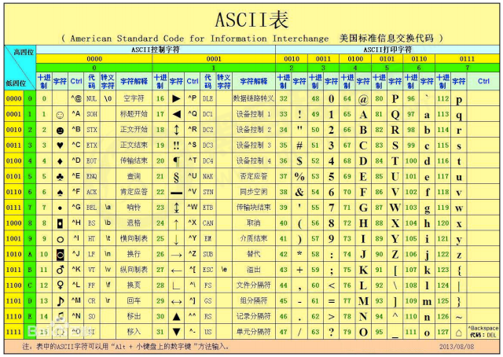

#### 3.8.2 示例1：键盘事件对象的 `keyCode` 属性

```html:no-line-numbers
<!DOCTYPE html>
<html lang="en">

<head>
    <meta charset="UTF-8">
    <meta name="viewport" content="width=device-width, initial-scale=1.0">
    <meta http-equiv="X-UA-Compatible" content="ie=edge">
    <title>Document</title>
</head>

<body>
    <script>
        // 键盘事件对象中的 keyCode 属性可以得到相应键的 ASCII 码值
        // 1. 我们的 keyup 和 keydown 事件不区分字母大小写  a 和 A 得到的都是 65
        // 2. 我们的 keypress 事件 区分字母大小写  a  97 和 A 得到的是65
        document.addEventListener('keyup', function(e) {
            // console.log(e);
            console.log('up:' + e.keyCode);
            // 我们可以利用 keycode 返回的 ASCII 码值来判断用户按下了那个键
            if (e.keyCode === 65) {
                alert('您按下的a键');
            } else {
                alert('您没有按下a键')
            }

        })
        document.addEventListener('keypress', function(e) {
            // console.log(e);
            console.log('press:' + e.keyCode);

        })
    </script>
</body>

</html>
```

#### 3.8.3 示例2：模拟京东按键输入内容

```html:no-line-numbers
<!DOCTYPE html>
<html lang="en">

<head>
    <meta charset="UTF-8">
    <meta name="viewport" content="width=device-width, initial-scale=1.0">
    <meta http-equiv="X-UA-Compatible" content="ie=edge">
    <title>Document</title>
</head>

<body>
    <input type="text">
    <script>
        // 核心思路： 检测用户是否按下了s 键，如果按下s 键，就把光标定位到搜索框里面
        // 使用键盘事件对象里面的keyCode 判断用户按下的是否是s键
        // 搜索框获得焦点： 使用 js 里面的 focus() 方法
        var search = document.querySelector('input');
        document.addEventListener('keyup', function(e) {
            // console.log(e.keyCode);
            if (e.keyCode === 83) {
                search.focus();
            }
        })
    </script>
</body>

</html>
```

#### 3.8.4 示例3：模拟京东快递单号查询

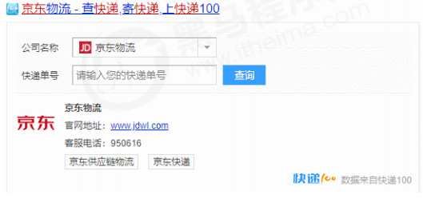

```html:no-line-numbers
<!DOCTYPE html>
<html lang="en">

<head>
    <meta charset="UTF-8">
    <meta name="viewport" content="width=device-width, initial-scale=1.0">
    <meta http-equiv="X-UA-Compatible" content="ie=edge">
    <title>Document</title>
    <style>
        * {
            margin: 0;
            padding: 0;
        }
        
        .search {
            position: relative;
            width: 178px;
            margin: 100px;
        }
        
        .con {
            display: none;
            position: absolute;
            top: -40px;
            width: 171px;
            border: 1px solid rgba(0, 0, 0, .2);
            box-shadow: 0 2px 4px rgba(0, 0, 0, .2);
            padding: 5px 0;
            font-size: 18px;
            line-height: 20px;
            color: #333;
        }
        
        .con::before {
            content: '';
            width: 0;
            height: 0;
            position: absolute;
            top: 28px;
            left: 18px;
            border: 8px solid #000;
            border-style: solid dashed dashed;
            border-color: #fff transparent transparent;
        }
    </style>
</head>

<body>
    <div class="search">
        <div class="con">123</div>
        <input type="text" placeholder="请输入您的快递单号" class="jd">
    </div>
    <script>
        // 快递单号输入内容时，上面的大号字体盒子（con）显示(这里面的字号更大）
        // 表单检测用户输入： 给表单添加键盘事件
        // 同时把快递单号里面的值（value）获取过来赋值给 con盒子（innerText）做为内容
        // 如果快递单号里面内容为空，则隐藏大号字体盒子(con)盒子
        var con = document.querySelector('.con');
        var jd_input = document.querySelector('.jd');
        jd_input.addEventListener('keyup', function() {
                // console.log('输入内容啦');
                if (this.value == '') {
                    con.style.display = 'none';
                } else {
                    con.style.display = 'block';
                    con.innerText = this.value;
                }
            })
            // 当我们失去焦点，就隐藏这个con盒子
        jd_input.addEventListener('blur', function() {
                con.style.display = 'none';
            })
            // 当我们获得焦点，就显示这个con盒子
        jd_input.addEventListener('focus', function() {
            if (this.value !== '') {
                con.style.display = 'block';
            }
        })
    </script>
</body>
```

## 4. `BOM`（浏览器对象模型）

### 4.1 `BOM` 概述

#### 4.1.1 什么是 `BOM`

`BOM`（`Browser Object Model`）即浏览器对象模型，它提供了独立于内容而与浏览器窗口进行交互的对象，其核心对象是 `window`。

`BOM` 由一系列相关的对象构成，并且每个对象都提供了很多方法与属性。

`BOM` 缺乏标准，`JavaScript` 语法的标准化组织是 `ECMA`，`DOM` 的标准化组织是 `W3C`，`BOM` 最初是 `Netscape` 浏览器标准的一部分。

#### 4.1.2 `DOM` 与 `BOM` 的对比

<table>
    <tr>
        <th>DOM</th>
        <th>BOM</th>
    </tr>
    <tr>
        <td>
            <ul>
                <li>文档对象模型</li>
                <li>DOM 就是把「文档」当做一个「对象」来看待</li>
                <li>DOM 的顶级对象是 document</li>
                <li>DOM 主要学习的是操作页面元素</li>
                <li>DOM 是 W3C 标准规范</li>
            </ul>
        </td>
        <td>
            <ul>
                <li>浏览器对象模型</li>
                <li>BOM 把「浏览器」当做一个「对象」来看待</li>
                <li>BOM 的顶级对象是 window</li>
                <li>BOM 学习的是浏览器窗口交互的一些对象</li>
                <li>BOM 是浏览器厂商在各自浏览器上定义的，兼容性较差</li>
            </ul>
        </td>
    </tr>
</table>

#### 4.1.3 `BOM` 的构成

`BOM` 比 `DOM` 更大，它包含 `DOM`。

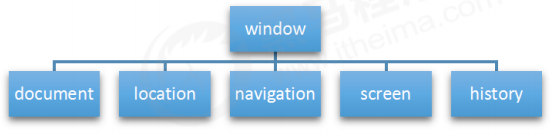

#### 4.1.4 浏览器顶级对象 `window` 概述

`window` 对象是浏览器的顶级对象，它具有双重角色：

1. 它是 `JS` 访问浏览器窗口的一个接口。
   
2. 它是一个全局对象。定义在全局作用域中的变量、函数都会变成 `window` 对象的属性和方法。

在调用的时候可以省略 `window`，前面学习的对话框都属于 `window` 对象方法，如 `alert()`、`prompt()` 等。

> 注意 `window` 下的一个特殊属性 `window.name`

**示例：**

```html:no-line-numbers
<!DOCTYPE html>
<html lang="en">

<head>
    <meta charset="UTF-8">
    <meta name="viewport" content="width=device-width, initial-scale=1.0">
    <meta http-equiv="X-UA-Compatible" content="ie=edge">
    <title>Document</title>
</head>

<body>
    <script>
        // window.document.querySelector()
        var num = 10;
        console.log(num);
        console.log(window.num);

        function fn() {
            console.log(11);

        }
        fn();
        window.fn();
        // alert(11);
        // window.alert(11)
        console.dir(window);
        // var name = 10;
        console.log(window.name);
    </script>
</body>

</html>
```

### 4.2 `window` 对象的常见事件

#### 4.2.1 窗口加载事件：`window.onload`

**注册窗口加载事件：**

```js:no-line-numbers
window.onload = function(){}
// 或者
window.addEventListener("load",function(){});
```

```:no-line-numbers
window.onload 是窗口 (页面）加载事件，当文档内容完全加载完成会触发该事件（包括图像、脚本文件、CSS 文件等），调用的处理函数。
```

**注意：**

```:no-line-numbers
1. 有了 window.onload 就可以把 JS 代码写到页面元素的上方，因为 onload 是等页面内容全部加载完毕，再去执行处理函数。
2. window.onload 传统注册事件方式只能写一次，如果有多个，会以最后一个 window.onload 为准。
3. 如果使用 addEventListener 则没有限制。
```

##### 4.2.1.1 `DOMContentLoaded` 事件

```js:no-line-numbers
document.addEventListener('DOMContentLoaded',function(){})
```

```:no-line-numbers
- DOMContentLoaded 事件触发时，仅当DOM加载完成，不包括样式表，图片，flash等等。
- IE9 以上才支持
- 如果页面的图片很多的话，从用户访问到 onload 触发可能需要较长的时间，交互效果就不能实现，必然影响用
  户的体验，此时用 DOMContentLoaded 事件比较合适。
```

##### 4.2.1.2 示例：利用 `window.onload` 将 `JS` 代码写到页面元素的上方

```html:no-line-numbers
<!DOCTYPE html>
<html lang="en">

<head>
    <meta charset="UTF-8">
    <meta name="viewport" content="width=device-width, initial-scale=1.0">
    <meta http-equiv="X-UA-Compatible" content="ie=edge">
    <title>Document</title>
    <script>
        // window.onload = function() {
        //     var btn = document.querySelector('button');
        //     btn.addEventListener('click', function() {
        //         alert('点击我');
        //     })
        // }
        // window.onload = function() {
        //     alert(22);
        // }
        window.addEventListener('load', function() {
            var btn = document.querySelector('button');
            btn.addEventListener('click', function() {
                alert('点击我');
            })
        })
        window.addEventListener('load', function() {

            alert(22);
        })
        document.addEventListener('DOMContentLoaded', function() {
                alert(33);
            })
            // load 等页面内容全部加载完毕，包含页面dom元素 图片 flash  css 等等
            // DOMContentLoaded 是DOM 加载完毕，不包含图片 falsh css 等就可以执行 加载速度比 load更快一些
    </script>
</head>

<body>
    <button>点击</button>
</body>

</html>
```

#### 4.2.2 调整窗口大小事件：`window.onresize`

**注册调整窗口大小事件：**

```js:no-line-numbers
window.onresize = function(){}
// 或者
window.addEventListener("resize",function(){});
```

```:no-line-numbers
window.onresize 是调整窗口大小加载事件，当触发时就调用的处理函数。
```

**注意：**

```:no-line-numbers
1. 只要窗口大小发生像素变化，就会触发这个事件。
2. 我们经常利用这个事件完成响应式布局。window.innerWidth 当前屏幕的宽度。
```

**示例：**

```html:no-line-numbers
<!DOCTYPE html>
<html lang="en">

<head>
    <meta charset="UTF-8">
    <meta name="viewport" content="width=device-width, initial-scale=1.0">
    <meta http-equiv="X-UA-Compatible" content="ie=edge">
    <title>Document</title>
    <style>
        div {
            width: 200px;
            height: 200px;
            background-color: pink;
        }
    </style>
</head>

<body>
    <script>
        window.addEventListener('load', function() {
            var div = document.querySelector('div');
            window.addEventListener('resize', function() {
                console.log(window.innerWidth);

                console.log('变化了');
                if (window.innerWidth <= 800) {
                    div.style.display = 'none';
                } else {
                    div.style.display = 'block';
                }

            })
        })
    </script>
    <div></div>
</body>

</html>
```

### 4.3 定时器

`window` 对象给我们提供了 2 个非常好用的方法 —— 定时器。

- `setTimeout()`
  
- `setInterval()`

#### 4.3.1 定时器1：`window.setTimeout(调用函数, [延迟的毫秒数])`

```:no-line-numbers
window.setTimeout(调用函数, [延迟的毫秒数]);

    setTimeout() 方法用于设置一个定时器，该定时器在定时器到期后执行调用函数。
    这个调用函数我们也称为回调函数 callback，即需要等待时间，时间到了才去调用这个函数
```

**注意：**

```:no-line-numbers
1. window 可以省略。
2. 这个调用函数可以直接写函数，或者写函数名，或者采取字符串 '函数名()' 三种形式写法。（第三种不推荐）
3. 延迟的毫秒数省略默认是 0，如果写，必须是毫秒。
4. 因为定时器可能有很多，所以我们经常给定时器赋值一个标识符。
```

**停止 `setTimeout()` 定时器**

```:no-line-numbers
window.clearTimeout(timeoutID)

    clearTimeout() 方法取消了先前通过调用 setTimeout() 建立的定时器。
    window 可以省略。
    参数 timeoutID 就是定时器的标识符 。
```

##### 4.3.1.1 示例1：回调函数的三种形式写法

```html:no-line-numbers
<!DOCTYPE html>
<html lang="en">

<head>
    <meta charset="UTF-8">
    <meta name="viewport" content="width=device-width, initial-scale=1.0">
    <meta http-equiv="X-UA-Compatible" content="ie=edge">
    <title>Document</title>
</head>

<body>
    <script>
        // 1. 直接写函数
        // setTimeout(function() {
        //     console.log('时间到了');

        // }, 2000);
        function callback() {
            console.log('爆炸了');

        }

        // 2. 写函数名
        var timer1 = setTimeout(callback, 3000); // timer1 就是给定时器赋的一个标识符
        var timer2 = setTimeout(callback, 5000); // timer2 就是给定时器赋的一个标识符

        // 3. 采取字符串 '函数名()'
        // setTimeout('callback()', 3000); // 我们不提倡这个写法
    </script>
</body>

</html>
```

##### 4.3.1.2 示例2：5秒之后自定关闭的广告

```html:no-line-numbers
<!DOCTYPE html>
<html lang="en">

<head>
    <meta charset="UTF-8">
    <meta name="viewport" content="width=device-width, initial-scale=1.0">
    <meta http-equiv="X-UA-Compatible" content="ie=edge">
    <title>Document</title>
</head>

<body>
    
    <script>
        var ad = document.querySelector('.ad');
        setTimeout(function() {
            ad.style.display = 'none';
        }, 5000);
    </script>
</body>

</html>
```

##### 4.3.1.3 示例3：停止 `setTimeout()` 定时器

```html:no-line-numbers
<!DOCTYPE html>
<html lang="en">

<head>
    <meta charset="UTF-8">
    <meta name="viewport" content="width=device-width, initial-scale=1.0">
    <meta http-equiv="X-UA-Compatible" content="ie=edge">
    <title>Document</title>
</head>

<body>
    <button>点击停止定时器</button>
    <script>
        var btn = document.querySelector('button');
        var timer = setTimeout(function() {
            console.log('爆炸了');

        }, 5000);
        btn.addEventListener('click', function() {
            clearTimeout(timer);
        })
    </script>
</body>

</html>
```

#### 4.3.2 定时器2：`window.setInterval(回调函数, [间隔的毫秒数])`

```:no-line-numbers
window.setInterval(回调函数, [间隔的毫秒数]);

    setInterval() 方法重复调用一个函数，每隔这个时间，就去调用一次回调函数。
```

**注意：**

```:no-line-numbers
1. window 可以省略。
2. 这个调用函数可以直接写函数，或者写函数名，或者采取字符串 '函数名()' 三种形式。
3. 间隔的毫秒数省略默认是 0，如果写，必须是毫秒，表示每隔多少毫秒就自动调用这个函数。
4. 因为定时器可能有很多，所以我们经常给定时器赋值一个标识符。 
5. 第一次执行也是间隔毫秒数之后执行，之后每隔毫秒数就执行一次。
```

**停止 `setInterval()` 定时器**

```:no-line-numbers
window.clearInterval(intervalID);

    clearInterval() 方法取消了先前通过调用 setInterval() 建立的定时器。
    window 可以省略。
    参数 intervalID 就是定时器的标识符。
```

**`setTimeout()` 和 `setInterval()` 的区别**

```:no-line-numbers
1. setTimeout 延时时间到了，就去调用这个回调函数，只调用一次 就结束了这个定时器
2. setInterval 每隔这个延时时间，就去调用这个回调函数，会调用很多次，重复调用这个函数
```

##### 4.3.2.1 示例1：倒计时效果

```html:no-line-numbers
<!DOCTYPE html>
<html lang="en">

<head>
    <meta charset="UTF-8">
    <meta name="viewport" content="width=device-width, initial-scale=1.0">
    <meta http-equiv="X-UA-Compatible" content="ie=edge">
    <title>Document</title>
    <style>
        div {
            margin: 200px;
        }
        
        span {
            display: inline-block;
            width: 40px;
            height: 40px;
            background-color: #333;
            font-size: 20px;
            color: #fff;
            text-align: center;
            line-height: 40px;
        }
    </style>
</head>

<body>
    <div>
        <span class="hour">1</span>
        <span class="minute">2</span>
        <span class="second">3</span>
    </div>
    <script>
        // 1. 获取元素 
        var hour = document.querySelector('.hour'); // 小时的黑色盒子
        var minute = document.querySelector('.minute'); // 分钟的黑色盒子
        var second = document.querySelector('.second'); // 秒数的黑色盒子
        var inputTime = +new Date('2019-5-1 18:00:00'); // 返回的是用户输入时间总的毫秒数
        countDown(); // 我们先调用一次这个函数，防止第一次刷新页面有空白 
        // 2. 开启定时器
        setInterval(countDown, 1000);

        function countDown() {
            var nowTime = +new Date(); // 返回的是当前时间总的毫秒数
            var times = (inputTime - nowTime) / 1000; // times是剩余时间总的秒数 
            var h = parseInt(times / 60 / 60 % 24); //时
            h = h < 10 ? '0' + h : h;
            hour.innerHTML = h; // 把剩余的小时给 小时黑色盒子
            var m = parseInt(times / 60 % 60); // 分
            m = m < 10 ? '0' + m : m;
            minute.innerHTML = m;
            var s = parseInt(times % 60); // 当前的秒
            s = s < 10 ? '0' + s : s;
            second.innerHTML = s;
        }
    </script>
</body>

</html
```

##### 4.3.2.2 示例2：停止 `setInterval()` 定时器

```html:no-line-numbers
<!DOCTYPE html>
<html lang="en">

<head>
    <meta charset="UTF-8">
    <meta name="viewport" content="width=device-width, initial-scale=1.0">
    <meta http-equiv="X-UA-Compatible" content="ie=edge">
    <title>Document</title>
</head>

<body>
    <button class="begin">开启定时器</button>
    <button class="stop">停止定时器</button>
    <script>
        var begin = document.querySelector('.begin');
        var stop = document.querySelector('.stop');
        var timer = null; // 全局变量 null 是一个空对象
        begin.addEventListener('click', function() {
            timer = setInterval(function() {
                console.log('ni hao ma');
            }, 1000);
        })
        stop.addEventListener('click', function() {
            clearInterval(timer);
        })
    </script>
</body>

</html>
```

##### 4.3.2.3 示例3：发送短信

点击按钮后，该按钮60秒之内不能再次点击，防止重复发送短信

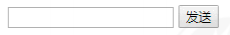

```html:no-line-numbers
<!DOCTYPE html>
<html lang="en">

<head>
    <meta charset="UTF-8">
    <meta name="viewport" content="width=device-width, initial-scale=1.0">
    <meta http-equiv="X-UA-Compatible" content="ie=edge">
    <title>Document</title>
</head>

<body>
    手机号码： <input type="number"> <button>发送</button>
    <script>
        // 按钮点击之后，会禁用 disabled 为true 
        // 同时按钮里面的内容会变化， 注意 button 里面的内容通过 innerHTML修改
        // 里面秒数是有变化的，因此需要用到定时器
        // 定义一个变量，在定时器里面，不断递减
        // 如果变量为0 说明到了时间，我们需要停止定时器，并且复原按钮初始状态
        var btn = document.querySelector('button');
        var time = 3; // 定义剩下的秒数
        btn.addEventListener('click', function() {
            btn.disabled = true;
            var timer = setInterval(function() {
                if (time == 0) {
                    // 清除定时器和复原按钮
                    clearInterval(timer);
                    btn.disabled = false;
                    btn.innerHTML = '发送';
                } else {
                    btn.innerHTML = '还剩下' + time + '秒';
                    time--;
                }
            }, 1000);
        })
    </script>
</body>

</html>
```

### 4.4 `this` 指向问题

`this` 的指向在函数定义的时候是确定不了的，只有函数执行的时候才能确定 `this` 到底指向谁，一般情况下 `this` 的最终指向的是那个调用它的对象。

现阶段，我们先了解一下几个 `this` 指向：

1. 全局作用域或者普通函数中 `this` 指向全局对象 `window`（注意定时器里面的 this 指向 `window`）
   
2. 方法调用中谁调用 `this` 指向谁
   
3. 构造函数中 `this` 指向构造函数的实例

**示例：**

```html:no-line-numbers
<!DOCTYPE html>
<html lang="en">

<head>
    <meta charset="UTF-8">
    <meta name="viewport" content="width=device-width, initial-scale=1.0">
    <meta http-equiv="X-UA-Compatible" content="ie=edge">
    <title>Document</title>
</head>

<body>
    <button>点击</button>
    <script>
        // this 指向问题 一般情况下 this 的最终指向的是那个调用它的对象

        // 1. 全局作用域或者普通函数中 this 指向全局对象 window（ 注意定时器里面的 this 指向 window）
        console.log(this);

        function fn() {
            console.log(this);
        }
        window.fn();
        window.setTimeout(function() {
            console.log(this);

        }, 1000);
        // 2. 方法调用中谁调用this指向谁
        var o = {
            sayHi: function() {
                console.log(this); // this指向的是 o 这个对象
            }
        }
        o.sayHi();
        var btn = document.querySelector('button');
        // btn.onclick = function() {
        //     console.log(this); // this指向的是btn这个按钮对象
        // }
        btn.addEventListener('click', function() {
                console.log(this); // this指向的是btn这个按钮对象
            })
            // 3. 构造函数中this指向构造函数的实例
        function Fun() {
            console.log(this); // this 指向的是fun 实例对象
        }
        var fun = new Fun();
    </script>
</body>

</html>
```

### 4.5 `JS` 执行机制

#### 4.5.1 `JS` 是单线程

`JavaScript` 语言的一大特点就是单线程。也就是说，同一个时间只能做一件事。

这是因为 `Javascript` 这门脚本语言诞生的使命所致 —— `JavaScript` 是为处理页面中用户的交互，以及操作 `DOM` 而诞生的。

比如我们对某个 `DOM` 元素进行添加和删除操作，不能同时进行。应该先进行添加，之后再删除。

单线程就意味着，所有任务需要排队，前一个任务结束，才会执行后一个任务。

这样所导致的问题是：如果 `JS` 执行的时间过长，这样就会造成页面的渲染不连贯，导致页面渲染加载阻塞的感觉。

#### 4.5.2 同步和异步

**以下代码执行的结果是什么？**

```js:no-line-numbers
console.log(1);
setTimeout(function () {
    console.log(3);
}, 1000);
console.log(2);
```

为了解决这个问题，利用多核 `CPU` 的计算能力，`HTML5` 提出 `Web Worker` 标准，允许 `JavaScript` 脚本创建多个线程。

于是，`JS` 中出现了同步和异步。

**同步：**

```:no-line-numbers
前一个任务结束后再执行后一个任务，程序的执行顺序与任务的排列顺序是一致的、同步的。
比如做饭的同步做法：我们要烧水煮饭，等水开了（10分钟之后），再去切菜，炒菜。
```

**异步：**

```:no-line-numbers
你在做一件事情时，因为这件事情会花费很长时间，在做这件事的同时，你还可以去处理其他事情。
比如做饭的异步做法，我们在烧水的同时，利用这10分钟，去切菜，炒菜。
```

> 同步和异步的本质区别： 这条流水线上各个流程的执行顺序不同。

**以下代码执行的结果是什么？**

```js:no-line-numbers
console.log(1);
setTimeout(function () {
    console.log(3);
}, 0);
console.log(2);
```

**同步任务：**

```:no-line-numbers
同步任务都在主线程上执行，形成一个执行栈。
```

**异步任务：**

```:no-line-numbers
JS 的异步是通过回调函数实现的。

一般而言，异步任务有以下三种类型: 
1、普通事件，如 click、resize 等 
2、资源加载，如 load、error 等 
3、定时器，包括 setInterval、setTimeout 等

异步任务相关回调函数添加到任务队列中（任务队列也称为消息队列）。
```

#### 4.5.3 `JS` 执行机制

```:no-line-numbers
1. 先执行执行栈中的同步任务。 
2. 异步任务（回调函数）放入任务队列中。
3. 一旦执行栈中的所有同步任务执行完毕，系统就会按次序读取任务队列中的异步任务，
   于是被读取的异步任务结束等待状态，进入执行栈，开始执行。
```

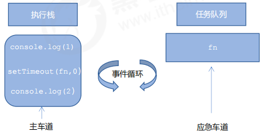

**事件循环（`event loop`）**

由于主线程不断的重复获得任务、执行任务、再获取任务、再执行，所以这种机制被称为事件循环（`event loop`）

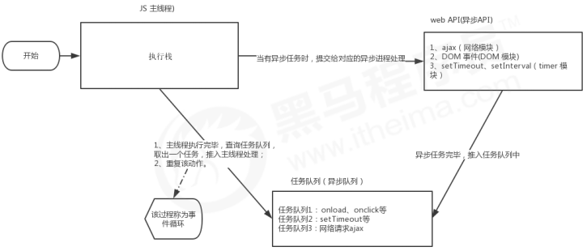

### 4.6 `location` 对象（操作窗体的 `URL`）

`window` 对象给我们提供了一个 `location` 属性用于获取或设置窗体的 `URL`，并且可以用于解析 `URL`。 

因为这个属性返回的是一个对象，所以我们将这个属性也称为 `location` 对象。

#### 4.6.1 `URL`（统一资源定位符）

统一资源定位符 (`Uniform Resource Locator`，`URL`) 是互联网上标准资源的地址。

互联网上的每个文件都有一个唯一的 `URL`，它包含的信息指出文件的位置以及浏览器应该怎么处理它。

**`URL` 的一般语法格式为：**

```:no-line-numbers
protocol://host[:port]/path/[?query]#fragment

示例：
http://www.itcast.cn/index.html?name=andy&age=18#link
```

|**组成**|**说明**|
|:-|:-|
|`protocol`|通信协议，常用的：`http`、`ftp`、`maito` 等|
|`host`|主机（域名），如：`www.itheima.com`|
|`port`|端口号（可选），省略时使用协议的默认端口，如 `http` 的默认端口为 80|
|`path`|路径，由零或多个 '`/`' 符号隔开的字符串，一般用来表示主机上的一个目录或文件地址|
|`query`|参数，以键值对的形式，通过 '`&`' 符号分隔开来|
|`fragment`|片段，'`#`' 后面内容，常见于链接锚点|

#### 4.6.2 `location` 对象的属性

|**`location` 对象属性**|**返回值**|
|:-|:-|
|`location.href`|获取或设置整个 `URL`|
|`location.host`|返回主机（域名）|
|`location.port`|返回端口号，如果未写，那么返回空字符串|
|`location.pathname`|返回路径|
|`location.search`|返回参数|
|`location.hash`|返回片段，'`#`' 后面内容|

> 重点记住： `href` 和 `search`

#### 4.6.3 示例1：5秒钟之后自动跳转页面

```html:no-line-numbers
<!DOCTYPE html>
<html lang="en">

<head>
    <meta charset="UTF-8">
    <meta name="viewport" content="width=device-width, initial-scale=1.0">
    <meta http-equiv="X-UA-Compatible" content="ie=edge">
    <title>Document</title>
</head>

<body>
    <button>点击</button>
    <div></div>
    <script>
        var btn = document.querySelector('button');
        var div = document.querySelector('div');
        btn.addEventListener('click', function() {
            // console.log(location.href);
            location.href = 'http://www.itcast.cn';
        })
        var timer = 5;
        setInterval(function() {
            if (timer == 0) {
                location.href = 'http://www.itcast.cn';
            } else {
                div.innerHTML = '您将在' + timer + '秒钟之后跳转到首页';
                timer--;
            }

        }, 1000);
    </script>
</body>

</html>
```

#### 4.6.4 示例2：获取 `URL` 参数

```html:no-line-numbers
<!-- login.xml -->
<!DOCTYPE html>
<html lang="en">

<head>
    <meta charset="UTF-8">
    <meta name="viewport" content="width=device-width, initial-scale=1.0">
    <meta http-equiv="X-UA-Compatible" content="ie=edge">
    <title>Document</title>
</head>

<body>
    <form action="index.html">
        用户名： <input type="text" name="uname">
        <input type="submit" value="登录">
    </form>
</body>

</html>
```

```html:no-line-numbers
<!-- index.xml -->
<!DOCTYPE html>
<html lang="en">

<head>
    <meta charset="UTF-8">
    <meta name="viewport" content="width=device-width, initial-scale=1.0">
    <meta http-equiv="X-UA-Compatible" content="ie=edge">
    <title>Document</title>
</head>

<body>
    <div></div>
    <script>
        console.log(location.search); // ?uname=andy
        // 1.先去掉？  substr('起始的位置'，截取几个字符);
        var params = location.search.substr(1); // uname=andy
        console.log(params);
        // 2. 利用=把字符串分割为数组 split('=');
        var arr = params.split('=');
        console.log(arr); // ["uname", "ANDY"]
        var div = document.querySelector('div');
        // 3.把数据写入div中
        div.innerHTML = arr[1] + '欢迎您';
    </script>
</body>

</html>
```

#### 4.6.5 `location` 对象的方法

|**`location` 对象方法**|**返回值**|
|:-|:-|
|`location.assign()`|跟 `href` 一样，可以跳转页面（也称为重定向页面）|
|`location.replace()`|替换当前页面，因为不记录历史，所以不能后退页面|
|`location.reload()`|重新加载页面，相当于刷新按钮或者 `F5`，如果参数为 `true`，那么表示强制刷新（`Ctrl + F5`）|

**示例：**

```html:no-line-numbers
<!DOCTYPE html>
<html lang="en">

<head>
    <meta charset="UTF-8">
    <meta name="viewport" content="width=device-width, initial-scale=1.0">
    <meta http-equiv="X-UA-Compatible" content="ie=edge">
    <title>Document</title>
</head>

<body>
    <button>点击</button>
    <script>
        var btn = document.querySelector('button');
        btn.addEventListener('click', function() {
            // 记录浏览历史，所以可以实现后退功能
            // location.assign('http://www.itcast.cn');
            // 不记录浏览历史，所以不可以实现后退功能
            // location.replace('http://www.itcast.cn');
            location.reload(true);
        })
    </script>
</body>

</html>
```

### 4.7 `navigator` 对象

`navigator` 对象包含有关浏览器的信息，它有很多属性。

我们最常用的是 `userAgent`，该属性可以返回由客户机发送服务器的 `user-agent` 头部的值。

**示例：根据用户终端（手机、`PC`）打开不同的 `html` 页面**

```js:no-line-numbers
if ((navigator.userAgent.match(/(phone|pad|pod|iPhone|iPod|ios|iPad|Android|Mobile|BlackBerry|IEMobile|MQQBrowser|JUC|Fennec|wOSBrowser|BrowserNG|WebOS|Symbian|Windows Phone)/i))) {
    window.location.href = "../H5/index.html"; //手机
}
```

### 4.8 `history` 对象

`window` 对象给我们提供了一个 `history` 对象，与浏览器历史记录进行交互。该对象包含用户（在浏览器窗口中）访问过的 `URL`。

|**`history` 对象方法**|**作用**|
|:-|:-|
|`back(`)|后退功能|
|`forward()`|前进功能|
|`go(参数)`|前进后退功能，参数如果是 `1`，表示前进 `1` 个页面；如果是 `-1`，表示后退 `1` 个页面|

> `history` 对象一般在实际开发中比较少用，但是会在一些 `OA` 办公系统中见到。
>
> 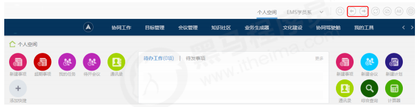


**示例：**

```html:no-line-numbers
<!-- index.xml -->
<!DOCTYPE html>
<html lang="en">

<head>
    <meta charset="UTF-8">
    <meta name="viewport" content="width=device-width, initial-scale=1.0">
    <meta http-equiv="X-UA-Compatible" content="ie=edge">
    <title>Document</title>
</head>

<body>
    <a href="list.html">点击我去往列表页</a>
    <button>前进</button>
    <script>
        var btn = document.querySelector('button');
        btn.addEventListener('click', function() {
            // history.forward();
            history.go(1);
        })
    </script>
</body>

</html>
```

```html:no-line-numbers
<!-- list.xml -->
<!DOCTYPE html>
<html lang="en">

<head>
    <meta charset="UTF-8">
    <meta name="viewport" content="width=device-width, initial-scale=1.0">
    <meta http-equiv="X-UA-Compatible" content="ie=edge">
    <title>Document</title>
</head>

<body>
    <a href="index.html">点击我去往首页</a>
    <button>后退</button>
    <script>
        var btn = document.querySelector('button');
        btn.addEventListener('click', function() {
            // history.back();
            history.go(-1);
        })
    </script>
</body>

</html>
```